# QA Evidence — NEARS-1575

**cycle-3 delta: PASS — AC7 fixed (label-only chips, no ? glyph, 48dp), AC1 header chain confirmed**

**11 screenshot(s).** Click any thumbnail for full resolution.

<table>
<tr>
<td align="center" width="33%"><a href="ac1-content-zone2-top.png">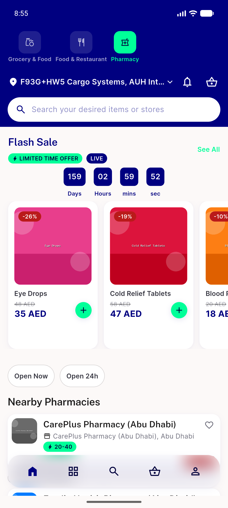</a> ac1 content zone2 top</td>
<td align="center" width="33%"><a href="ac1-header-chain-order.png">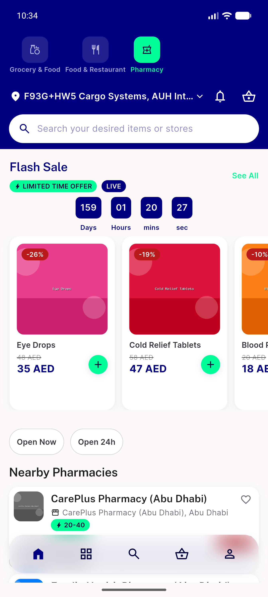</a> ac1 header chain order</td>
<td align="center" width="33%"><a href="ac4-filter-empty-inline-note.png">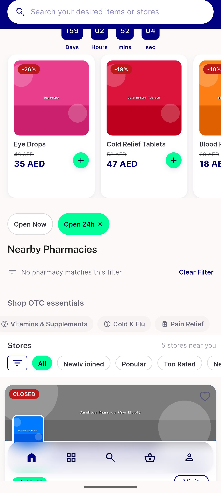</a> ac4 filter empty inline note</td>
</tr>
<tr>
<td align="center" width="33%"><a href="ac5-badge-binds-to-prescription-order.png">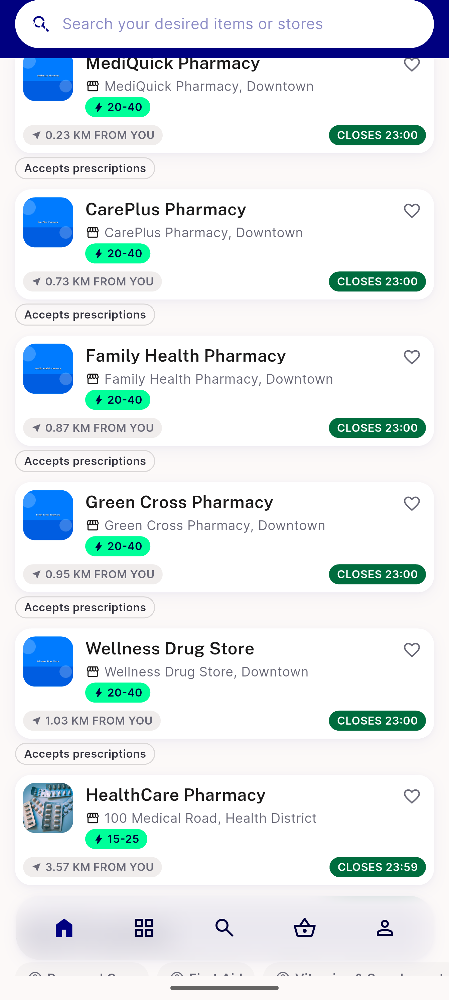</a> ac5 badge binds to prescription order</td>
<td align="center" width="33%"><a href="ac6-fallback-inactive-store-honest-closed.png">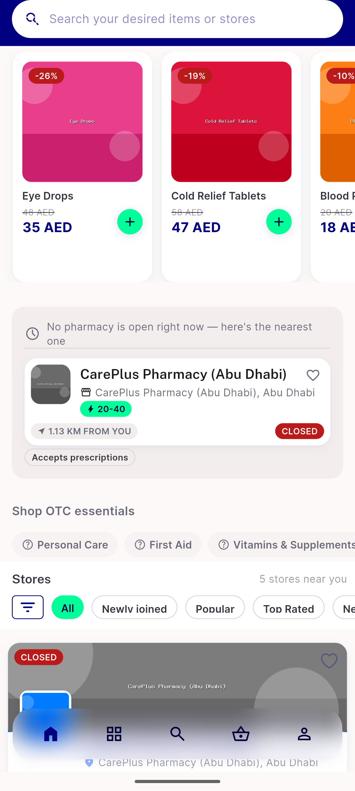</a> ac6 fallback inactive store honest closed</td>
<td align="center" width="33%"><a href="ac6-store-load-failed-branch.png">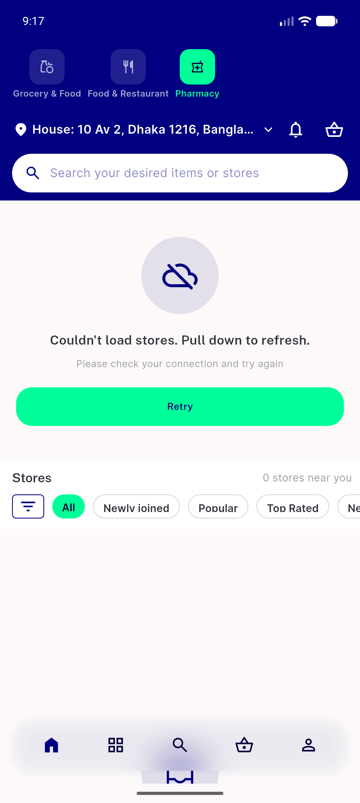</a> ac6 store load failed branch</td>
</tr>
<tr>
<td align="center" width="33%"><a href="ac6-urgent-fallback-one-card.png">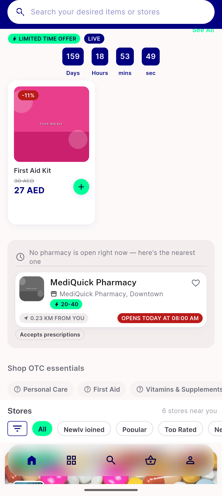</a> ac6 urgent fallback one card</td>
<td align="center" width="33%"><a href="ac7-otc-rail-below-list.png">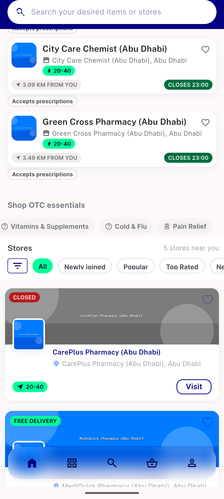</a> ac7 otc rail below list</td>
<td align="center" width="33%"><a href="ac7-otc-rail-label-only-fixed.png">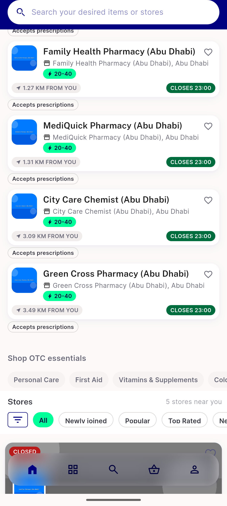</a> ac7 otc rail label only fixed</td>
</tr>
<tr>
<td align="center" width="33%"><a href="ac8-loading-skeletons.png">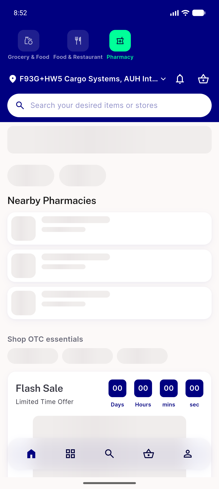</a> ac8 loading skeletons</td>
<td align="center" width="33%"><a href="bug-otc-rail-unknown-icon-glyph.png">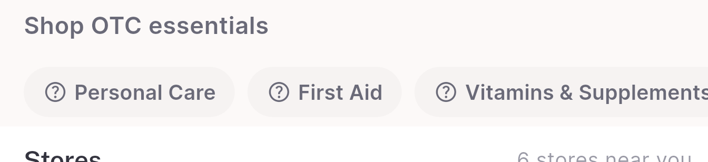</a> bug otc rail unknown icon glyph</td>
</tr>
</table>

### Other artifacts
- [`bug-nfilterchip-remove-target-14dp.log`](bug-nfilterchip-remove-target-14dp.log)
- [`bug-otc-rail-unknown-icon-glyph.log`](bug-otc-rail-unknown-icon-glyph.log)
- [`bug-preexisting-test-failures.log`](bug-preexisting-test-failures.log)

---
*From `nears/docs/qa-evidence/NEARS-1575/` · public-repo scrub policy (no live secrets; verified clean).*
