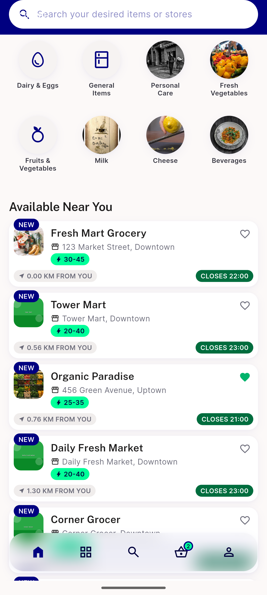
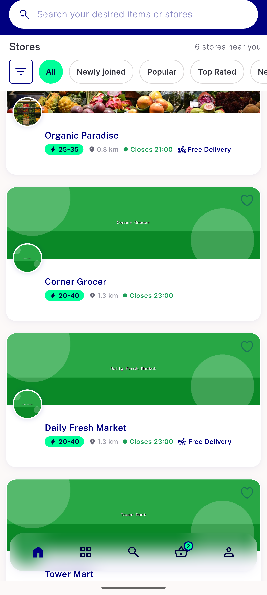
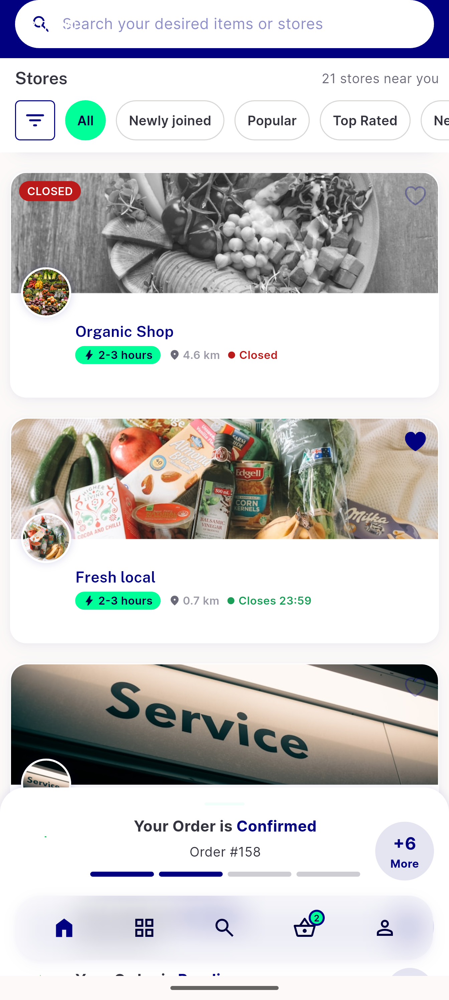
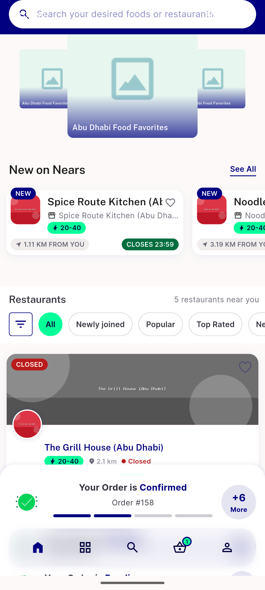

# QA Evidence — NEARS-1578

**PASS — express lane cycle 1: AC1 (dot/text agreement via shared isStoreCurrentlyOpen predicate) confirmed via automated test (data-gap falsifying scenario per ticket brief) + live device confirmation on real seeded stores across zone1/zone2, grocery/food/pharmacy modules; AC2 grep-confirmed; AC3 confirmed both by automated test AND live device (store id=9 Organic Shop active=0, store id=53 CarePlus Pharmacy active=0) — dot+text+NotAvailableWidget overlay all agree, no crash. Automated backstop 153/154 (1 pre-existing unrelated failure, confirmed pre-existing on parent commit).**

**4 screenshot(s).** Click any thumbnail for full resolution.

<table>
<tr>
<td align="center" width="33%"> ac1 live open stores</td>
<td align="center" width="33%"> ac1 storecardwidget allstores</td>
<td align="center" width="33%"> ac3 live inactive store</td>
</tr>
<tr>
<td align="center" width="33%"> regression food module inactive</td>
</tr>
</table>

---
*From `nears/docs/qa-evidence/NEARS-1578/` · public-repo scrub policy (no live secrets; verified clean).*
