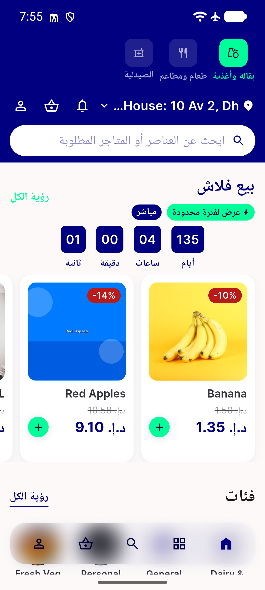

# QA Evidence — NEARS-1579

**PASS - NModuleRow sliver extent verified live (Arabic + 1.3x text scale, emulator-5564): under-reports by 3.0dp for real Arabic module labels but absorbed with no visible clip by _RowTile's Flexible + 8dp bottom padding**

**1 screenshot(s).** Click any thumbnail for full resolution.

<table>
<tr>
<td align="center" width="33%"> home ar 1.3x</td>
</tr>
</table>

### Other artifacts
- [`measurement.json`](measurement.json)
- [`rendertree-home-appbar-ar-1.3x.json`](rendertree-home-appbar-ar-1.3x.json)

---
*From `nears/docs/qa-evidence/NEARS-1579/` · public-repo scrub policy (no live secrets; verified clean).*
