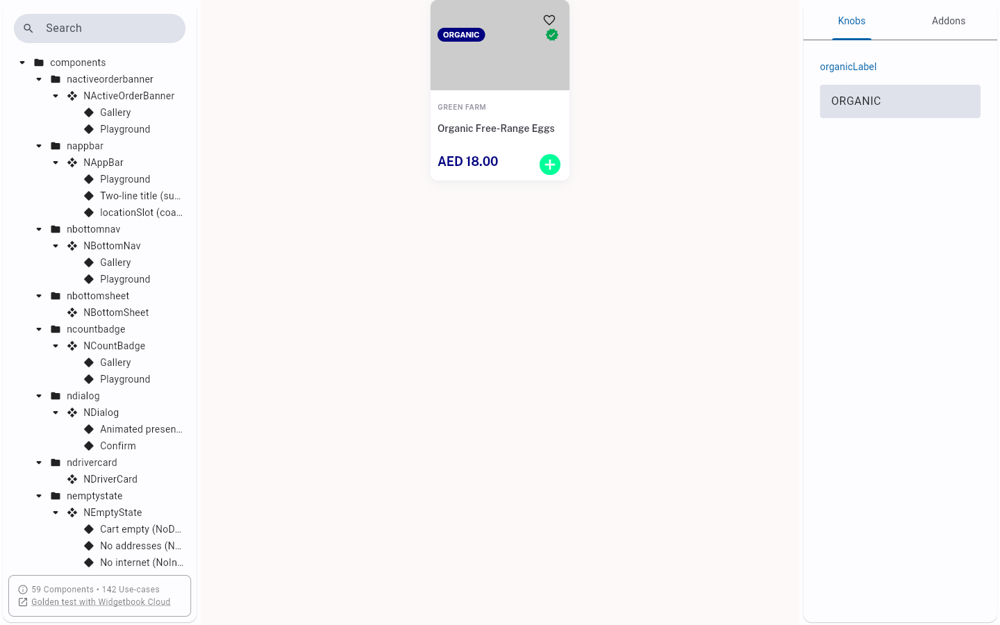
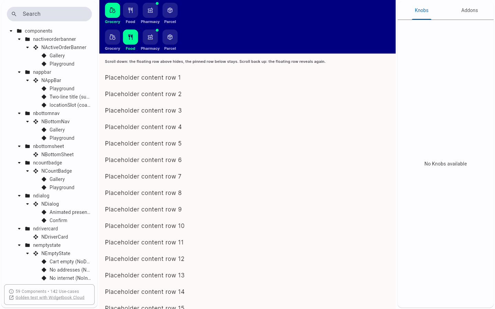
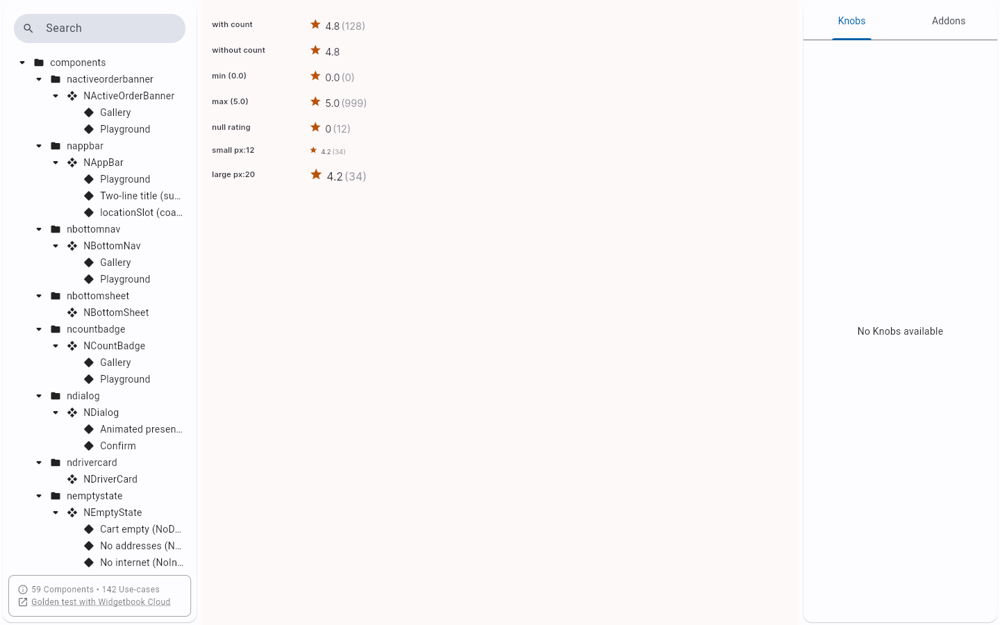
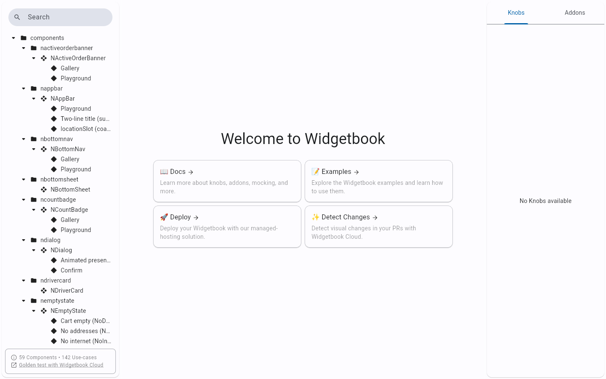

# QA Evidence — NEARS-1580

**PASS - widgetbook deep-link hash form verified live, fix-cycle 2**

**4 screenshot(s).** Click any thumbnail for full resolution.

<table>
<tr>
<td align="center" width="33%"> ac1 nitemcard halal organic</td>
<td align="center" width="33%"> ac1 nmodulerow sliver host</td>
<td align="center" width="33%"> ac4 nrating gallery</td>
</tr>
<tr>
<td align="center" width="33%"> regression old bare path fails open</td>
</tr>
</table>

---
*From `nears/docs/qa-evidence/NEARS-1580/` · public-repo scrub policy (no live secrets; verified clean).*
