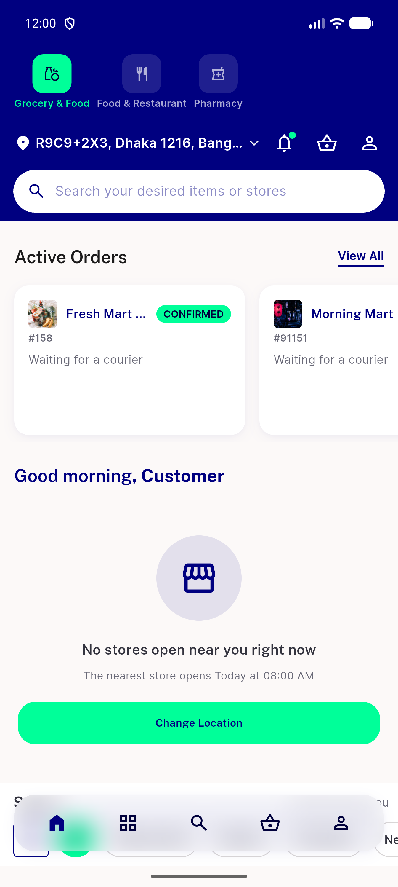
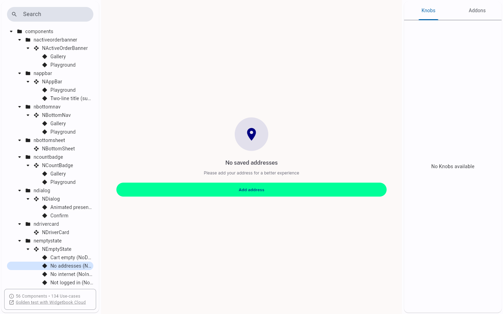
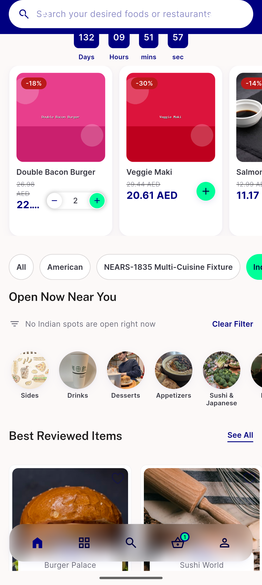
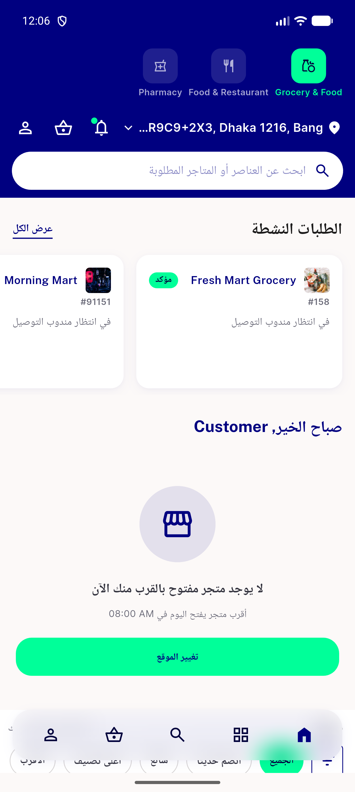
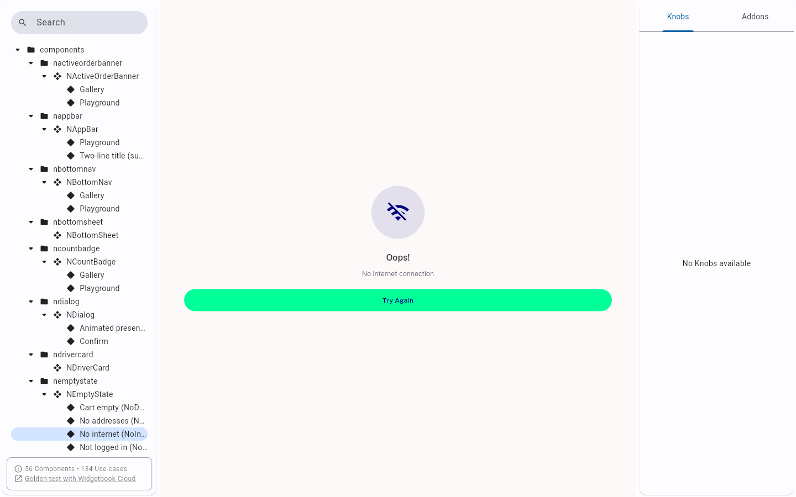

# QA Evidence — NEARS-1583

**PASS — NEmptyState.subtitle WCAG AA contrast fix verified live**

**5 screenshot(s).** Click any thumbnail for full resolution.

<table>
<tr>
<td align="center" width="33%"> ac2 grocery home empty live</td>
<td align="center" width="33%"> ac3 food home widgetbook substitute</td>
<td align="center" width="33%"> ac4 food filter empty clear filter live</td>
</tr>
<tr>
<td align="center" width="33%"> ac6 grocery home empty rtl live</td>
<td align="center" width="33%"> ac7 no internet widgetbook</td>
</tr>
</table>

---
*From `nears/docs/qa-evidence/NEARS-1583/` · public-repo scrub policy (no live secrets; verified clean).*
