# QA Evidence — NEARS-1585

**PASS — fix-cycle 2 delta re-QA: AC2 + AC1 restored on the deep-link path via the store-payload module_type fallback; guard directions hold; fallback correctly does not fire on normal nav**

**23 screenshot(s).** Click any thumbnail for full resolution.

<table>
<tr>
<td align="center" width="33%"><a href="ac1-grocery-store1-hero.png">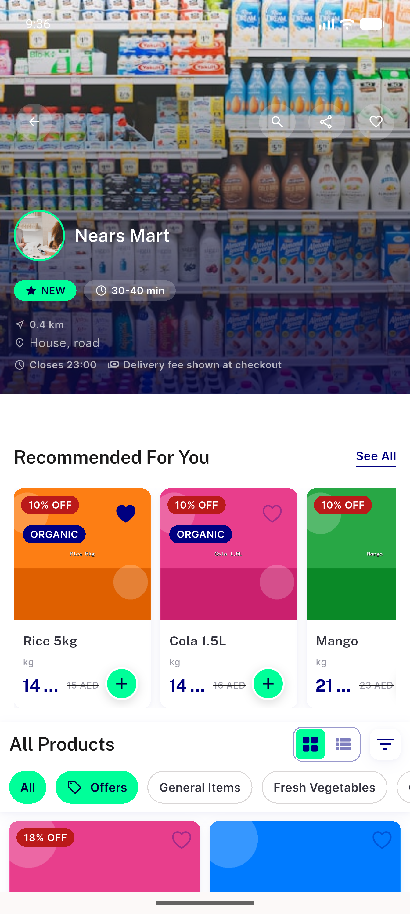</a> ac1 grocery store1 hero</td>
<td align="center" width="33%"><a href="ac1-store-cards-status-fee.png">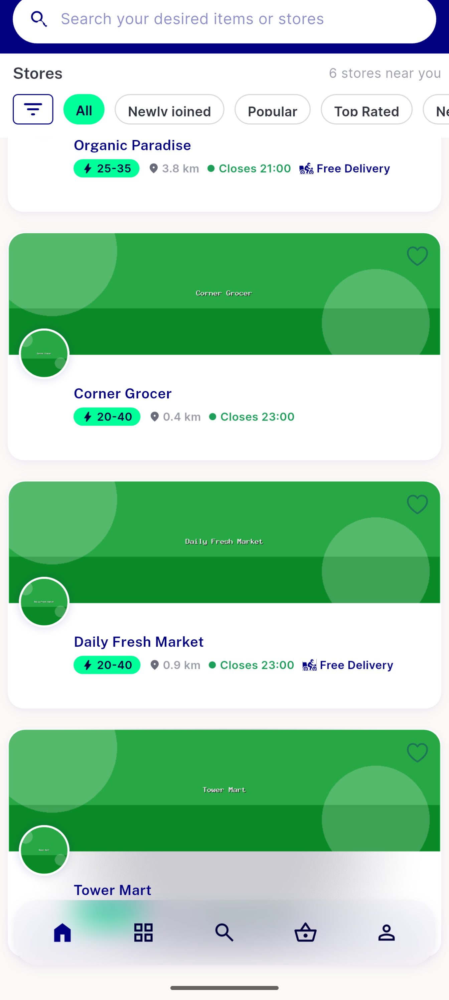</a> ac1 store cards status fee</td>
<td align="center" width="33%"><a href="ac2-closed-store47-greyscale-1_3x.png">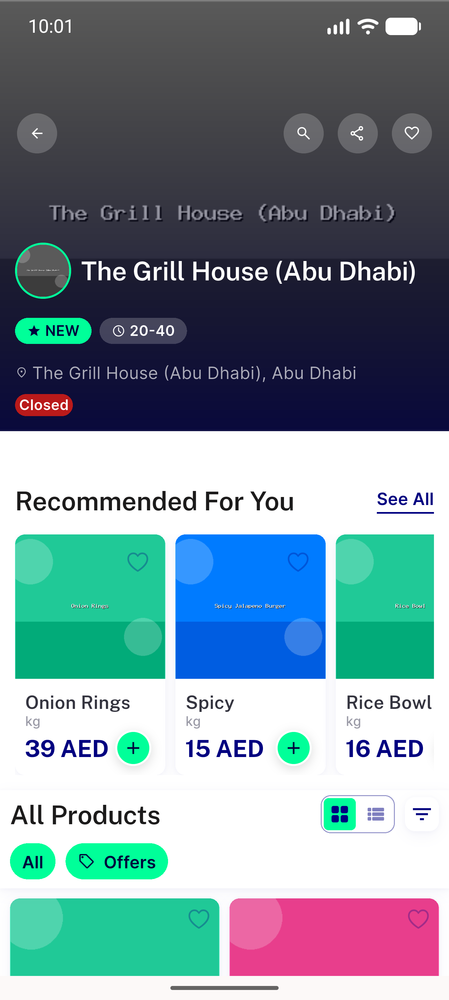</a> ac2 closed store47 greyscale 1 3x</td>
</tr>
<tr>
<td align="center" width="33%"><a href="ac2-closed-store47-veil.png">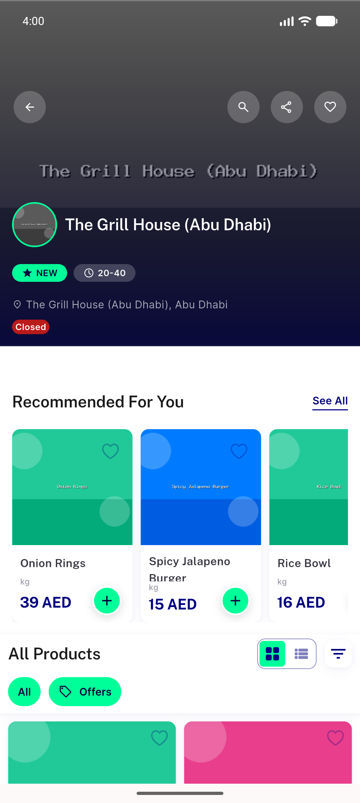</a> ac2 closed store47 veil</td>
<td align="center" width="33%"><a href="ac2-food-open-badge-store51.png">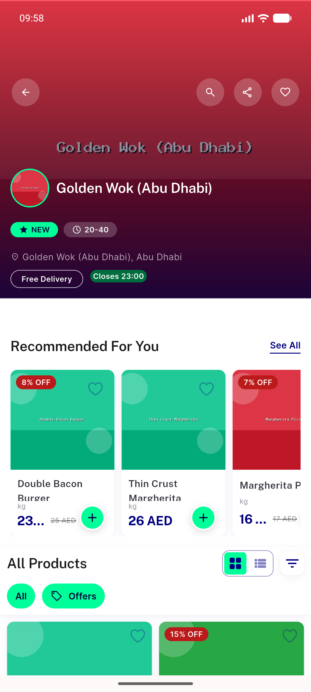</a> ac2 food open badge store51</td>
<td align="center" width="33%"><a href="ac2-food-store6-closed-badge.png">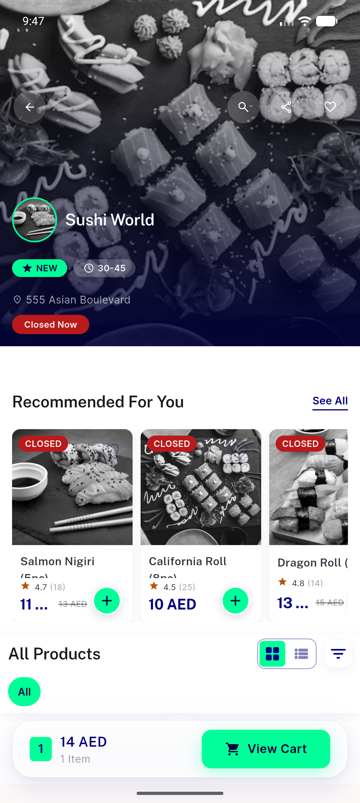</a> ac2 food store6 closed badge</td>
</tr>
<tr>
<td align="center" width="33%"><a href="ac7-empty-category-arm.png">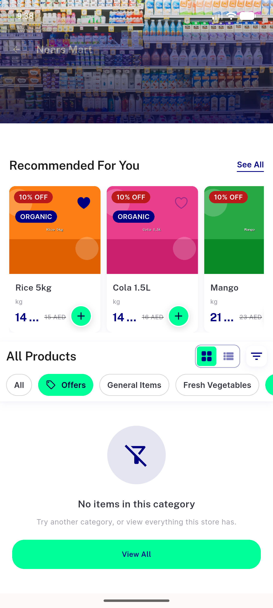</a> ac7 empty category arm</td>
<td align="center" width="33%"><a href="ac7-empty-store-arm.png">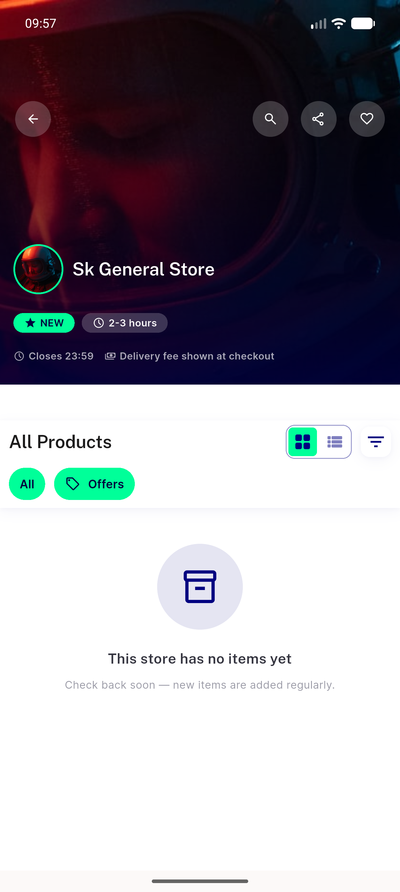</a> ac7 empty store arm</td>
<td align="center" width="33%"> ac7 error retry state rtl</td>
</tr>
<tr>
<td align="center" width="33%"> ac7 loading skeleton grid</td>
<td align="center" width="33%"> ac9 rtl arabic grocery hero</td>
<td align="center" width="33%"><a href="bug-deeplink-category-rail-collapse.png">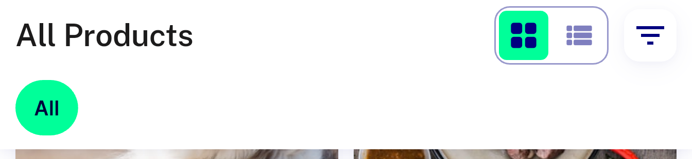</a> bug deeplink category rail collapse</td>
</tr>
<tr>
<td align="center" width="33%"><a href="bug-deeplink-food-status-missing.png">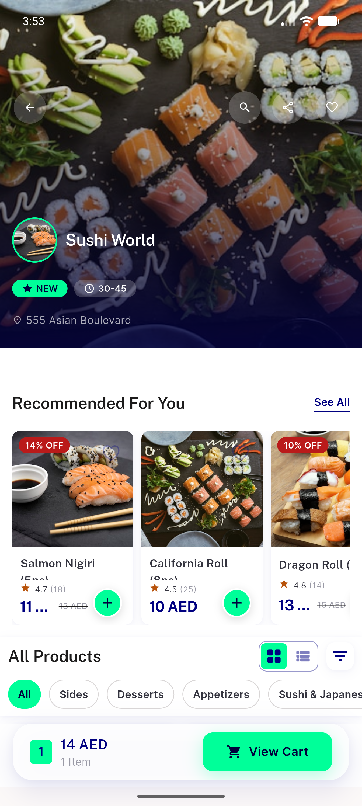</a> bug deeplink food status missing</td>
<td align="center" width="33%"><a href="bug-deeplink-grocery-hours-fee-missing.png">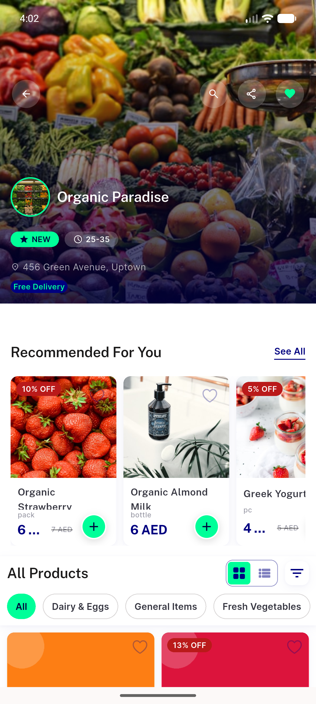</a> bug deeplink grocery hours fee missing</td>
<td align="center" width="33%"><a href="bug-deeplink-module-unresolved.png">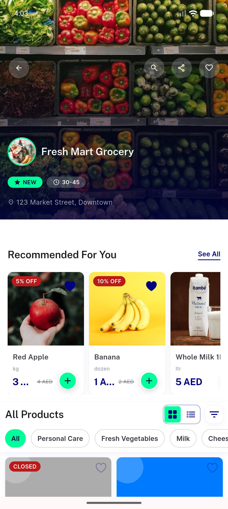</a> bug deeplink module unresolved</td>
</tr>
<tr>
<td align="center" width="33%"><a href="cycle1-ac2-open-food-listnav-store39.png">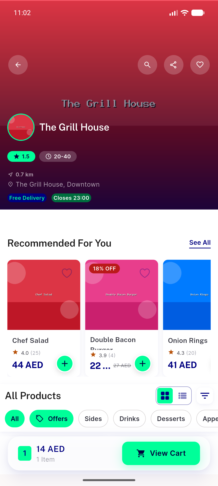</a> cycle1 ac2 open food listnav store39</td>
<td align="center" width="33%"><a href="cycle1-ac8-pills-nbadge-store51.png">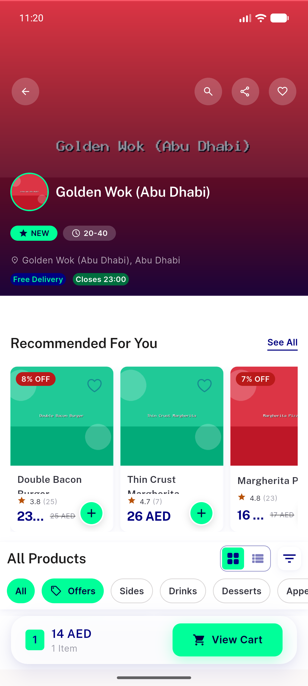</a> cycle1 ac8 pills nbadge store51</td>
<td align="center" width="33%"><a href="cycle1-bug-deeplink-store6-still-closed.png">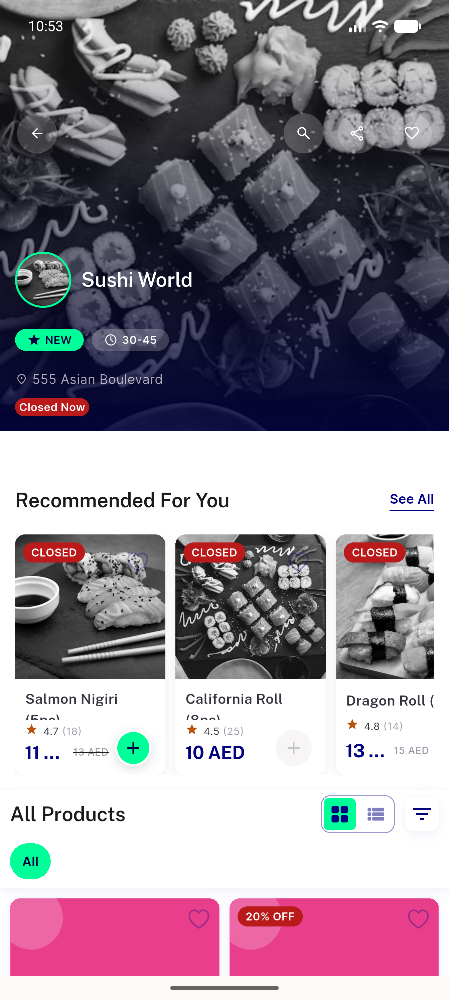</a> cycle1 bug deeplink store6 still closed</td>
</tr>
<tr>
<td align="center" width="33%"><a href="cycle1-bug-unusable-schedules-false-closed.png">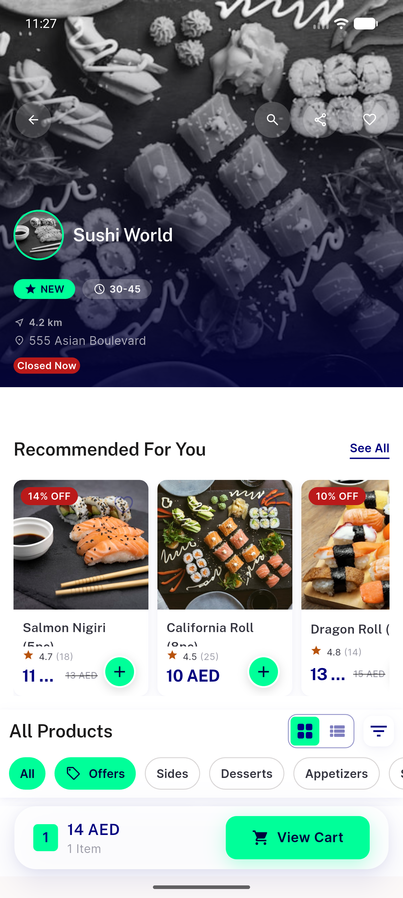</a> cycle1 bug unusable schedules false closed</td>
<td align="center" width="33%"><a href="cycle1-check3-closed-store47-veil-retained.png">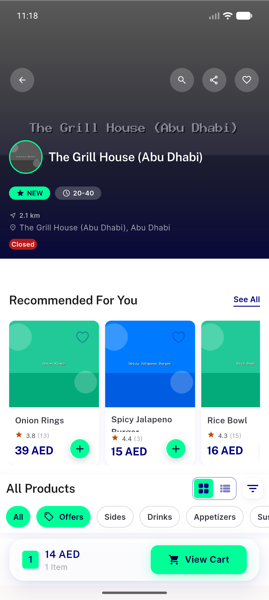</a> cycle1 check3 closed store47 veil retained</td>
<td align="center" width="33%"> cycle1 deeplink store6 open nostatus noveil</td>
</tr>
<tr>
<td align="center" width="33%"><a href="cycle2-ac1-deeplink-grocery-rows-restored.png">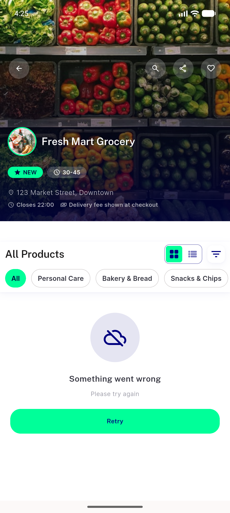</a> cycle2 ac1 deeplink grocery rows restored</td>
<td align="center" width="33%"><a href="cycle2-step3-closed-store47-veil.png">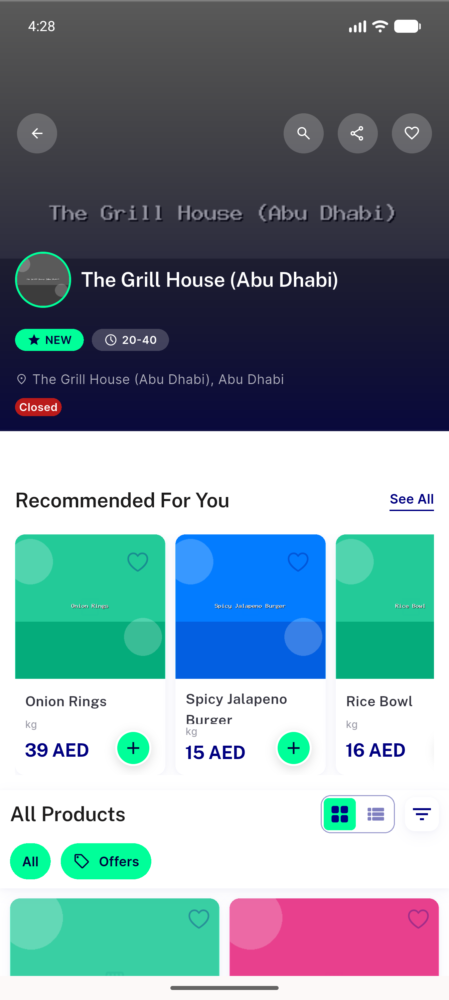</a> cycle2 step3 closed store47 veil</td>
</tr>
</table>

### Other artifacts
- [`bug-ac8-raw-pills-beside-nbadge.log`](bug-ac8-raw-pills-beside-nbadge.log)
- [`bug-deeplink-category-rail-collapse.log`](bug-deeplink-category-rail-collapse.log)
- [`bug-deeplink-module-unresolved.log`](bug-deeplink-module-unresolved.log)
- [`bug-deeplink-status-copy-degrades.log`](bug-deeplink-status-copy-degrades.log)
- [`bug-delivery-fee-from-zero.log`](bug-delivery-fee-from-zero.log)

---
*From `nears/docs/qa-evidence/NEARS-1585/` · public-repo scrub policy (no live secrets; verified clean).*
