# QA Evidence — NEARS-1586

**FAIL — 7 AC PASS, AC5 NOT_VERIFIED (loader route unreachable on Android), AC3 descoped**

**25 screenshot(s).** Click any thumbnail for full resolution.

<table>
<tr>
<td align="center" width="33%">  bg browse nosheet</td>
<td align="center" width="33%"><a href="_bg-cart.png">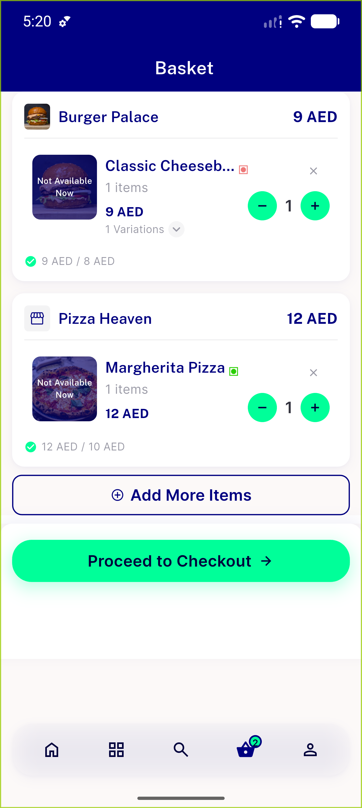</a>  bg cart</td>
<td align="center" width="33%"><a href="_bg2-browse.png">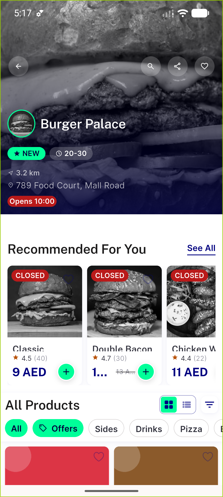</a>  bg2 browse</td>
</tr>
<tr>
<td align="center" width="33%"><a href="_sheet-browse.png">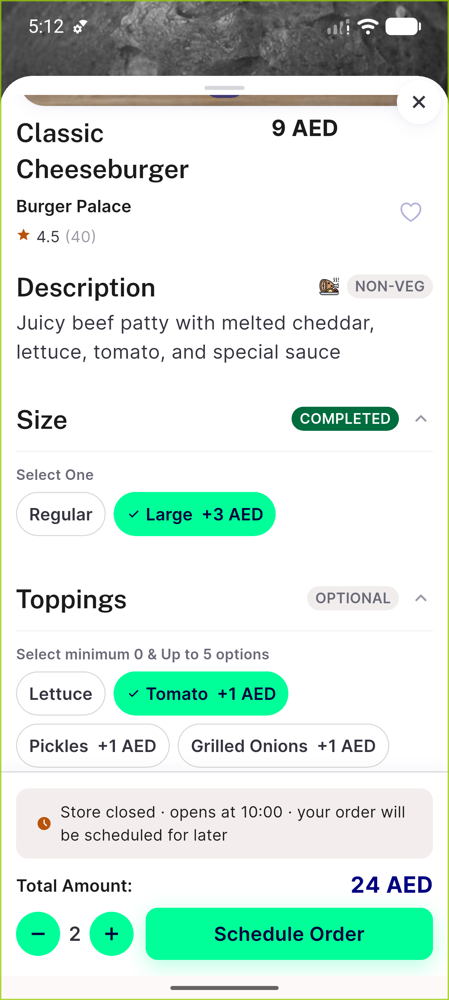</a>  sheet browse</td>
<td align="center" width="33%">  sheet2 browse</td>
<td align="center" width="33%"><a href="ac1-c3-item84-variations.png">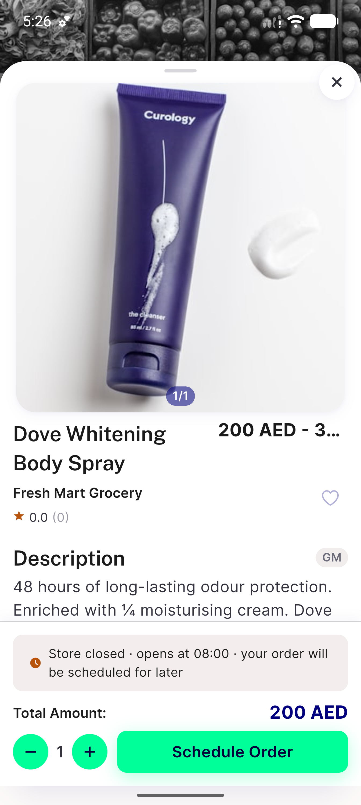</a> ac1 c3 item84 variations</td>
</tr>
<tr>
<td align="center" width="33%"><a href="ac1-grocery-banana-sheet.png">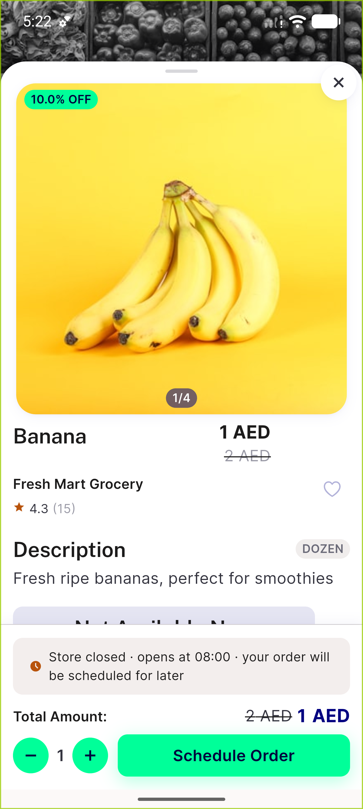</a> ac1 grocery banana sheet</td>
<td align="center" width="33%"><a href="ac2-food-sheet-item16.png">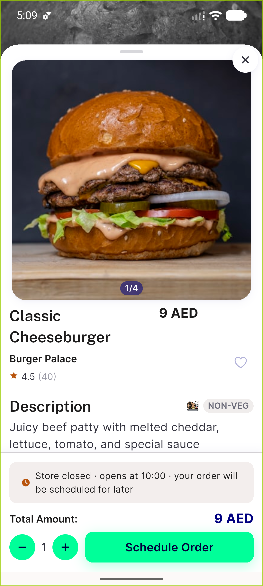</a> ac2 food sheet item16</td>
<td align="center" width="33%"><a href="ac2-footer-total.png">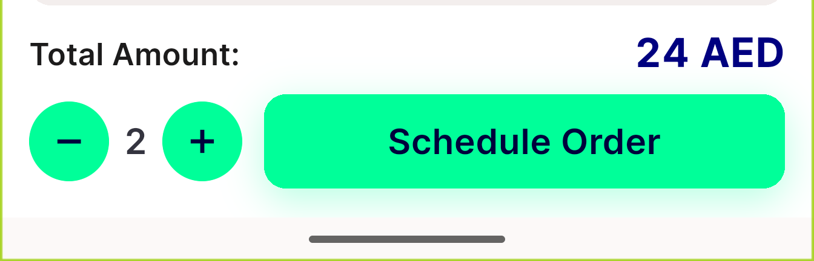</a> ac2 footer total</td>
</tr>
<tr>
<td align="center" width="33%"><a href="ac2-live-price-large.png">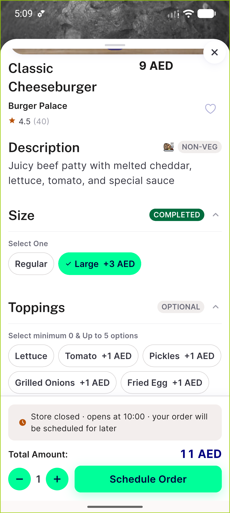</a> ac2 live price large</td>
<td align="center" width="33%"><a href="ac4-cart-line-sheet.png">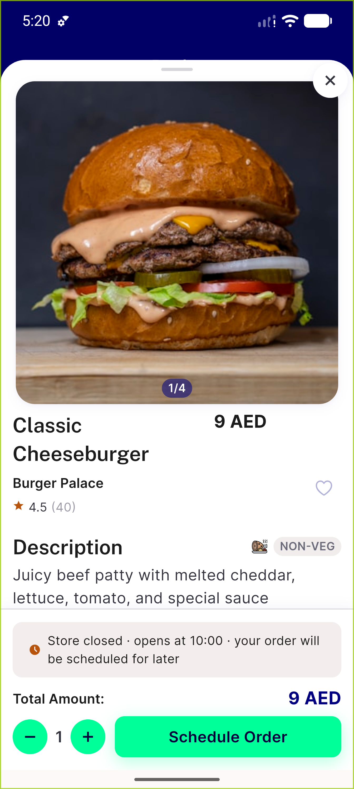</a> ac4 cart line sheet</td>
<td align="center" width="33%"><a href="ac5-coldstart-underlying-route.png">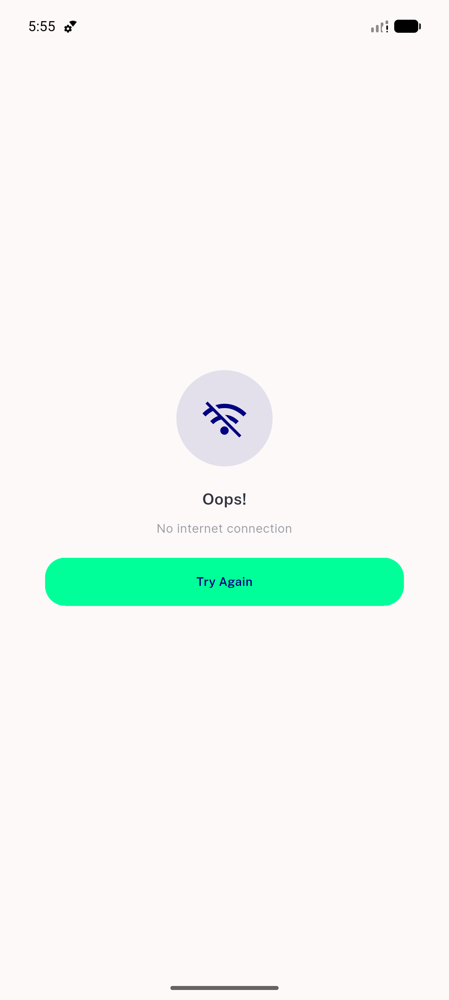</a> ac5 coldstart underlying route</td>
</tr>
<tr>
<td align="center" width="33%"> ac5 deeplink loader route</td>
<td align="center" width="33%"> ac5 deeplink result</td>
<td align="center" width="33%"><a href="ac5-deeplink-skeleton-offline.png">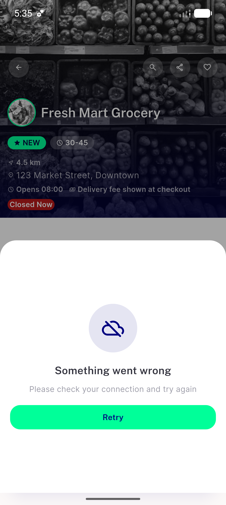</a> ac5 deeplink skeleton offline</td>
</tr>
<tr>
<td align="center" width="33%"> ac5 loader route underneath</td>
<td align="center" width="33%"> ac6 loadfailed retry</td>
<td align="center" width="33%"><a href="ac6-notfound.png">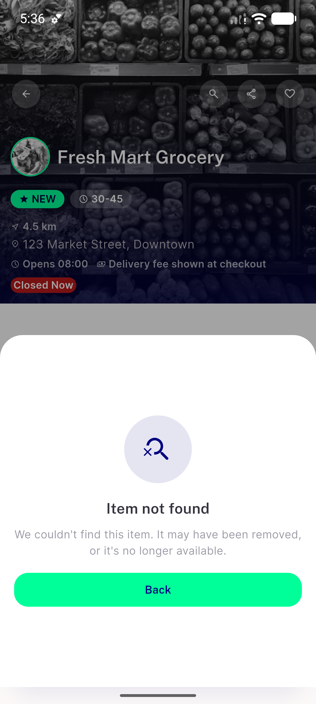</a> ac6 notfound</td>
</tr>
<tr>
<td align="center" width="33%"><a href="ac6-outofzone.png">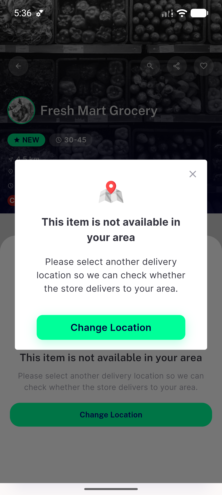</a> ac6 outofzone</td>
<td align="center" width="33%"> ac7 basket both stores</td>
<td align="center" width="33%"><a href="ac7-multistore-after-add.png">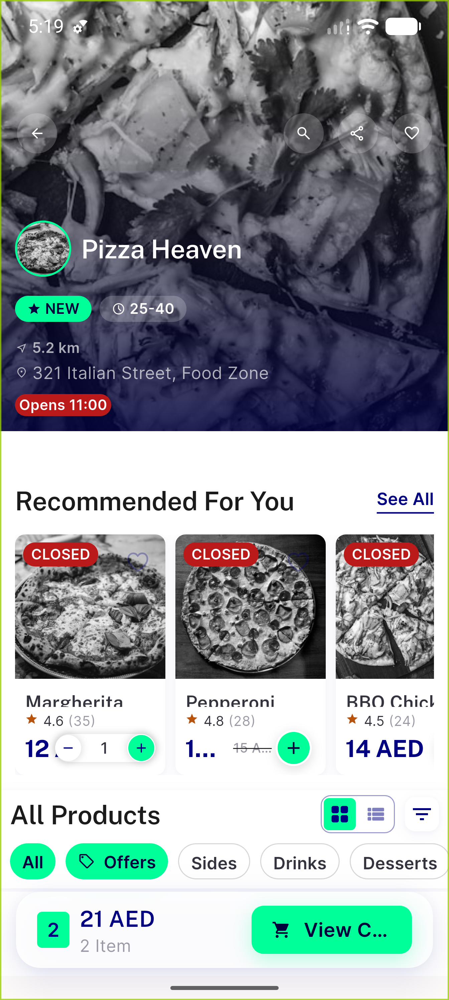</a> ac7 multistore after add</td>
</tr>
<tr>
<td align="center" width="33%"><a href="ac8-rtl-arabic-sheet.png">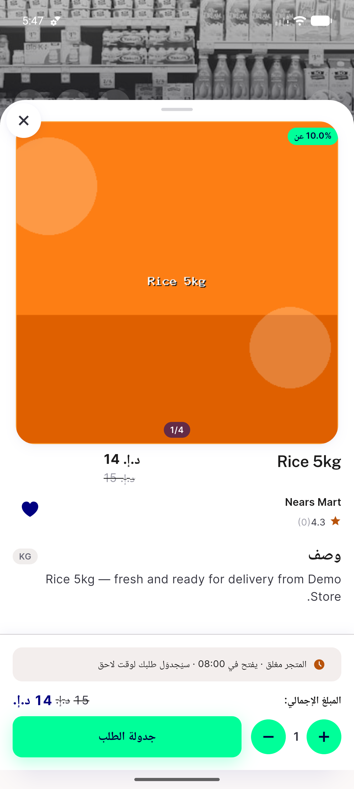</a> ac8 rtl arabic sheet</td>
<td align="center" width="33%"><a href="loading-arm-close-x.png">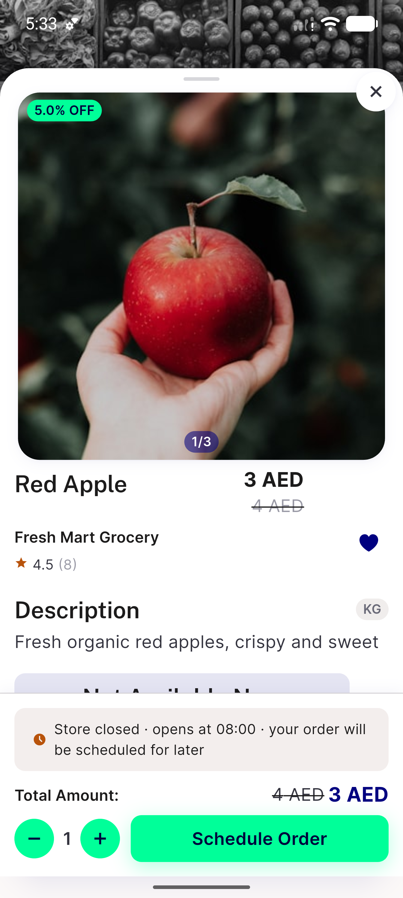</a> loading arm close x</td>
<td align="center" width="33%"><a href="qa5-textscale130-item84.png">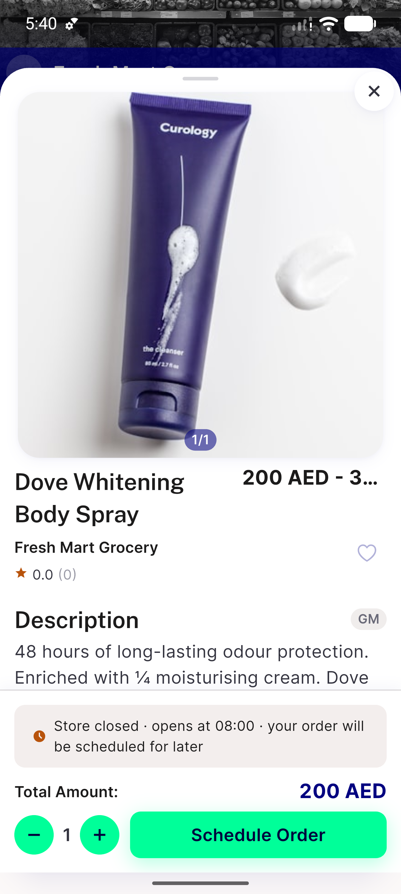</a> qa5 textscale130 item84</td>
</tr>
<tr>
<td align="center" width="33%"><a href="smallscreen-180x320dp.png">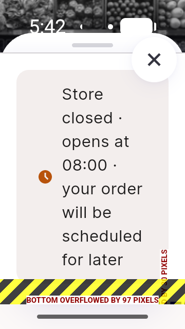</a> smallscreen 180x320dp</td>
</tr>
</table>

### Other artifacts
- [`bug-cartadd-outofzone-after-deeplink.log`](bug-cartadd-outofzone-after-deeplink.log)
- [`bug-deeplink-loader-route-unreachable.log`](bug-deeplink-loader-route-unreachable.log)
- [`bug-nrating-overflow-narrow-viewport.log`](bug-nrating-overflow-narrow-viewport.log)
- [`bug-option-price-label-rounding.log`](bug-option-price-label-rounding.log)
- [`bug-speedbanner-not-built.log`](bug-speedbanner-not-built.log)
- [`progress.md`](progress.md)

---
*From `nears/docs/qa-evidence/NEARS-1586/` · public-repo scrub policy (no live secrets; verified clean).*
