# QA Evidence — NEARS-1589

**PASS — NTabBar promotion: tab-bar band pixel-identical to pre-change build (0/215040 px), RTL directional inset mirrors correctly, a11y button+selected added**

**15 screenshot(s).** Click any thumbnail for full resolution.

<table>
<tr>
<td align="center" width="33%"><a href="ac1-sidebyside-ltr-all-orders.png">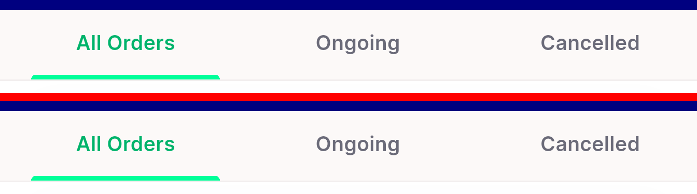</a> ac1 sidebyside ltr all orders</td>
<td align="center" width="33%"><a href="ac1-sidebyside-ltr-cancelled.png">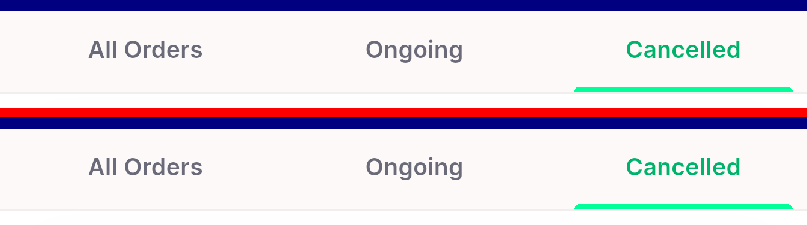</a> ac1 sidebyside ltr cancelled</td>
<td align="center" width="33%"><a href="ac1-sidebyside-ltr-ongoing.png">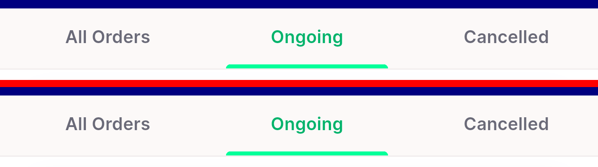</a> ac1 sidebyside ltr ongoing</td>
</tr>
<tr>
<td align="center" width="33%"><a href="ac1-sidebyside-rtl-arabic.png">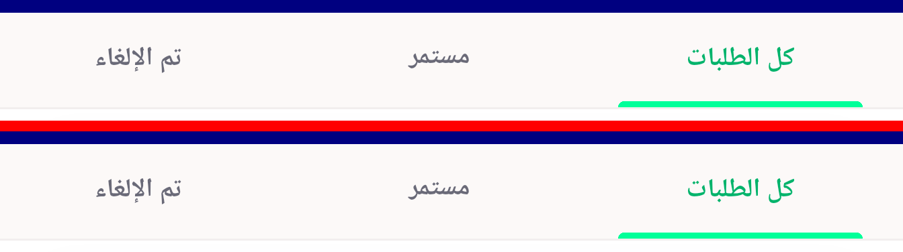</a> ac1 sidebyside rtl arabic</td>
<td align="center" width="33%"><a href="ac4-ltr-rtl-pair.png">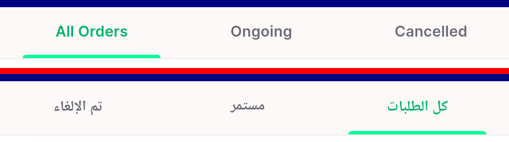</a> ac4 ltr rtl pair</td>
<td align="center" width="33%"><a href="post-ar-rtl-tab1.png">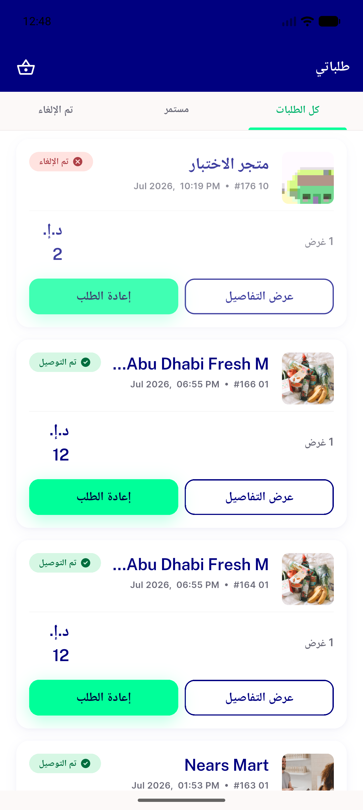</a> post ar rtl tab1</td>
</tr>
<tr>
<td align="center" width="33%"><a href="post-en-all-orders.png">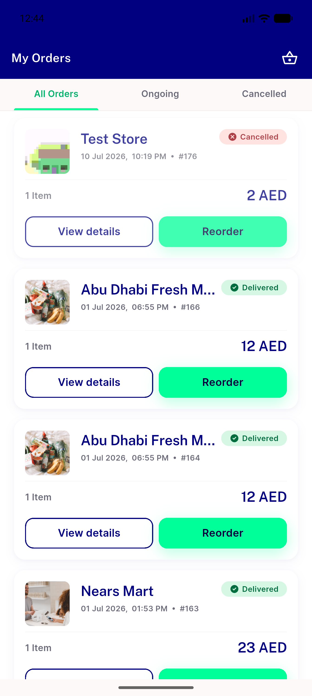</a> post en all orders</td>
<td align="center" width="33%"><a href="post-en-cancelled.png">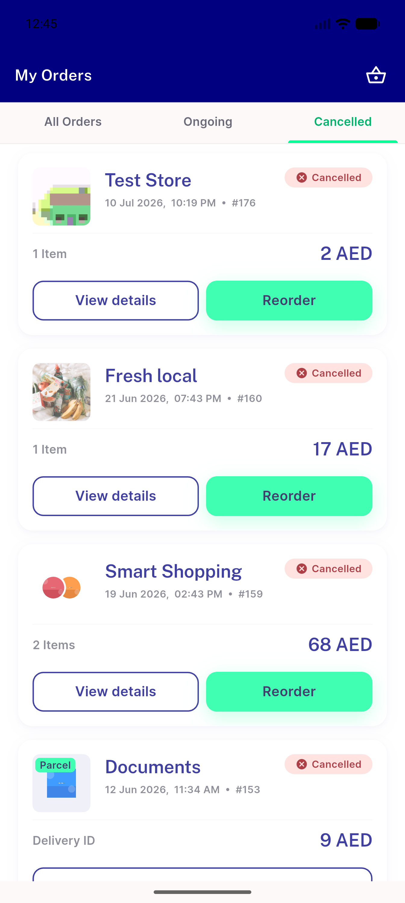</a> post en cancelled</td>
<td align="center" width="33%"><a href="post-en-empty-all.png">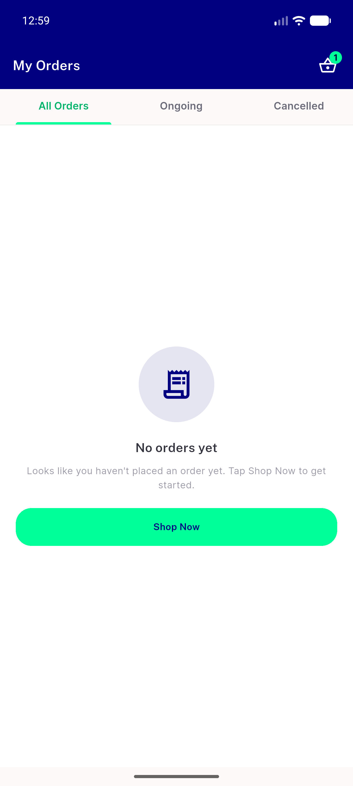</a> post en empty all</td>
</tr>
<tr>
<td align="center" width="33%"><a href="post-en-empty-cancelled.png">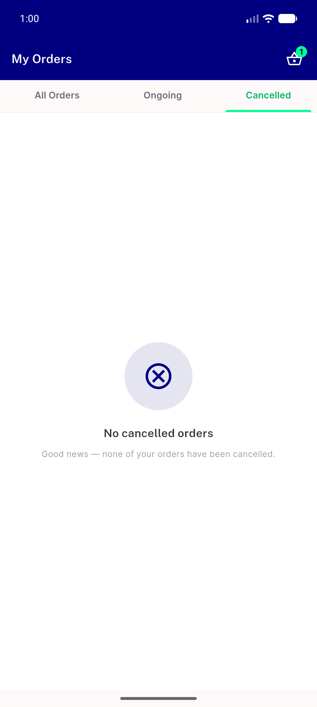</a> post en empty cancelled</td>
<td align="center" width="33%"> post en ongoing</td>
<td align="center" width="33%"><a href="pre-ar-rtl-tab1.png">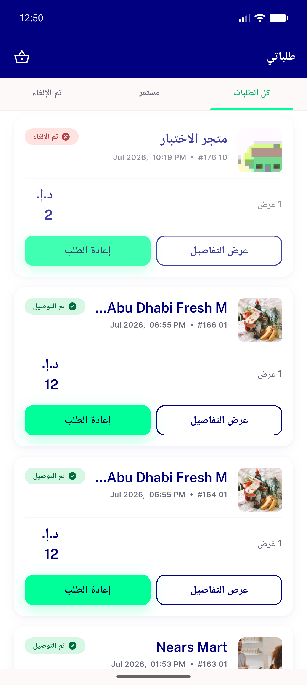</a> pre ar rtl tab1</td>
</tr>
<tr>
<td align="center" width="33%"> pre en all orders</td>
<td align="center" width="33%"> pre en cancelled</td>
<td align="center" width="33%"><a href="pre-en-ongoing.png">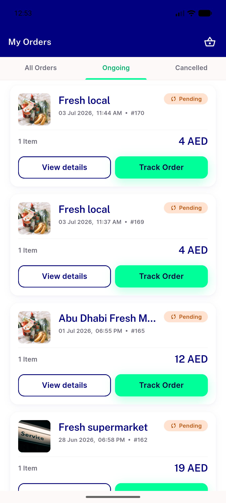</a> pre en ongoing</td>
</tr>
</table>

### Other artifacts
- [`bug-preexisting-userapp-test-failures.log`](bug-preexisting-userapp-test-failures.log)
- [`progress.md`](progress.md)

---
*From `nears/docs/qa-evidence/NEARS-1589/` · public-repo scrub policy (no live secrets; verified clean).*
