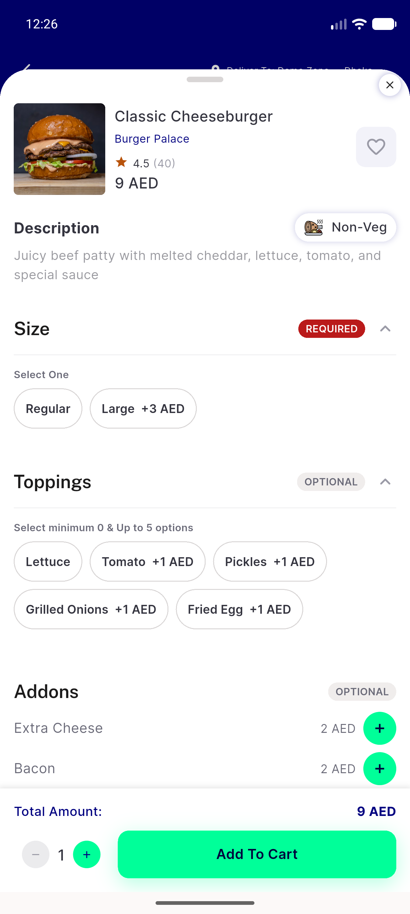
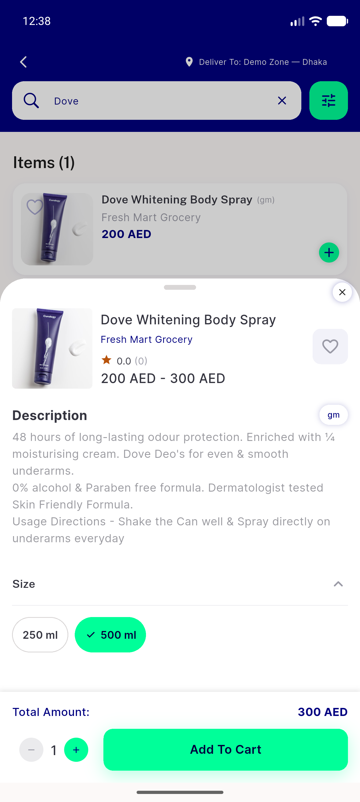
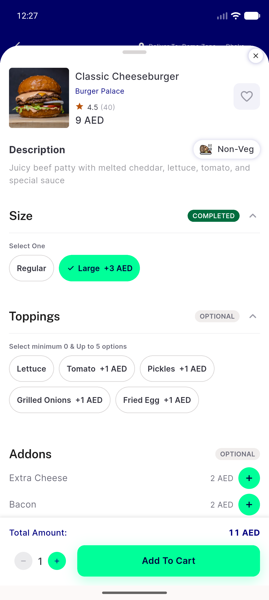
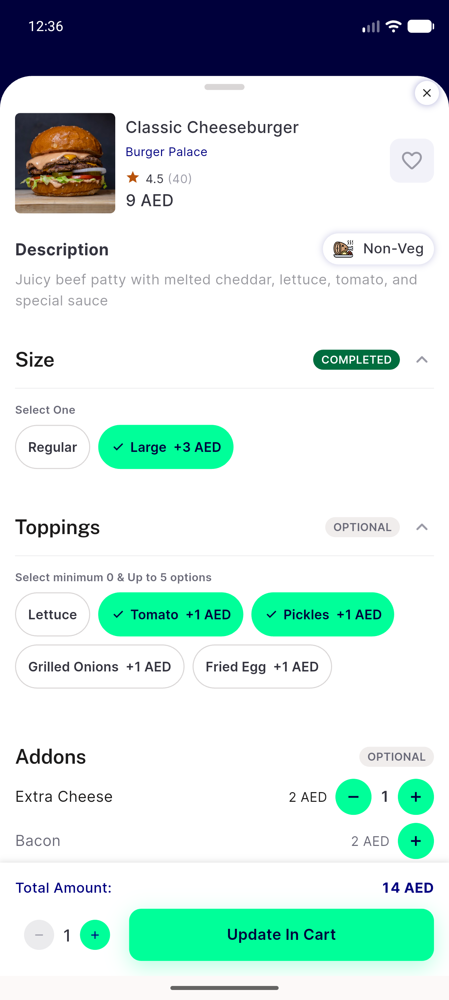
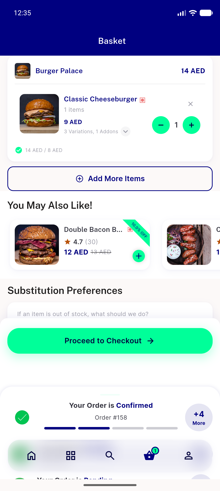
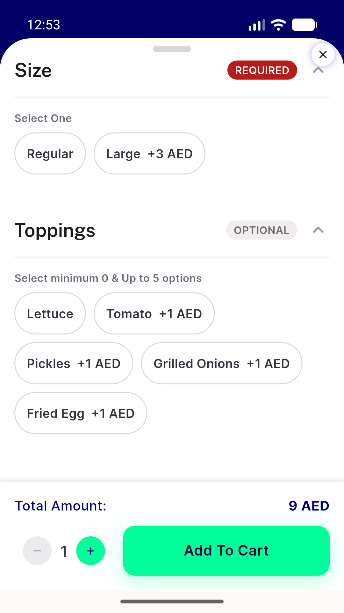
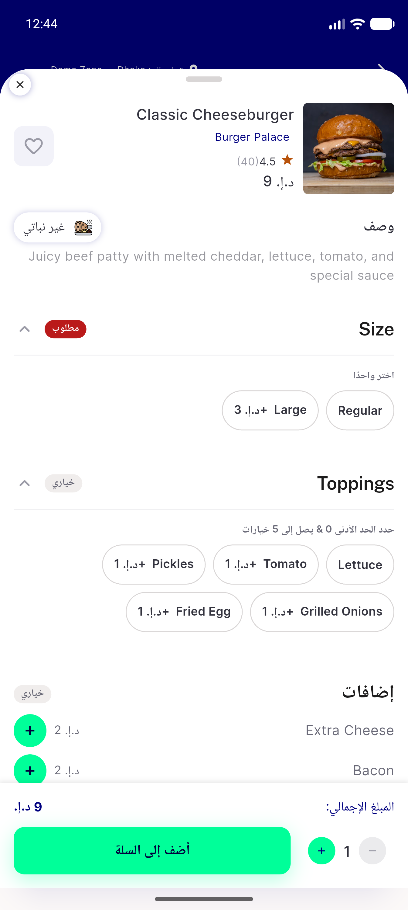

# QA Evidence — NEARS-1590

**PASS — 7/7 ACs live; + per-bug artifacts for 3 pre-existing findings**

**9 screenshot(s).** Click any thumbnail for full resolution.

<table>
<tr>
<td align="center" width="33%"> ac1 food groups unmet required</td>
<td align="center" width="33%"> ac1 legacy grocery choiceoptions</td>
<td align="center" width="33%"> ac1 required flipped completed</td>
</tr>
<tr>
<td align="center" width="33%"> ac2 cart edit prepopulated</td>
<td align="center" width="33%"> ac2 cart line agrees 14aed</td>
<td align="center" width="33%"> ac7 small screen 360dp wrap</td>
</tr>
<tr>
<td align="center" width="33%"> bug cart base price 9 vs 8</td>
<td align="center" width="33%"> bug currency zero decimals</td>
<td align="center" width="33%"> rtl arabic chip plus prefix</td>
</tr>
</table>

### Other artifacts
- [`bug-coupon-list-422.log`](bug-coupon-list-422.log)
- [`bug-store4-coords-outside-zone1.log`](bug-store4-coords-outside-zone1.log)
- [`progress.md`](progress.md)

---
*From `nears/docs/qa-evidence/NEARS-1590/` · public-repo scrub policy (no live secrets; verified clean).*
