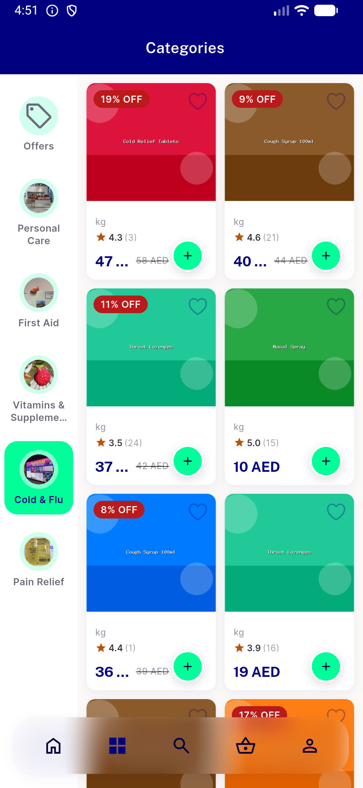
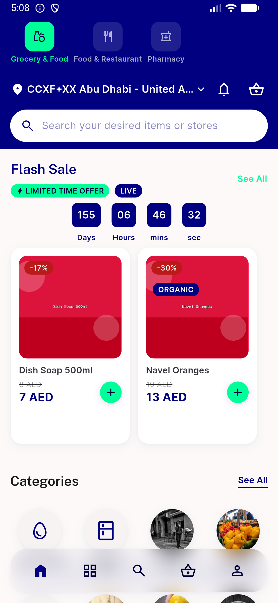

# QA Evidence — NEARS-1592

**PASS — dead-code deletion verified as a true no-op on live Pharmacy home (emulator-5560, checksum-verified build)**

**10 screenshot(s).** Click any thumbnail for full resolution.

<table>
<tr>
<td align="center" width="33%"> ac2 coldstart skeleton</td>
<td align="center" width="33%"> ac2 nothing open fallback</td>
<td align="center" width="33%"> ac2 otc tap result</td>
</tr>
<tr>
<td align="center" width="33%"> ac2 pharmacy home loaded</td>
<td align="center" width="33%"> ac2 pharmacy home loading</td>
<td align="center" width="33%"> ac2 pharmacy home rtl arabic</td>
</tr>
<tr>
<td align="center" width="33%"> ac2 pharmacy otc rail</td>
<td align="center" width="33%"> ac2 store load failed retry</td>
<td align="center" width="33%"> regression food home</td>
</tr>
<tr>
<td align="center" width="33%"> regression grocery home</td>
</tr>
</table>

### Other artifacts
- [`ac2-log-scan.log`](ac2-log-scan.log)
- [`bug-preexisting-destination-resolver-failures.log`](bug-preexisting-destination-resolver-failures.log)
- [`progress.md`](progress.md)

---
*From `nears/docs/qa-evidence/NEARS-1592/` · public-repo scrub policy (no live secrets; verified clean).*
