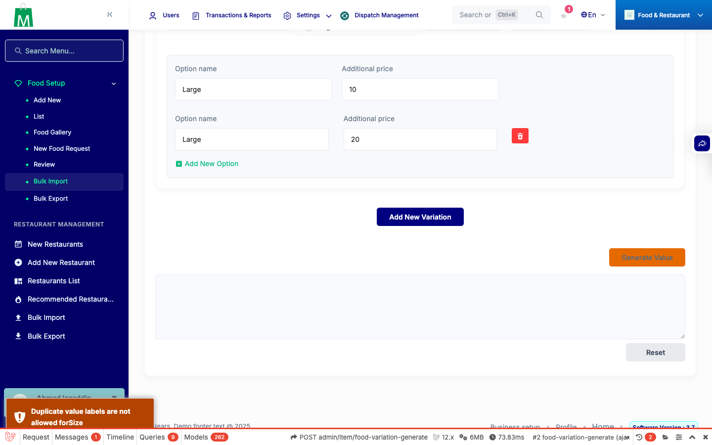
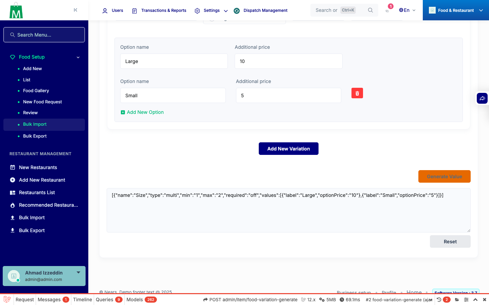
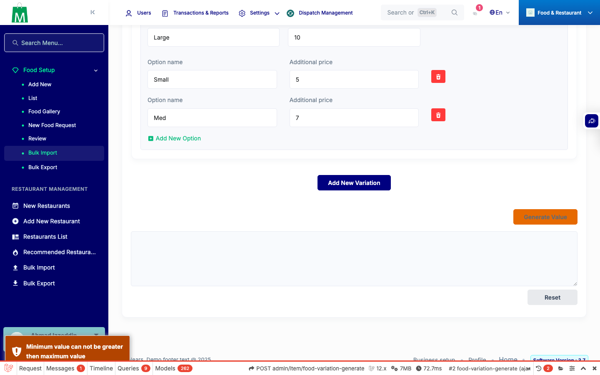
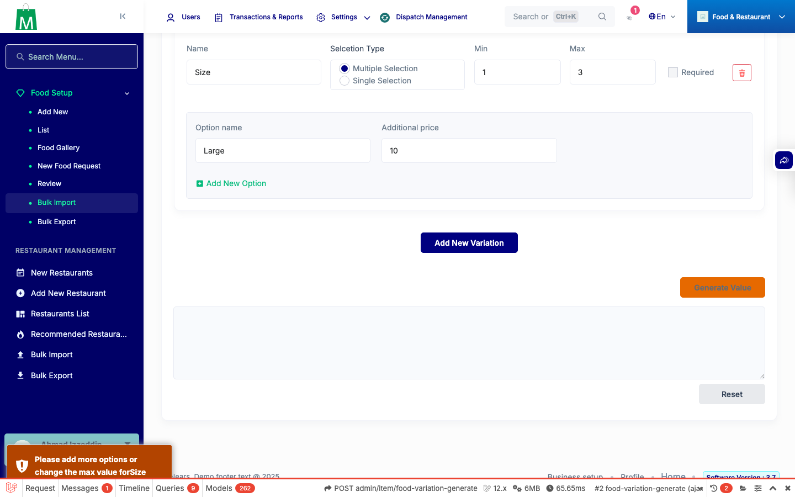
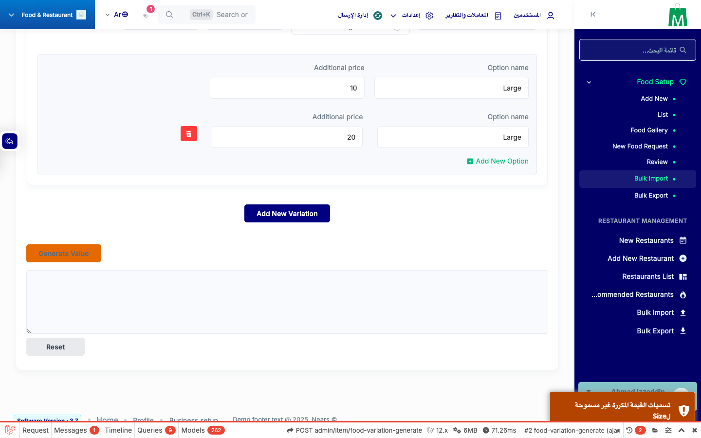
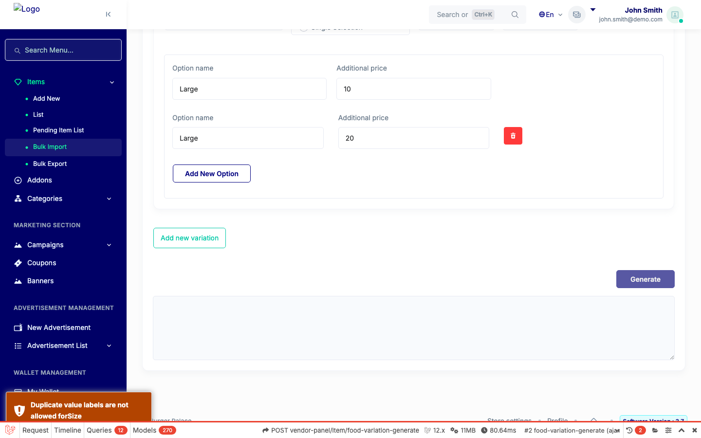
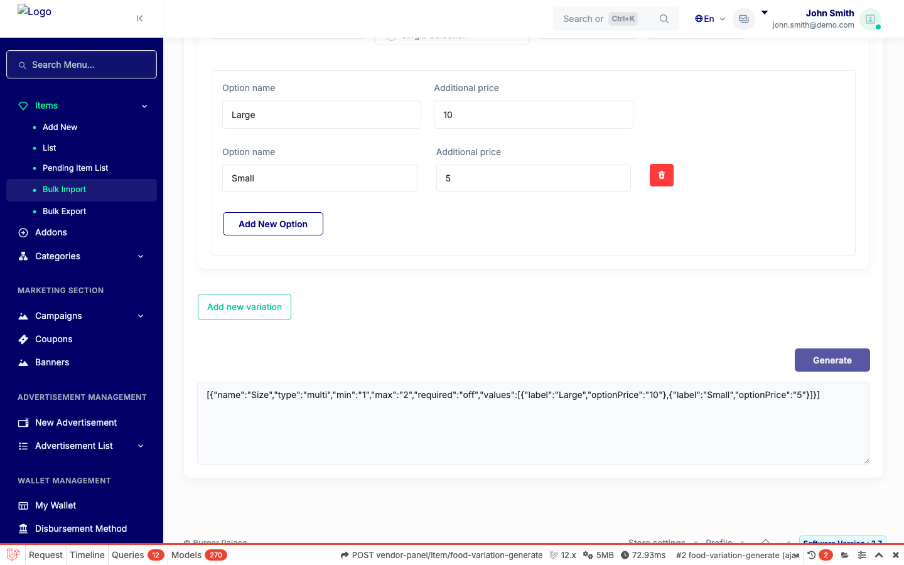
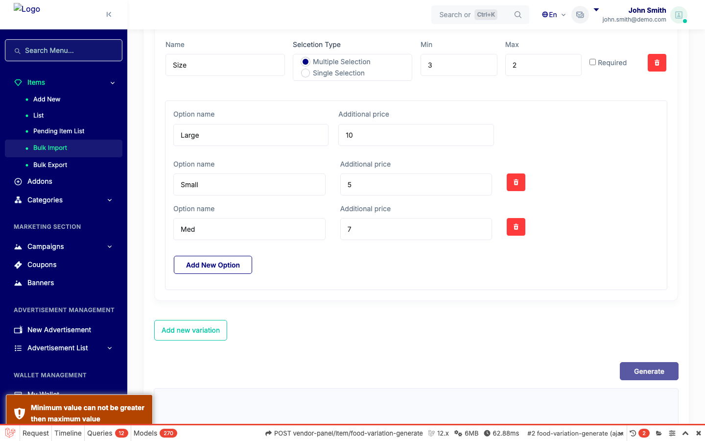
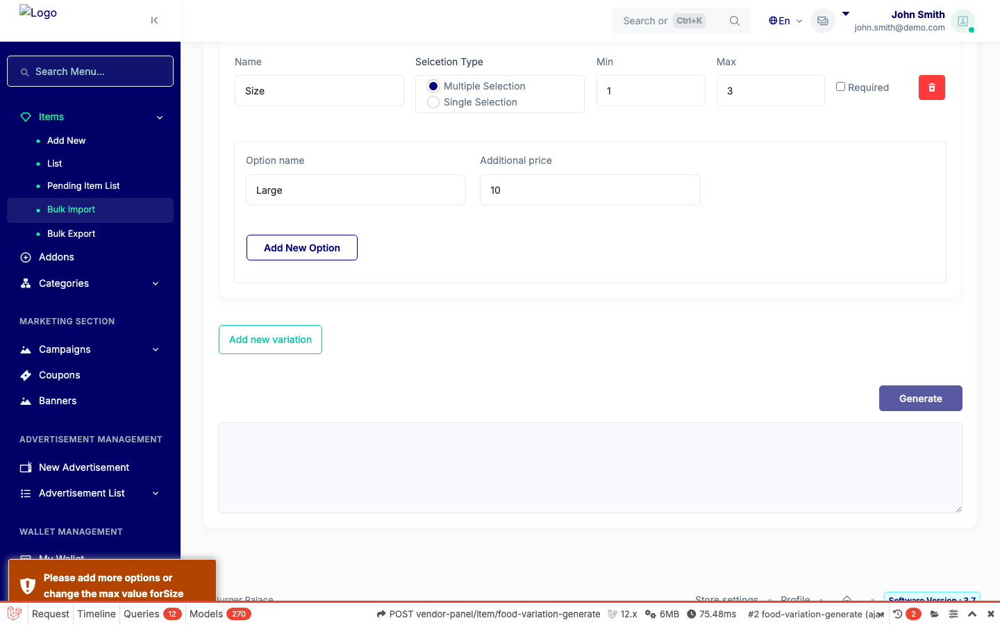

# QA Evidence — NEARS-1598

**PASS — NEARS-1598 duplicate variation label: AC1 verified live on admin+vendor bulk-import (EN+AR), AC2/3/4 demonstrated read-only on the live money path + 14/14 tests**

**9 screenshot(s).** Click any thumbnail for full resolution.

<table>
<tr>
<td align="center" width="33%"> admin A1 duplicate label rejected</td>
<td align="center" width="33%"> admin A2 distinct labels generate</td>
<td align="center" width="33%"> admin A3 min gt max</td>
</tr>
<tr>
<td align="center" width="33%"> admin A4 max gt count</td>
<td align="center" width="33%"> admin A8 arabic duplicate label</td>
<td align="center" width="33%"> vendor V1 duplicate label rejected</td>
</tr>
<tr>
<td align="center" width="33%"> vendor V2 distinct labels generate</td>
<td align="center" width="33%"> vendor V3 min gt max</td>
<td align="center" width="33%"> vendor V4 max gt count</td>
</tr>
</table>

### Other artifacts
- [`generator-cases-admin.json`](generator-cases-admin.json)
- [`generator-cases-vendor.json`](generator-cases-vendor.json)
- [`money-path-probe.log`](money-path-probe.log)

---
*From `nears/docs/qa-evidence/NEARS-1598/` · public-repo scrub policy (no live secrets; verified clean).*
