# QA Evidence — NEARS-1600

**NFilterChip shrink-wraps in a Wrap — AC1/AC3/AC4 live evidence**

**16 screenshot(s).** Click any thumbnail for full resolution.

<table>
<tr>
<td align="center" width="33%"><a href="ac1-add-address-label-as-chips.png">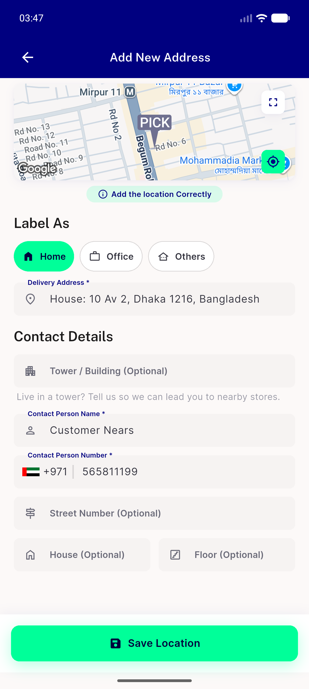</a> ac1 add address label as chips</td>
<td align="center" width="33%"><a href="ac3-cart-substitution-chips.png">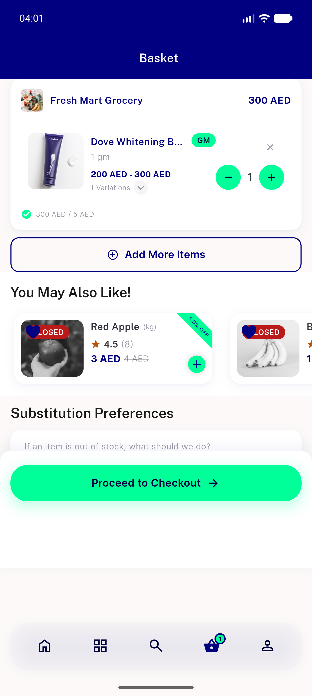</a> ac3 cart substitution chips</td>
<td align="center" width="33%"><a href="ac3-category-subcategory-rail.png">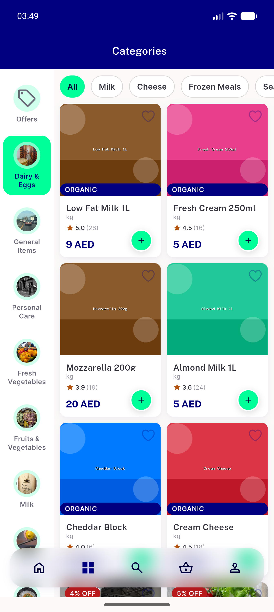</a> ac3 category subcategory rail</td>
</tr>
<tr>
<td align="center" width="33%"> ac3 checkout coupon rail</td>
<td align="center" width="33%"> ac3 checkout timeslot change chip</td>
<td align="center" width="33%"><a href="ac3-global-search-recent-chips-onremove.png">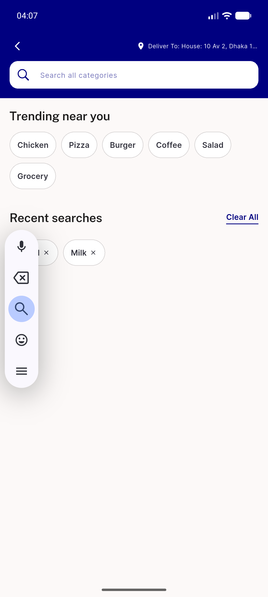</a> ac3 global search recent chips onremove</td>
</tr>
<tr>
<td align="center" width="33%"><a href="ac3-home-store-filter-rail.png">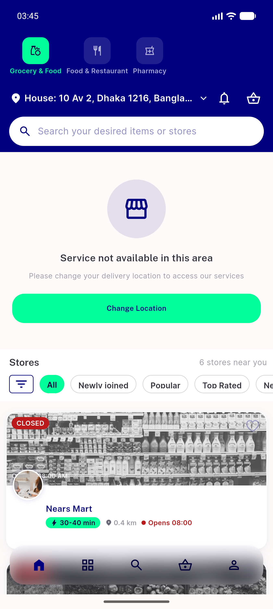</a> ac3 home store filter rail</td>
<td align="center" width="33%"><a href="ac3-search-recent-chips-overflow-ellipsize.png">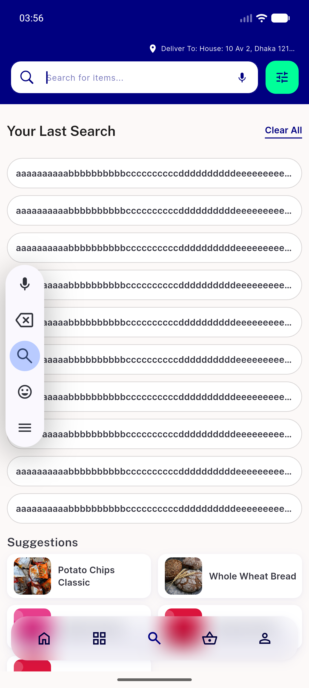</a> ac3 search recent chips overflow ellipsize</td>
<td align="center" width="33%"><a href="ac3-store-category-rail-offers-chip.png">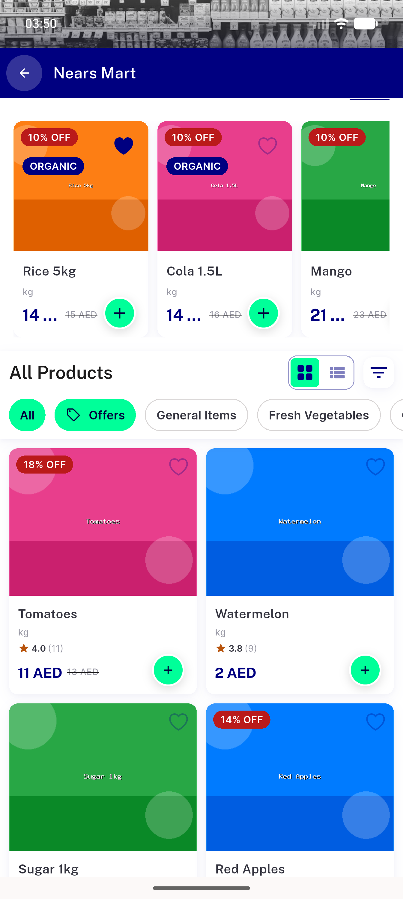</a> ac3 store category rail offers chip</td>
</tr>
<tr>
<td align="center" width="33%"><a href="ac3-store-item-search-chip-row.png">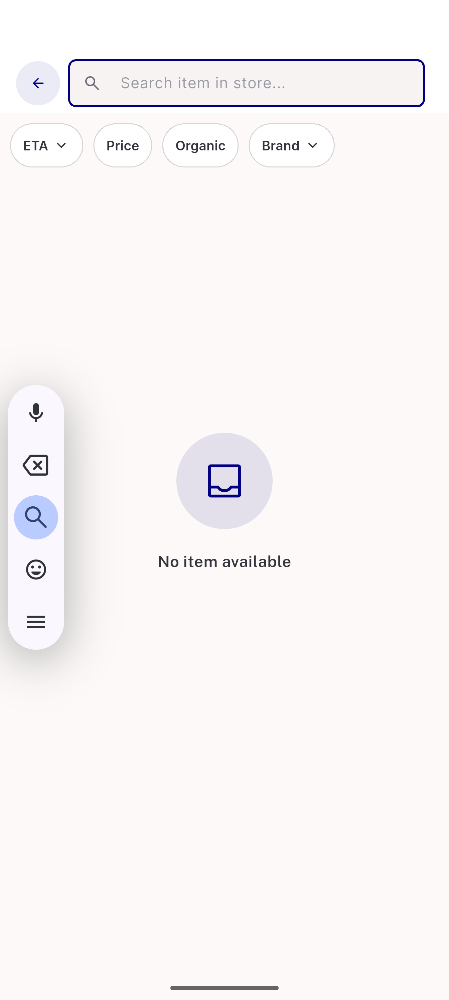</a> ac3 store item search chip row</td>
<td align="center" width="33%"><a href="ac3-store-offers-chip-selected.png">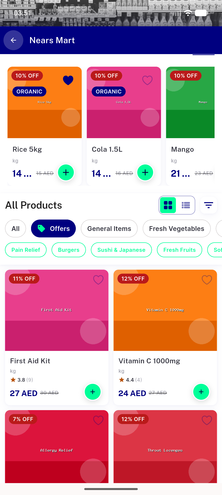</a> ac3 store offers chip selected</td>
<td align="center" width="33%"><a href="ac4-item-sheet-chips-selected.png">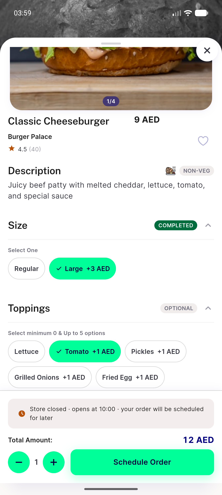</a> ac4 item sheet chips selected</td>
</tr>
<tr>
<td align="center" width="33%"><a href="ac4-item-sheet-choiceoptions-chips.png">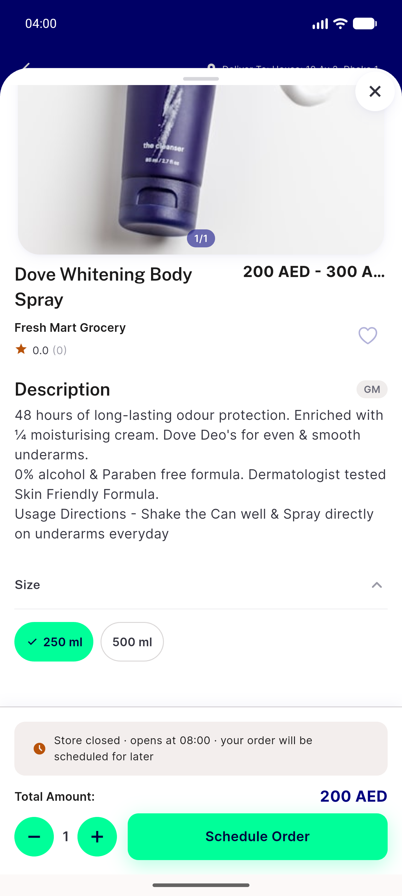</a> ac4 item sheet choiceoptions chips</td>
<td align="center" width="33%"><a href="ac4-item-sheet-newvariationview-chips.png">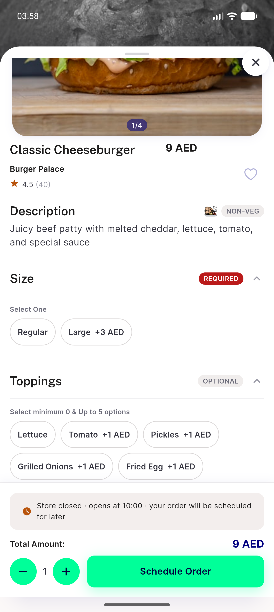</a> ac4 item sheet newvariationview chips</td>
<td align="center" width="33%"> rtl search recent chips arabic</td>
</tr>
<tr>
<td align="center" width="33%"><a href="rtl-store-category-rail-arabic.png">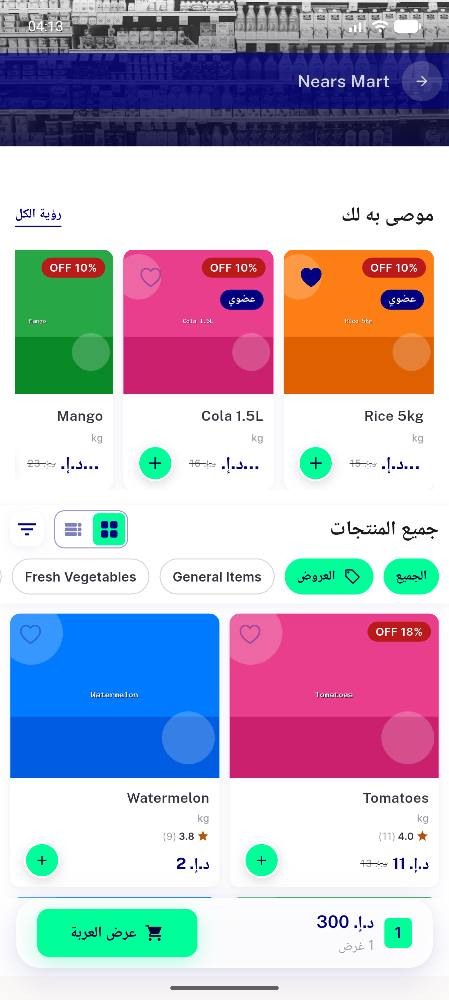</a> rtl store category rail arabic</td>
</tr>
</table>

### Other artifacts
- [`post`](post)
- [`pre`](pre)

---
*From `nears/docs/qa-evidence/NEARS-1600/` · public-repo scrub policy (no live secrets; verified clean).*
