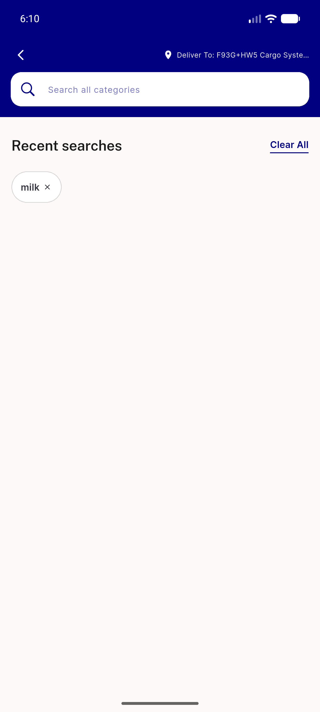
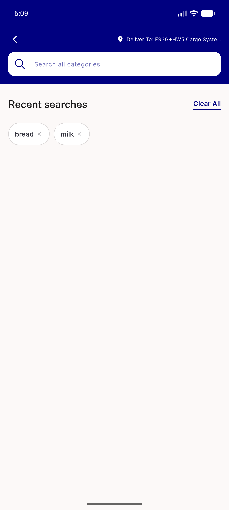

# QA Evidence — NEARS-1601

**Delta re-QA c2d6c091 PASS — focus stops 12 -> 6**

**4 screenshot(s).** Click any thumbnail for full resolution.

<table>
<tr>
<td align="center" width="33%"> ac5 globalsearch after remove</td>
<td align="center" width="33%"> ac5 globalsearch before remove</td>
<td align="center" width="33%"> ac5 search history chips postfix</td>
</tr>
<tr>
<td align="center" width="33%"> delta offers chip rail c2d6c091</td>
</tr>
</table>

### Other artifacts
- [`bug-store-screen-double-announce.log`](bug-store-screen-double-announce.log)
- [`delta-fixcycle1-c2d6c091.md`](delta-fixcycle1-c2d6c091.md)
- [`progress.md`](progress.md)

---
*From `nears/docs/qa-evidence/NEARS-1601/` · public-repo scrub policy (no live secrets; verified clean).*
