# QA Evidence — NEARS-1603

**PASS — NErrorRetry promotion: 5/5 gating ACs demonstrated live on emulator-5560 (411x891dp); adapter path pixel-identical to base**

**17 screenshot(s).** Click any thumbnail for full resolution.

<table>
<tr>
<td align="center" width="33%"><a href="00-home-launch.png">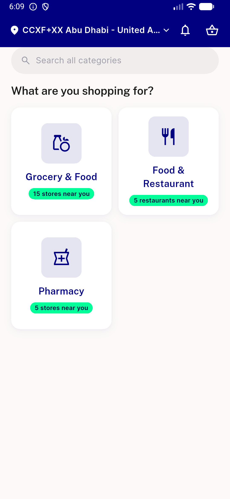</a> home launch</td>
<td align="center" width="33%"><a href="ac-a-store-generic-offline-en.png">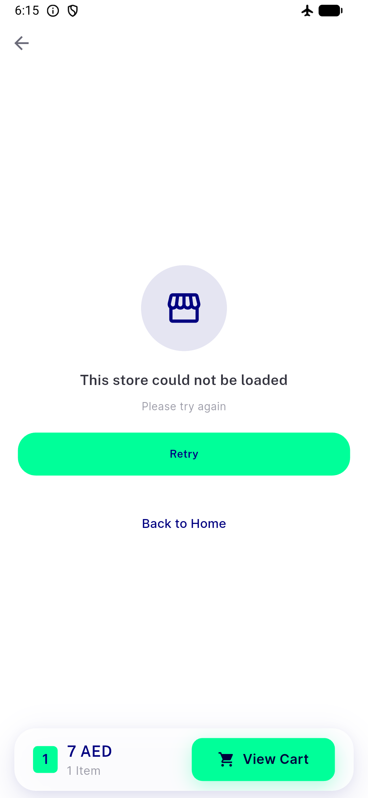</a> ac a store generic offline en</td>
<td align="center" width="33%"><a href="ac-a2-real-store-generic-offline.png">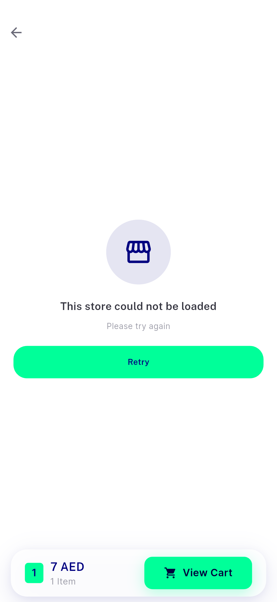</a> ac a2 real store generic offline</td>
</tr>
<tr>
<td align="center" width="33%"><a href="ac-b-store-not-found-en.png">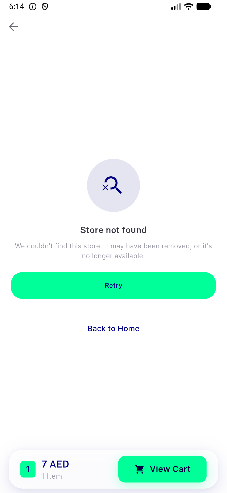</a> ac b store not found en</td>
<td align="center" width="33%"><a href="ac-c-retry-recovered-store.png">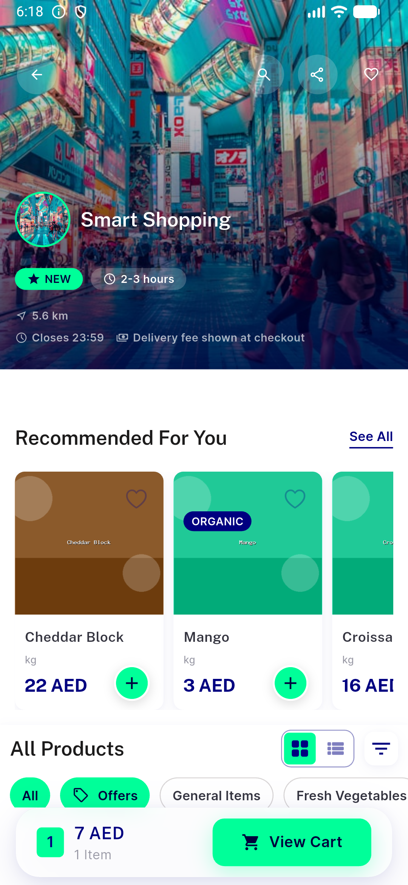</a> ac c retry recovered store</td>
<td align="center" width="33%"> ac d1 notification error BASE</td>
</tr>
<tr>
<td align="center" width="33%"><a href="ac-d1-notification-error-HEAD.png">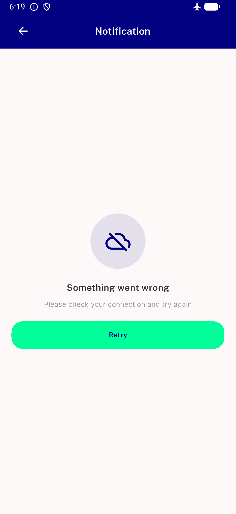</a> ac d1 notification error HEAD</td>
<td align="center" width="33%"><a href="ac-d2-coupon-error-HEAD.png">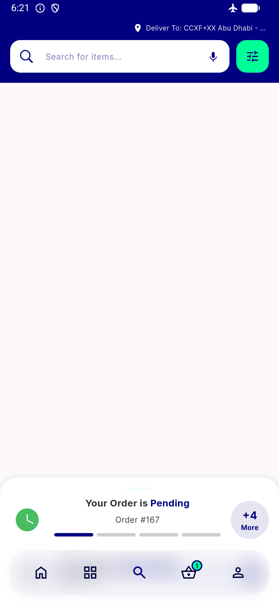</a> ac d2 coupon error HEAD</td>
<td align="center" width="33%"> ac d2 loyalty history error BASE</td>
</tr>
<tr>
<td align="center" width="33%"><a href="ac-d2-loyalty-history-error-HEAD.png">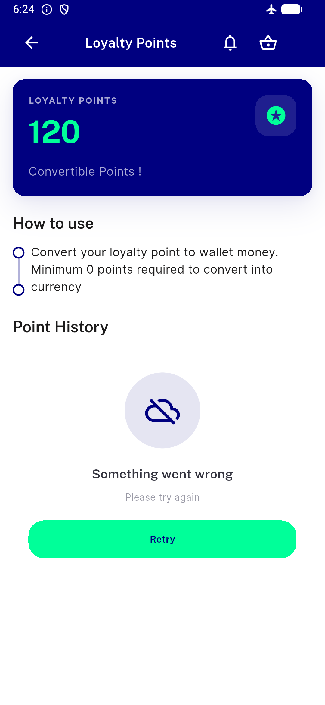</a> ac d2 loyalty history error HEAD</td>
<td align="center" width="33%"><a href="ac-e1-store-not-found-ar.png">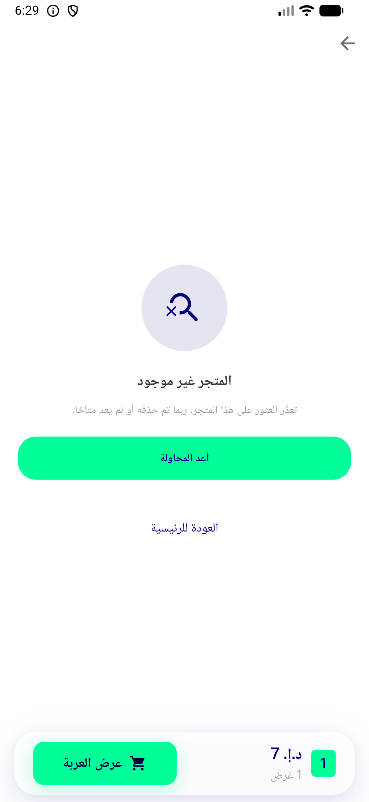</a> ac e1 store not found ar</td>
<td align="center" width="33%"><a href="ac-e2-store-generic-ar.png">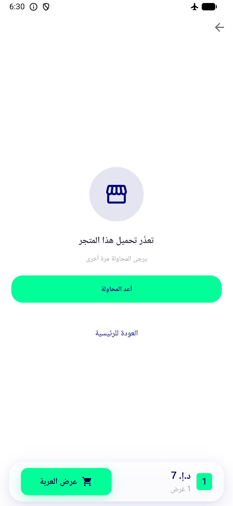</a> ac e2 store generic ar</td>
</tr>
<tr>
<td align="center" width="33%"><a href="ac-f-wb-connectivity.png">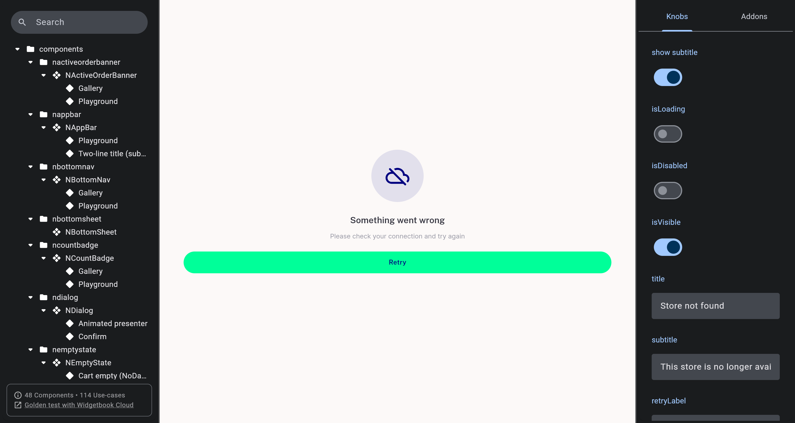</a> ac f wb connectivity</td>
<td align="center" width="33%"><a href="ac-f-wb-knob-url-toggle-INCONCLUSIVE.png">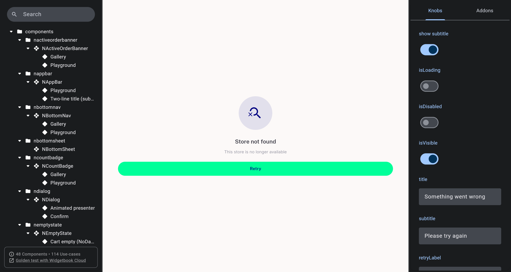</a> ac f wb knob url toggle INCONCLUSIVE</td>
<td align="center" width="33%"> ac f wb notfound</td>
</tr>
<tr>
<td align="center" width="33%"><a href="ac-f-wb-server.png">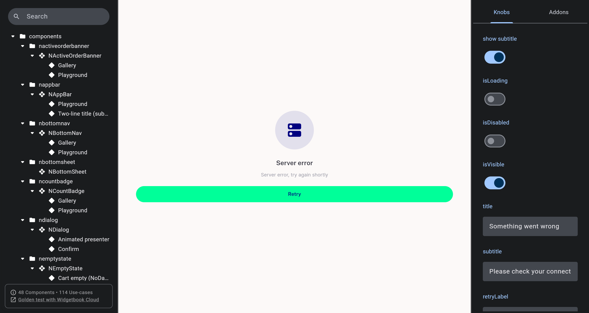</a> ac f wb server</td>
<td align="center" width="33%"><a href="ac-f-wb-unknown.png">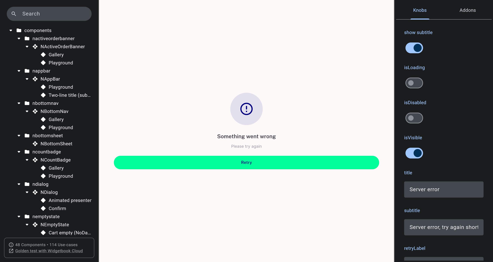</a> ac f wb unknown</td>
</tr>
</table>

### Other artifacts
- [`bug-cold-deeplink-config-race-redscreen.log`](bug-cold-deeplink-config-race-redscreen.log)

---
*From `nears/docs/qa-evidence/NEARS-1603/` · public-repo scrub policy (no live secrets; verified clean).*
