# QA Evidence — NEARS-1607

**PASS (8/8 ACs) - splash onto DLS + silent location prefetch; 3 pre-existing regression bugs filed separately**

**21 screenshot(s).** Click any thumbnail for full resolution.

<table>
<tr>
<td align="center" width="33%"><a href="ac1-splash-loading-en.png">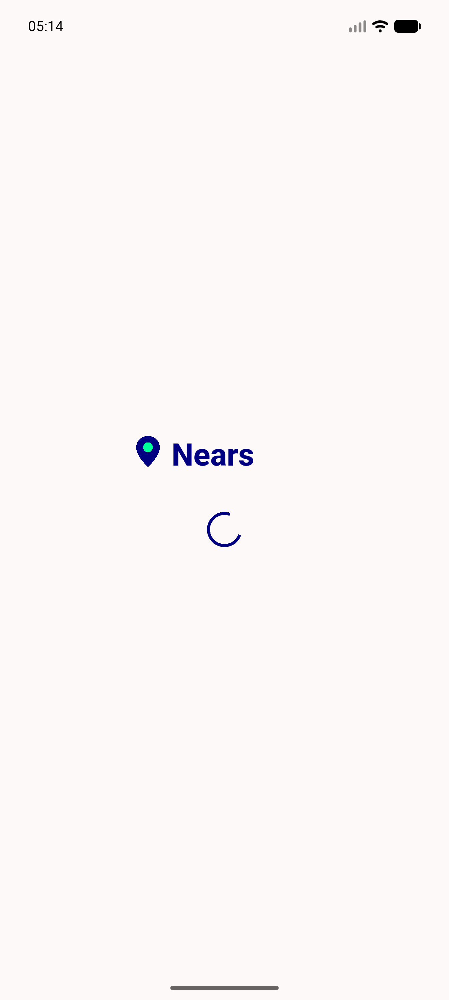</a> ac1 splash loading en</td>
<td align="center" width="33%"> ac3 toast error no connection</td>
<td align="center" width="33%"> ac3 toast success connected</td>
</tr>
<tr>
<td align="center" width="33%"><a href="ac3-toasts-both-branches.png">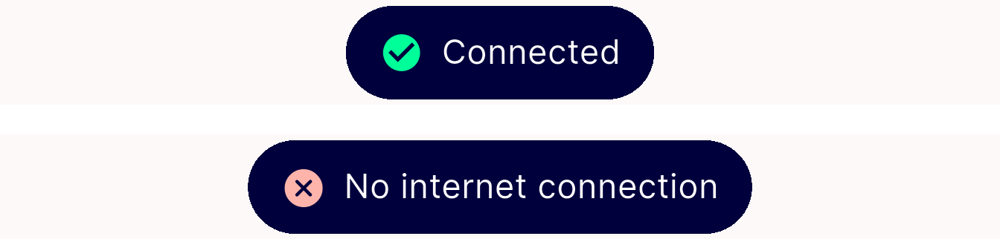</a> ac3 toasts both branches</td>
<td align="center" width="33%"><a href="ac5a-03-location-gate.png">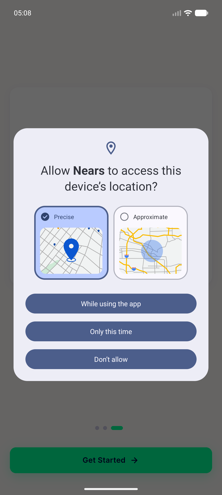</a> ac5a 03 location gate</td>
<td align="center" width="33%"><a href="ac5a-destination-ar.png">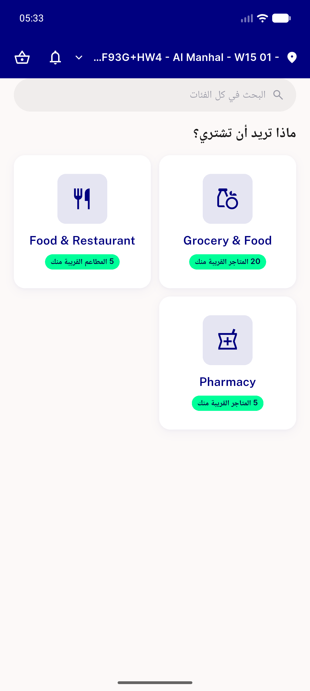</a> ac5a destination ar</td>
</tr>
<tr>
<td align="center" width="33%"><a href="ac5a-location-gate-ar.png">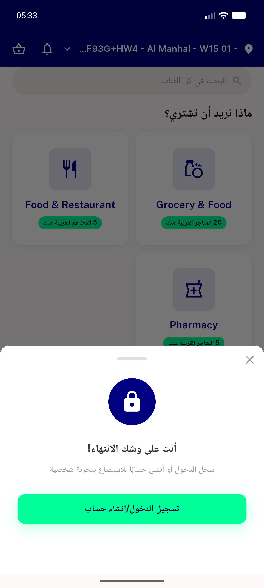</a> ac5a location gate ar</td>
<td align="center" width="33%"><a href="ac5a-location-gate-no-saved-address.png">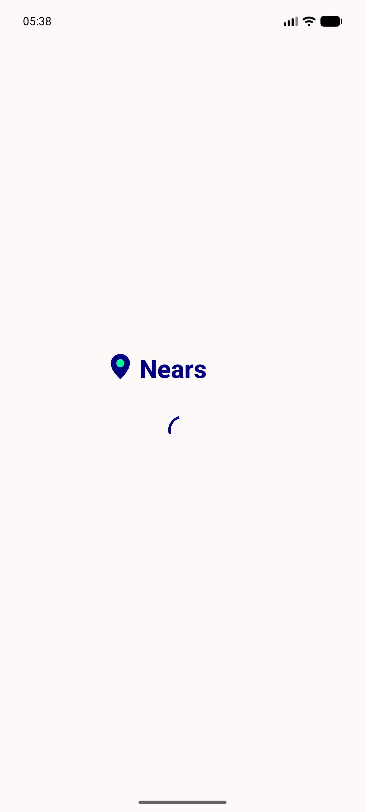</a> ac5a location gate no saved address</td>
<td align="center" width="33%"><a href="ac5b-dashboard-saved-address.png">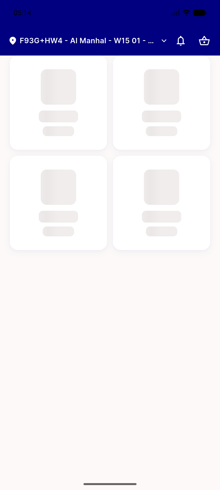</a> ac5b dashboard saved address</td>
</tr>
<tr>
<td align="center" width="33%"><a href="ac5c-01-language.png">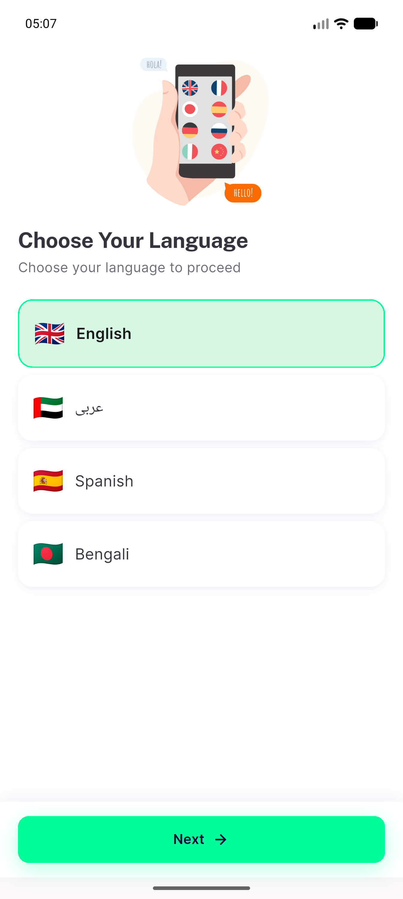</a> ac5c 01 language</td>
<td align="center" width="33%"><a href="ac5c-02-onboarding.png">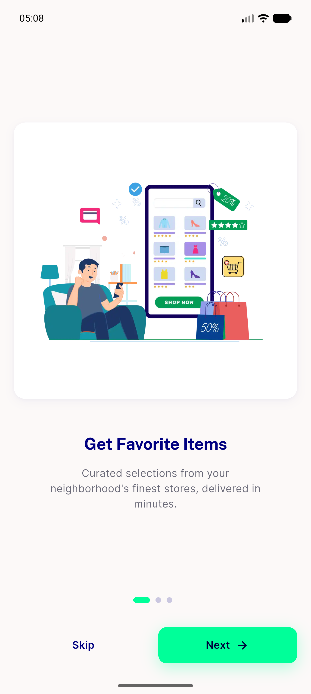</a> ac5c 02 onboarding</td>
<td align="center" width="33%"><a href="ac6-location-services-off.png">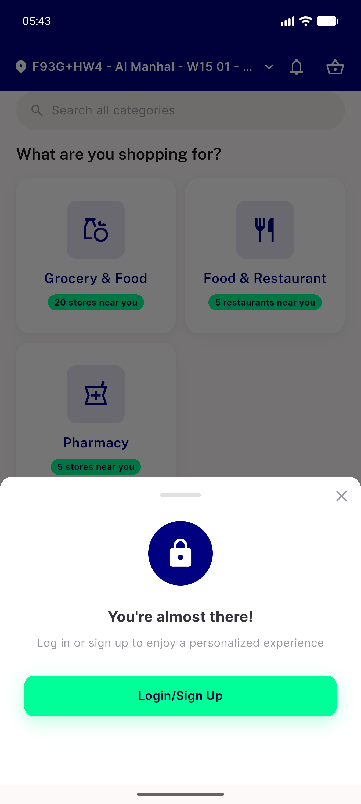</a> ac6 location services off</td>
</tr>
<tr>
<td align="center" width="33%"><a href="ac7-config-failure-nointernet.png">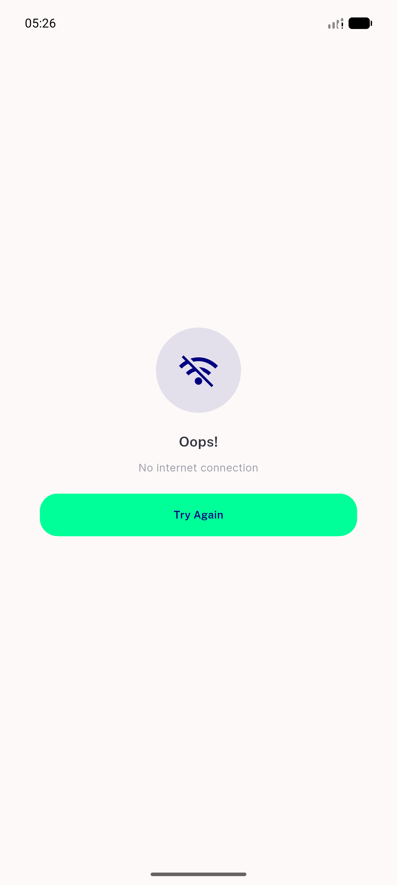</a> ac7 config failure nointernet</td>
<td align="center" width="33%"><a href="ac8-splash-loading-ar.png">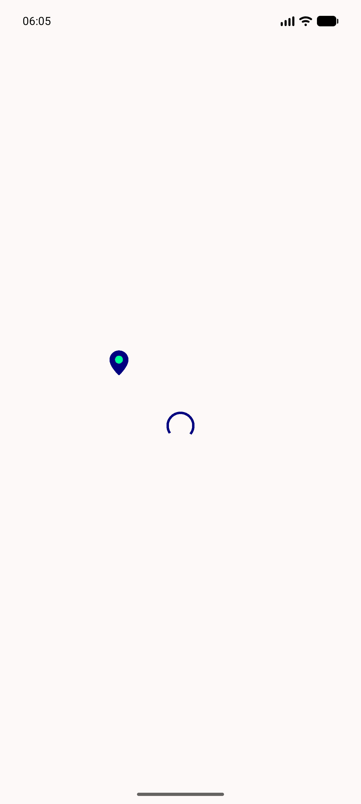</a> ac8 splash loading ar</td>
<td align="center" width="33%"><a href="ac8-toasts-arabic-both-branches.png">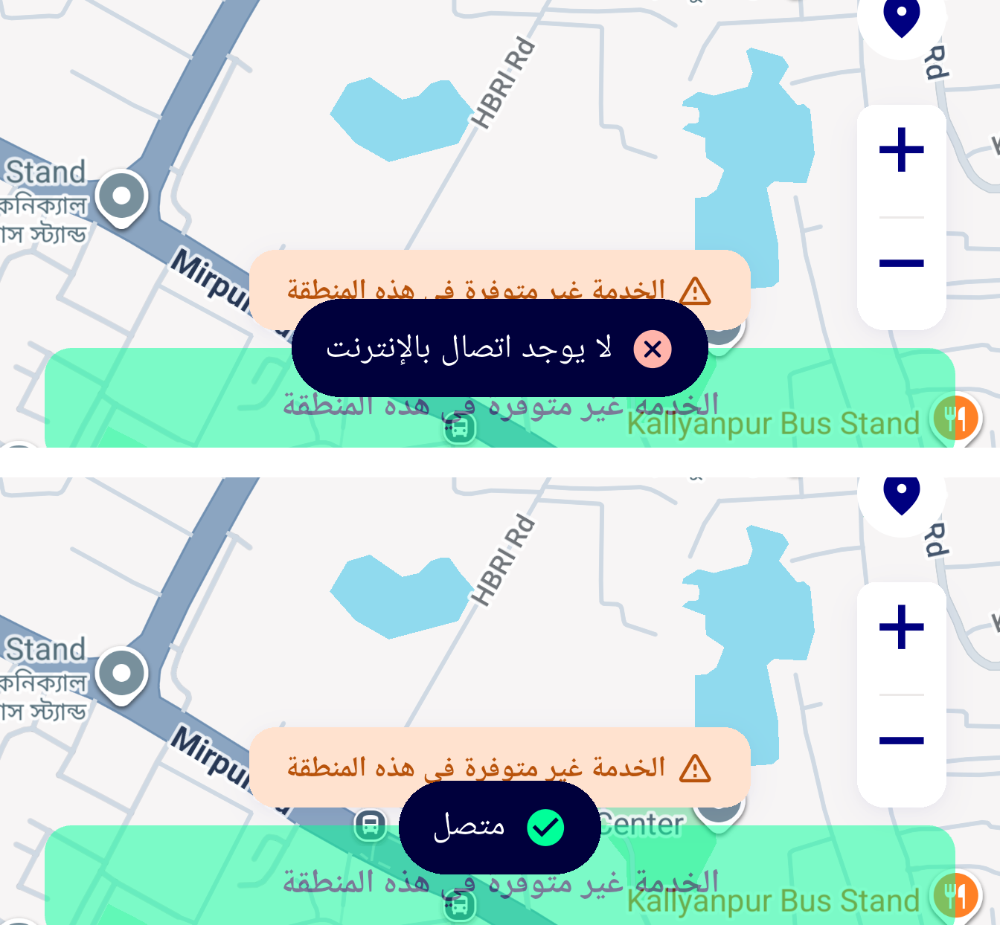</a> ac8 toasts arabic both branches</td>
</tr>
<tr>
<td align="center" width="33%"><a href="base-control-no-address-perm-revoked.png">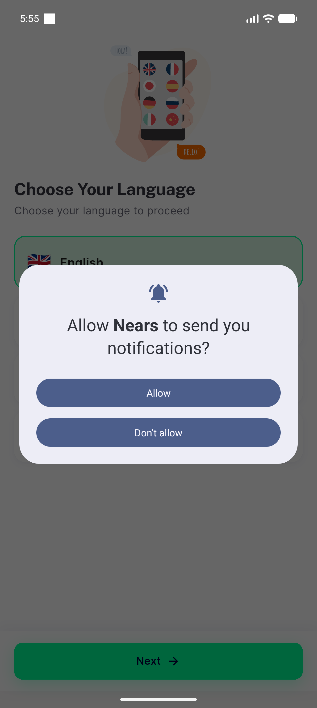</a> base control no address perm revoked</td>
<td align="center" width="33%"><a href="base-control-splash-ar.png">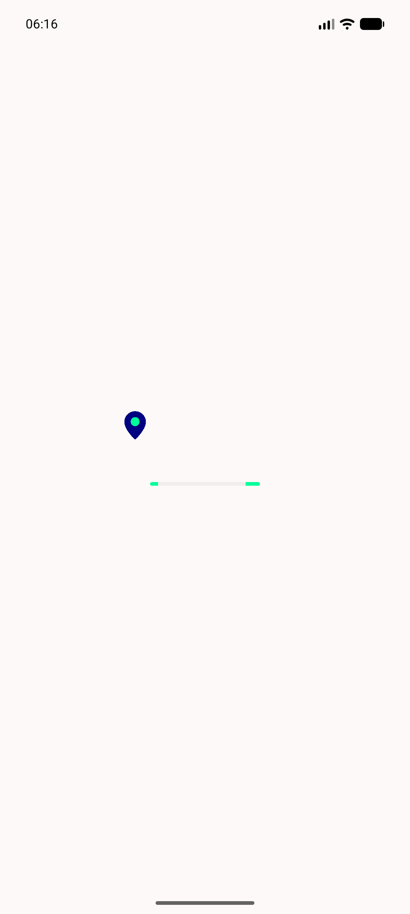</a> base control splash ar</td>
<td align="center" width="33%"><a href="bug-arabic-lockup-missing-wordmark.png">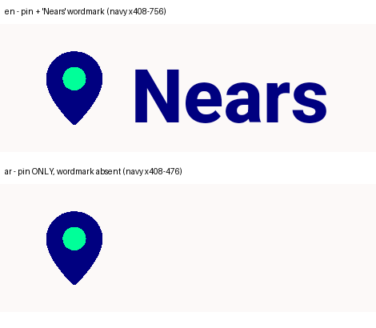</a> bug arabic lockup missing wordmark</td>
</tr>
<tr>
<td align="center" width="33%"><a href="bug-legacy-launch-window-branding.png">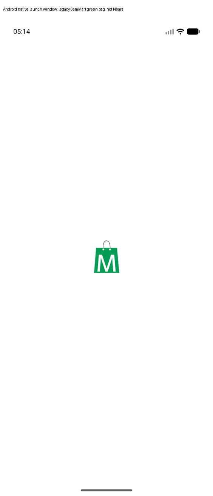</a> bug legacy launch window branding</td>
<td align="center" width="33%"><a href="bug-splash-stall-no-address-perm-revoked.png">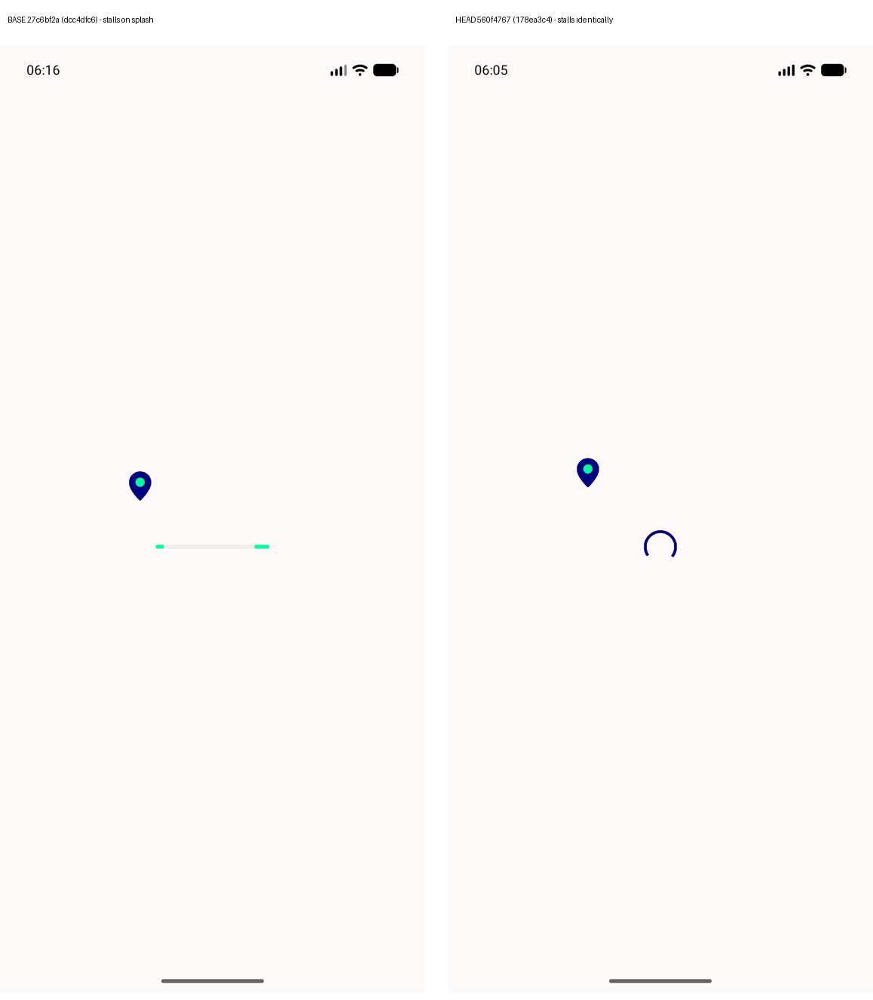</a> bug splash stall no address perm revoked</td>
<td align="center" width="33%"> os permission dialog from location gate</td>
</tr>
</table>

### Other artifacts
- [`bug-arabic-lockup-missing-wordmark.log`](bug-arabic-lockup-missing-wordmark.log)
- [`bug-legacy-launch-window-branding.log`](bug-legacy-launch-window-branding.log)
- [`bug-splash-stall-no-address-perm-revoked.log`](bug-splash-stall-no-address-perm-revoked.log)
- [`progress.md`](progress.md)

---
*From `nears/docs/qa-evidence/NEARS-1607/` · public-repo scrub policy (no live secrets; verified clean).*
