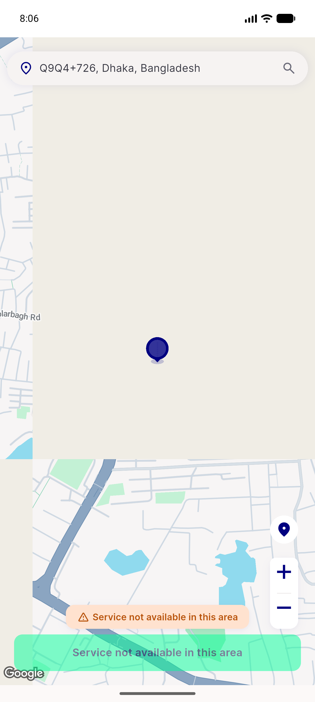
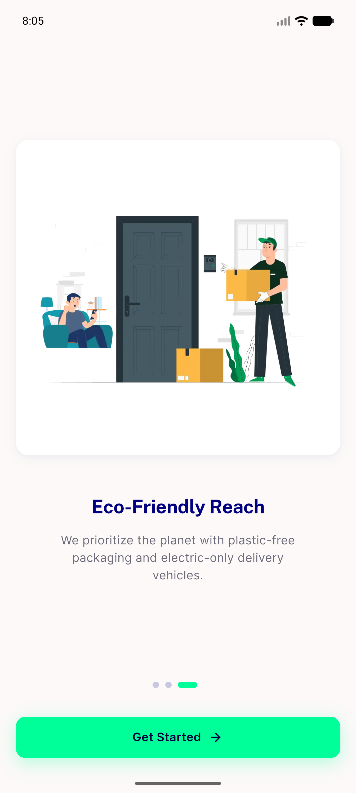
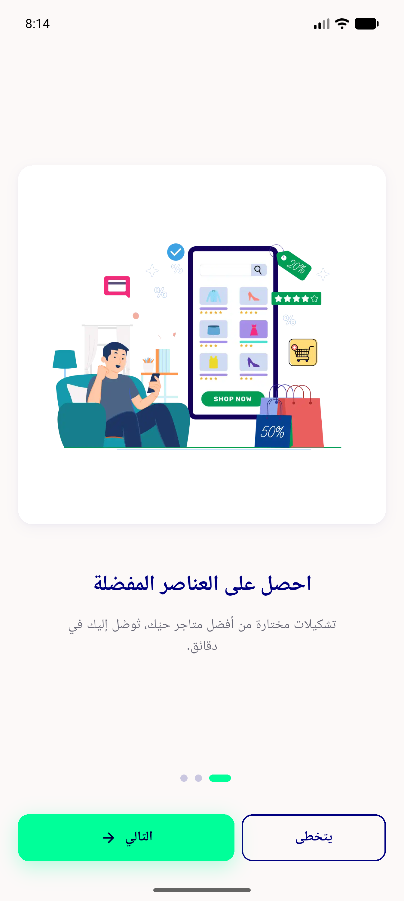
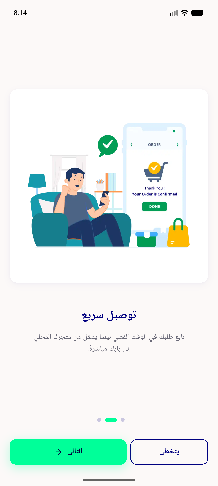
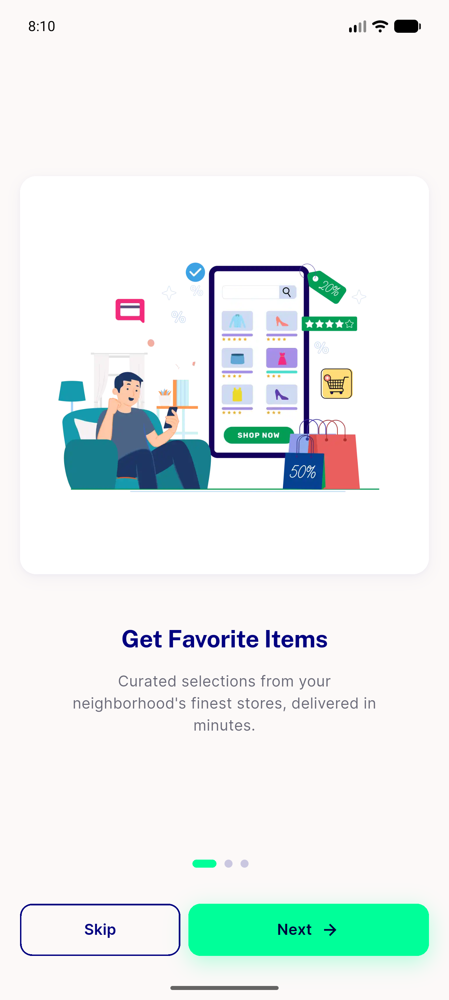
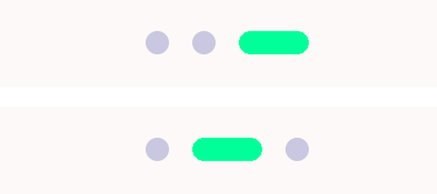
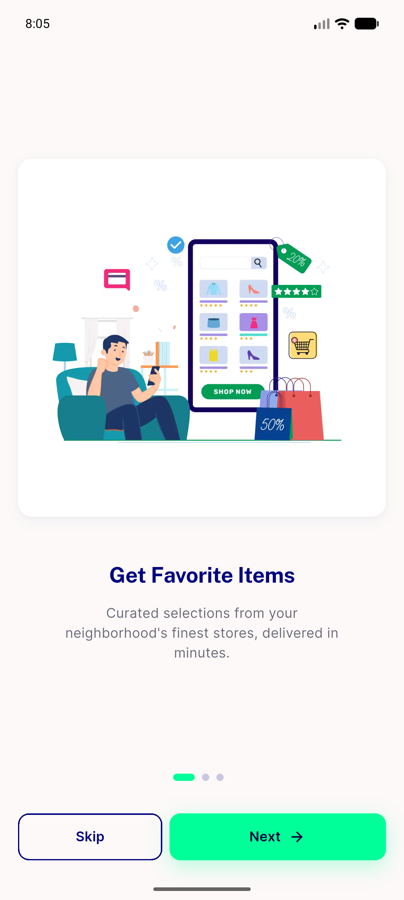
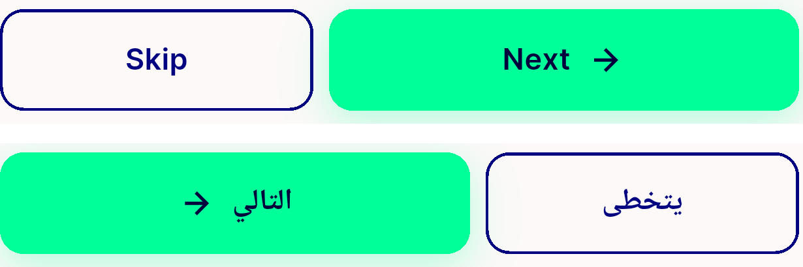

# QA Evidence — NEARS-1608

**PASS — onboarding carousel on DLS; AC2 six routing flows + AC6 RTL demonstrated live on emulator-5558**

**10 screenshot(s).** Click any thumbnail for full resolution.

<table>
<tr>
<td align="center" width="33%"> ac2 getstarted address present initialroute</td>
<td align="center" width="33%"> ac2 locationgate address absent</td>
<td align="center" width="33%"> ac2 slide3 get started EN</td>
</tr>
<tr>
<td align="center" width="33%"> ac6 AR slide1</td>
<td align="center" width="33%"> ac6 AR slide2</td>
<td align="center" width="33%"> ac6 EN slide1</td>
</tr>
<tr>
<td align="center" width="33%"> ac6 indicator advances rtl</td>
<td align="center" width="33%"> bug rtl arrow forward no mirror</td>
<td align="center" width="33%"> d2 skip cta row EN slide1</td>
</tr>
<tr>
<td align="center" width="33%"> d2 skip outlined button EN vs AR</td>
</tr>
</table>

---
*From `nears/docs/qa-evidence/NEARS-1608/` · public-repo scrub policy (no live secrets; verified clean).*
