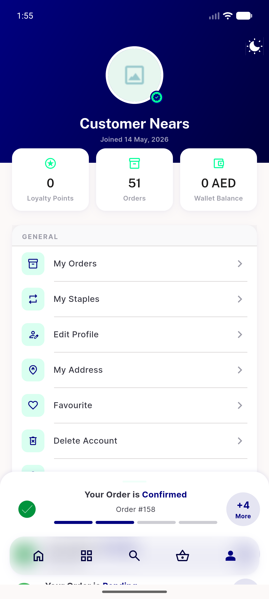
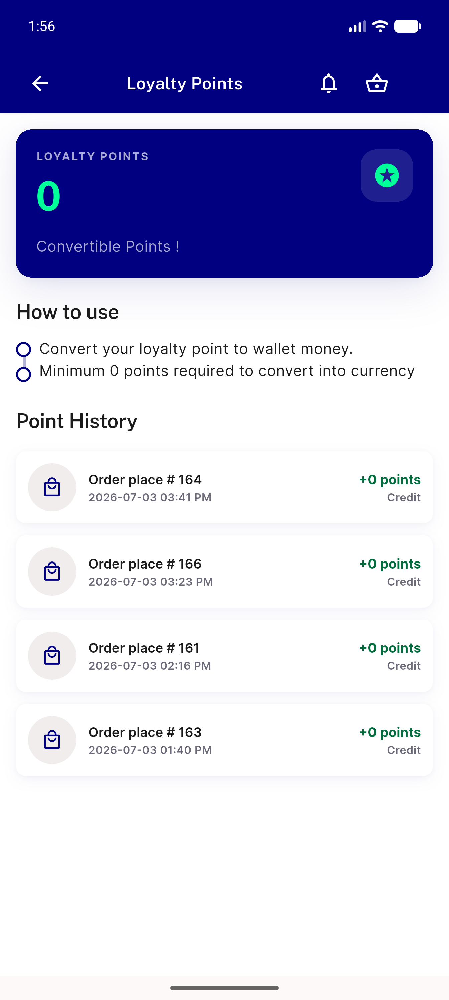
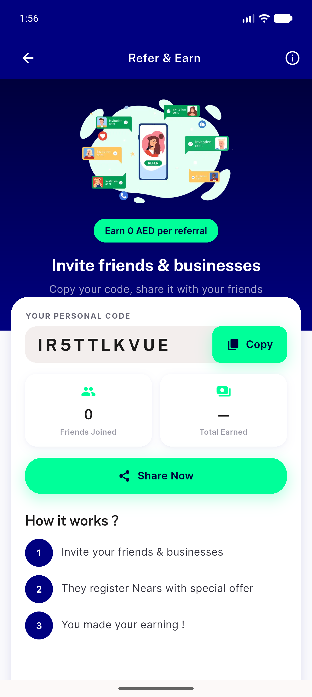
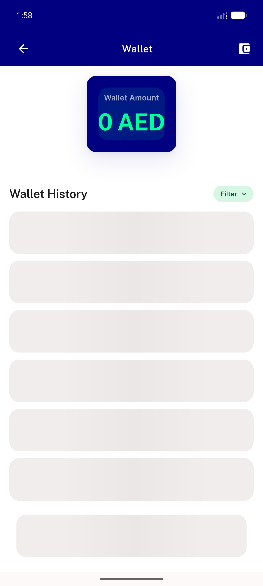
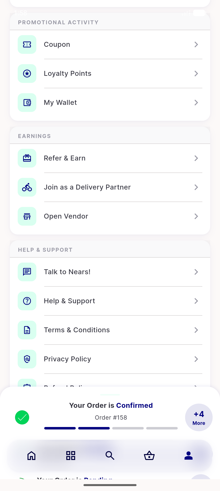
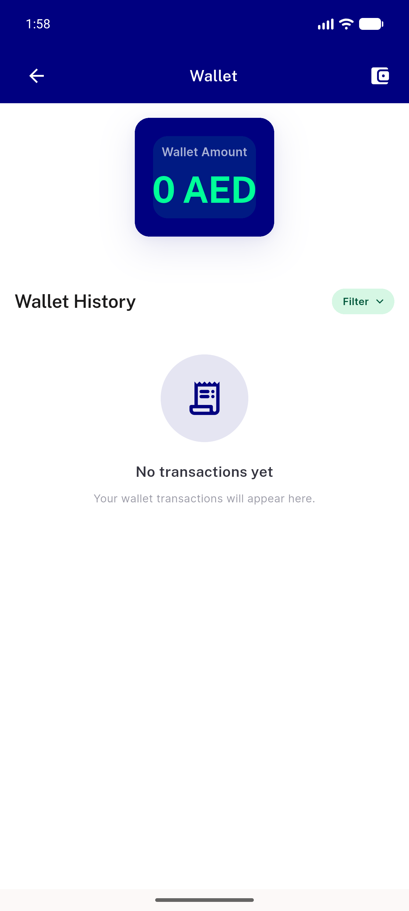
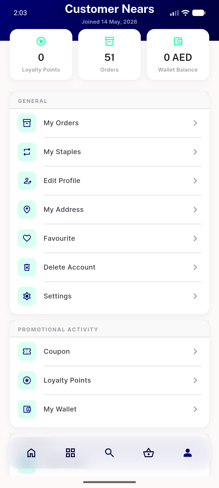

# QA Evidence — NEARS-1609

**PASS — profile load-failure flag + [FAIL] log demonstrated live on emulator-5556; additive-only, 0 regressions**

**8 screenshot(s).** Click any thumbnail for full resolution.

<table>
<tr>
<td align="center" width="33%"> baseline profile network up</td>
<td align="center" width="33%"> baseline wallet</td>
<td align="center" width="33%"> baseline loyalty</td>
</tr>
<tr>
<td align="center" width="33%"> baseline refer</td>
<td align="center" width="33%"> network down wallet</td>
<td align="center" width="33%"> network down profile</td>
</tr>
<tr>
<td align="center" width="33%"> recovered wallet same session</td>
<td align="center" width="33%"> post relogin profile</td>
</tr>
</table>

### Other artifacts
- [`ac4-fail-log-evidence.log`](ac4-fail-log-evidence.log)

---
*From `nears/docs/qa-evidence/NEARS-1609/` · public-repo scrub policy (no live secrets; verified clean).*
