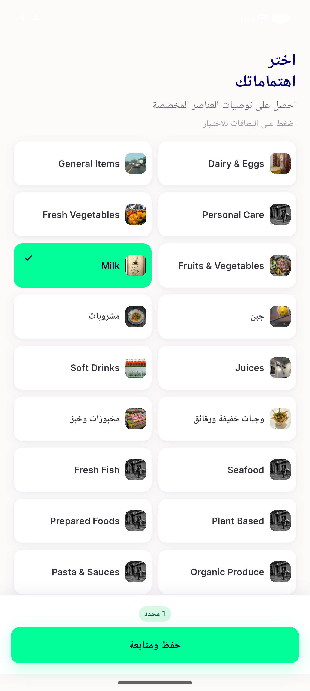

# QA Evidence — NEARS-1610

**delta re-QA: AC6(b) MET (200 + ids [8,47] persisted + routed); update-interest failure re-characterised as INTERMITTENT**

**2 screenshot(s).** Click any thumbnail for full resolution.

<table>
<tr>
<td align="center" width="33%"> ac3 ac4 card badge light en</td>
<td align="center" width="33%"> ac8 rtl arabic grid pill</td>
</tr>
</table>

### Other artifacts
- [`bug-interest-error-state-unreachable.log`](bug-interest-error-state-unreachable.log)
- [`bug-update-interest-post-INTERMITTENT.log`](bug-update-interest-post-INTERMITTENT.log)

---
*From `nears/docs/qa-evidence/NEARS-1610/` · public-repo scrub policy (no live secrets; verified clean).*
