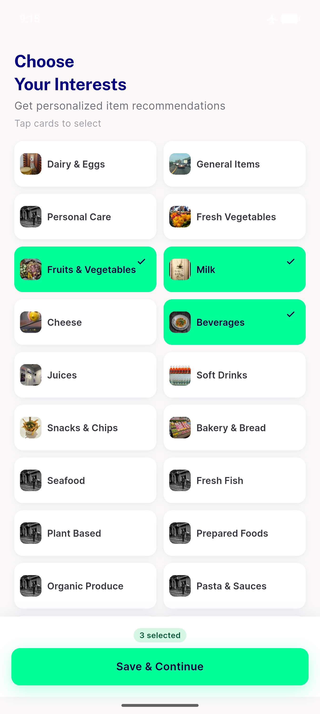
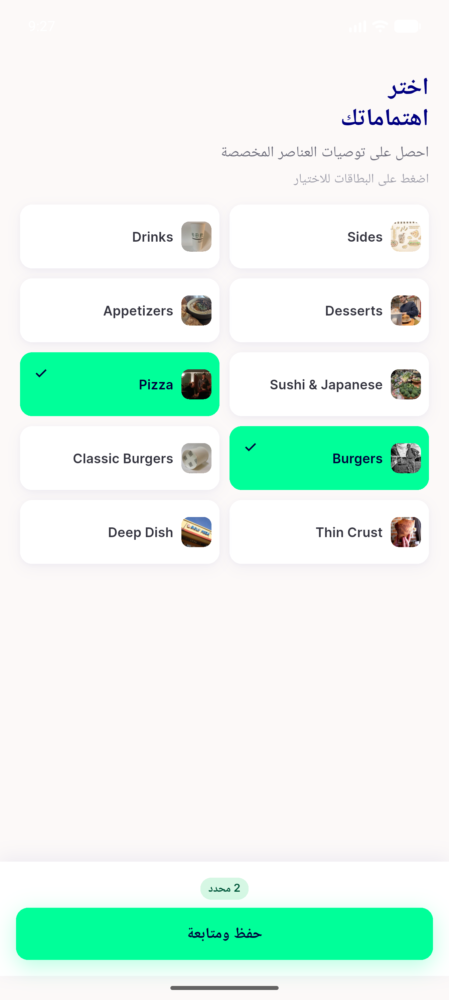

# QA Evidence — NEARS-1610

**FAIL — AC2 error state unreachable via user navigation; AC6/AC8 pass; regression clean**

**3 screenshot(s).** Click any thumbnail for full resolution.

<table>
<tr>
<td align="center" width="33%"> ac2 offline warmcache grid no error</td>
<td align="center" width="33%"> ac4 badge 3 selected en</td>
<td align="center" width="33%"> ac8 rtl arabic grid counter</td>
</tr>
</table>

### Other artifacts
- [`bug-ac2-error-state-unreachable.log`](bug-ac2-error-state-unreachable.log)
- [`bug-coldcache-interest-screen-never-opens.log`](bug-coldcache-interest-screen-never-opens.log)

---
*From `nears/docs/qa-evidence/NEARS-1610/` · public-repo scrub policy (no live secrets; verified clean).*
