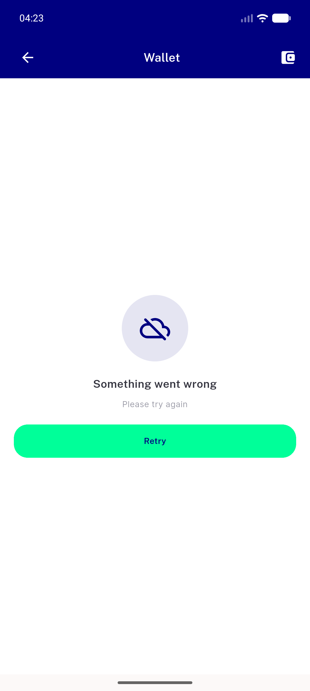
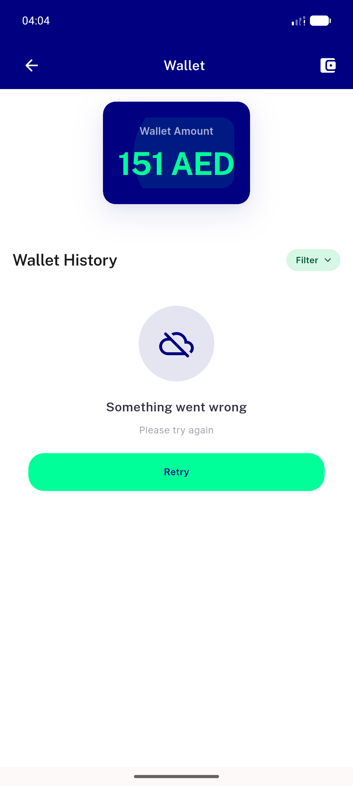
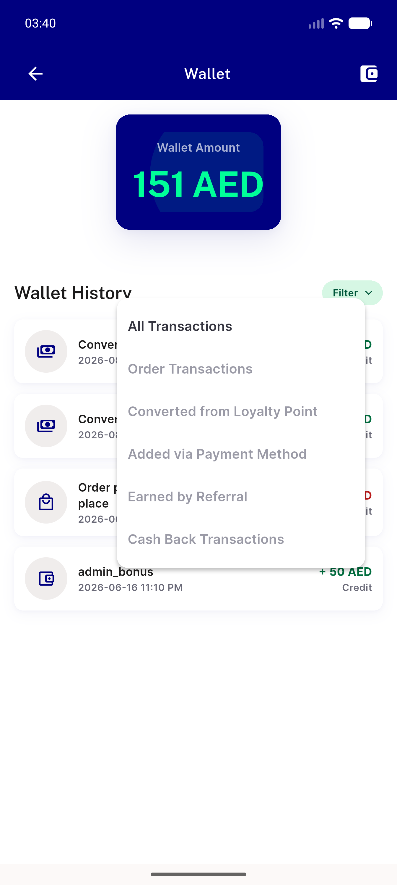
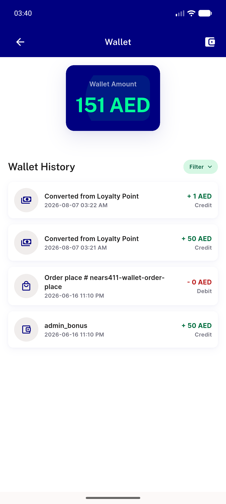
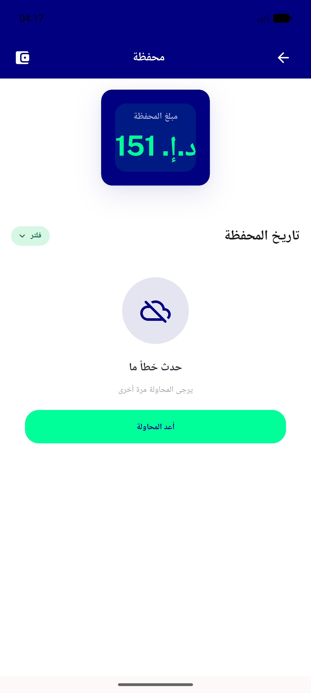

# QA Evidence — NEARS-1611

**FAIL (AC5 unmet-in-part, adjudicated) - 6/7 ACs PASS live on emulator-5554**

**5 screenshot(s).** Click any thumbnail for full resolution.

<table>
<tr>
<td align="center" width="33%"> ac1 screen level error retry</td>
<td align="center" width="33%"> ac3 list level retry offline</td>
<td align="center" width="33%"> ac5 ac7 filter popup delta</td>
</tr>
<tr>
<td align="center" width="33%"> ac5 success path</td>
<td align="center" width="33%"> regression rtl arabic retry</td>
</tr>
</table>

### Other artifacts
- [`ac6-fail-lines.log`](ac6-fail-lines.log)

---
*From `nears/docs/qa-evidence/NEARS-1611/` · public-repo scrub policy (no live secrets; verified clean).*
