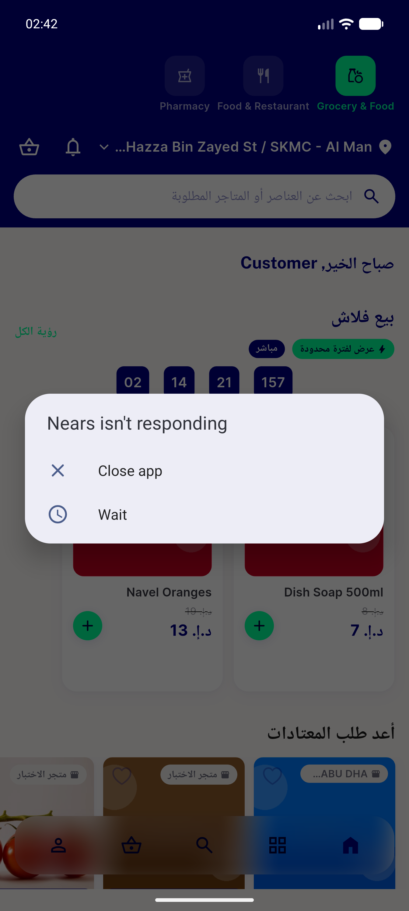
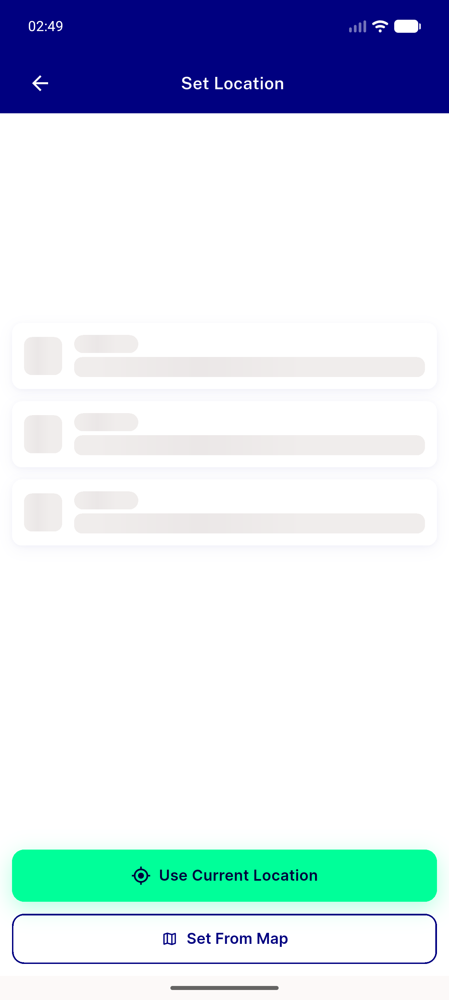
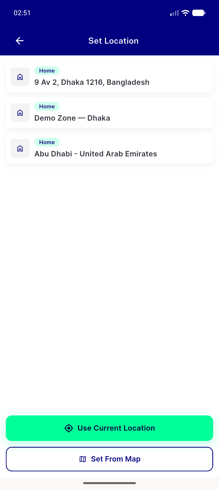
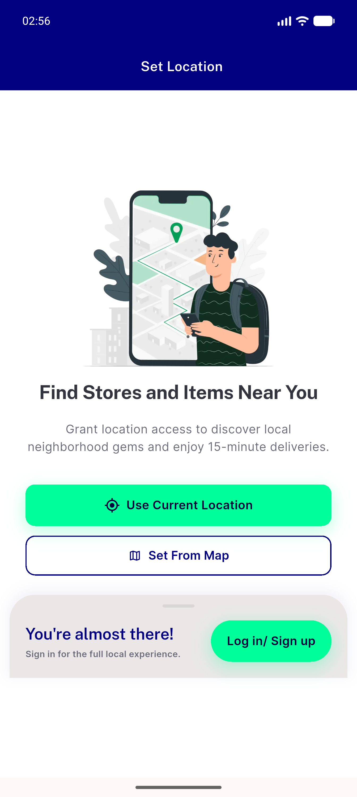
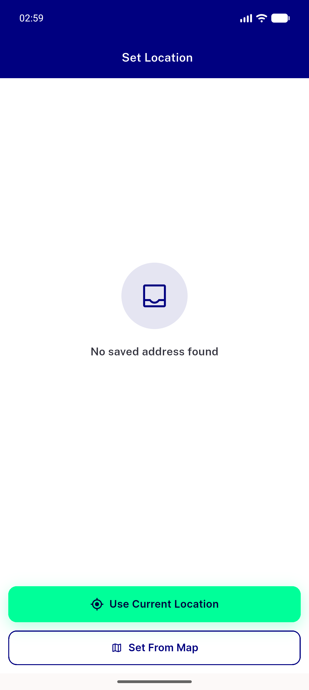
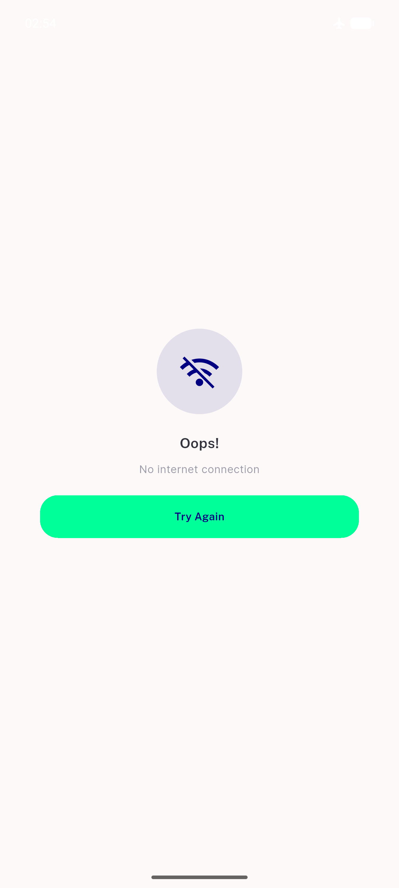
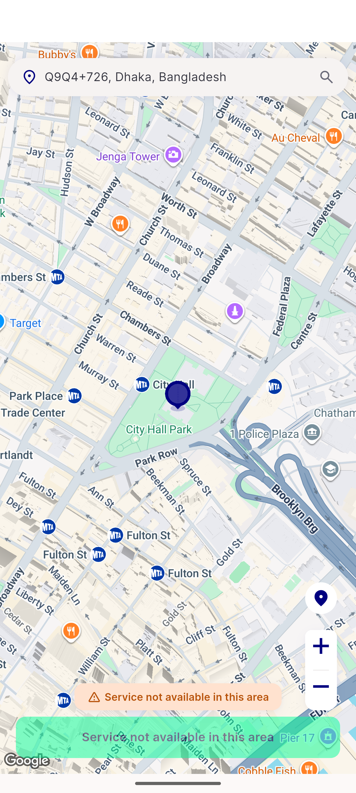
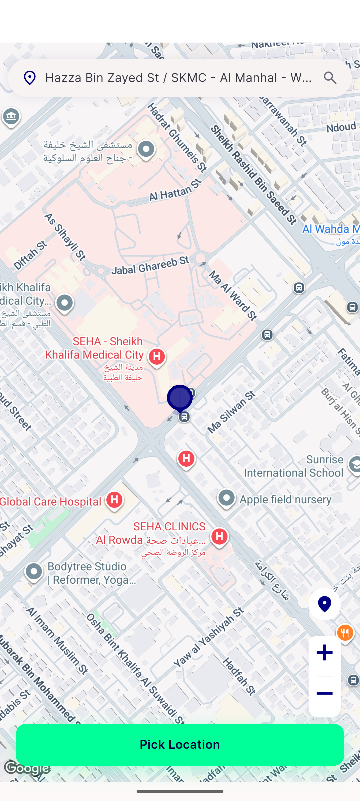
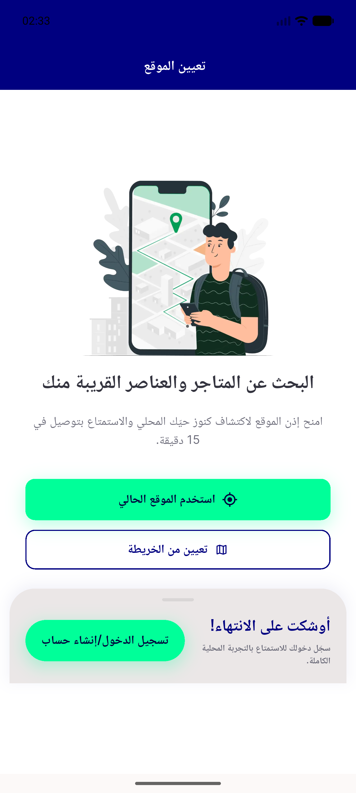
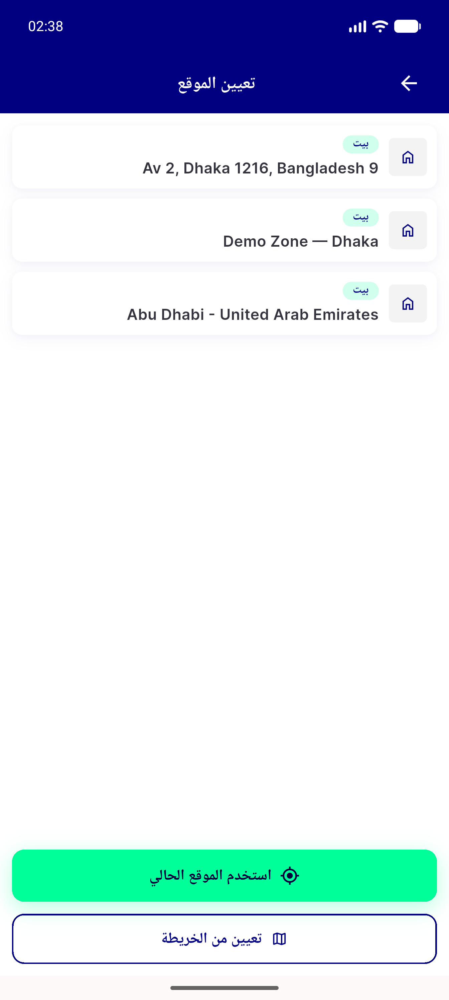

# QA Evidence — NEARS-1612

**PASS (fix_cycle 1) — 9/10 ACs met, AC1 criterion met but its screenshot instrument unrunnable; 1 pre-existing regression filed**

**10 screenshot(s).** Click any thumbnail for full resolution.

<table>
<tr>
<td align="center" width="33%"> ac1 after backpress route already popped toast not capturable</td>
<td align="center" width="33%"> ac2 ac6 loading skeleton 3 shimmer rows</td>
<td align="center" width="33%"> ac3 ac5b signedin changelocation showback</td>
</tr>
<tr>
<td align="center" width="33%"> ac4 ac5a guest branch firstrun gate no back</td>
<td align="center" width="33%"> ac6 empty no saved address found</td>
<td align="center" width="33%"> ac6 error offline nointernetscreen</td>
</tr>
<tr>
<td align="center" width="33%"> ac6 outofzone snackbar</td>
<td align="center" width="33%"> ac7 setfrommap resolved address pick location</td>
<td align="center" width="33%"> ac9 ac4 guest branch ARABIC rtl firstrun gate</td>
</tr>
<tr>
<td align="center" width="33%"> ac9 signedin branch ARABIC rtl</td>
</tr>
</table>

### Other artifacts
- [`ac1-nsnackbar-live-proof.log`](ac1-nsnackbar-live-proof.log)
- [`bug-signin-gate-stuck-loading.log`](bug-signin-gate-stuck-loading.log)

---
*From `nears/docs/qa-evidence/NEARS-1612/` · public-repo scrub policy (no live secrets; verified clean).*
