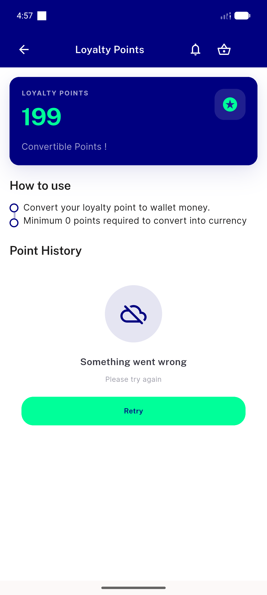
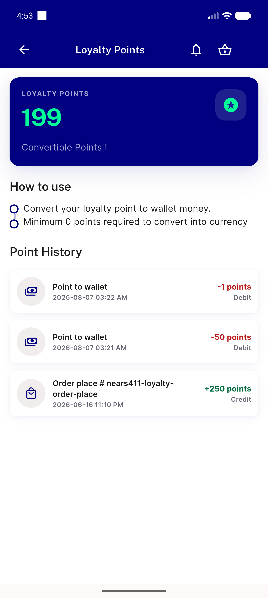
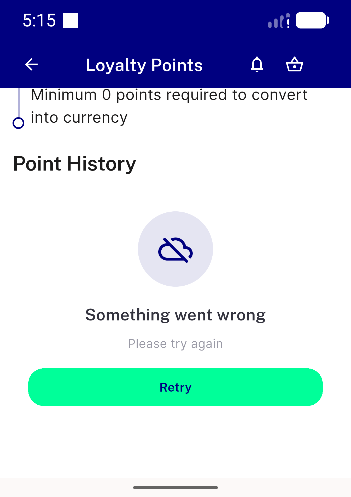
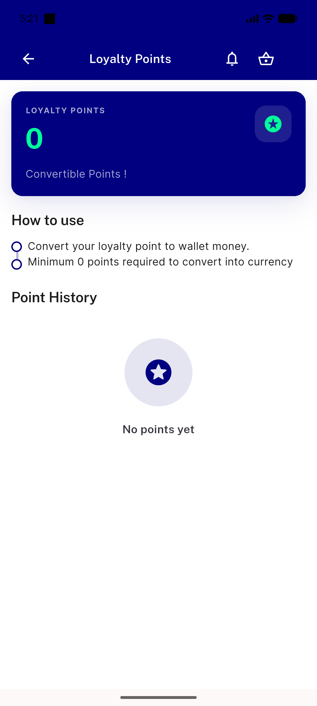
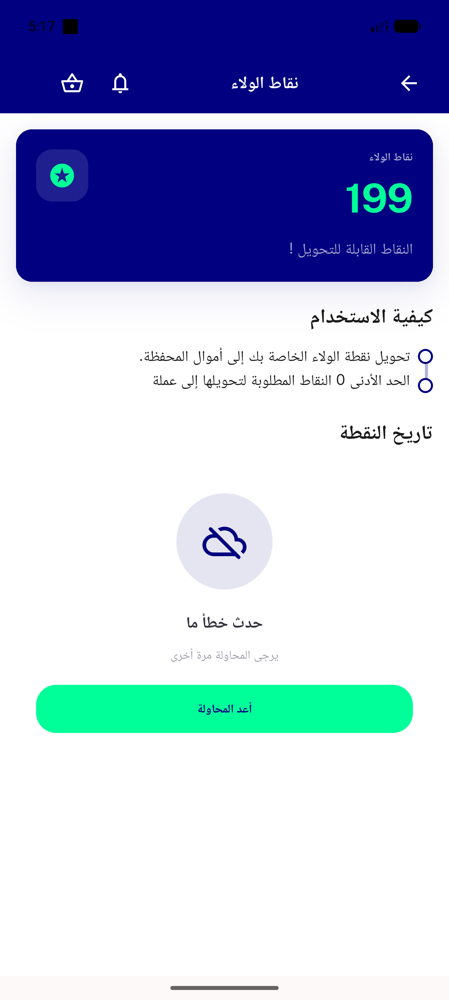

# QA Evidence — NEARS-1613

**BLOCKED — 5/6 ACs verified live; AC1 screen-level branch unverifiable under device-scoped isolation; zero defects found (emulator-5558, worktree build)**

**5 screenshot(s).** Click any thumbnail for full resolution.

<table>
<tr>
<td align="center" width="33%"> ac3 history region retry points card intact</td>
<td align="center" width="33%"> ac5 success path baseline</td>
<td align="center" width="33%"> regression compound guard refresh offline largetext</td>
</tr>
<tr>
<td align="center" width="33%"> regression empty state not retry</td>
<td align="center" width="33%"> regression rtl arabic history retry</td>
</tr>
</table>

### Other artifacts
- [`bug-vendorapp-audioplayers-enoent.log`](bug-vendorapp-audioplayers-enoent.log)

---
*From `nears/docs/qa-evidence/NEARS-1613/` · public-repo scrub policy (no live secrets; verified clean).*
