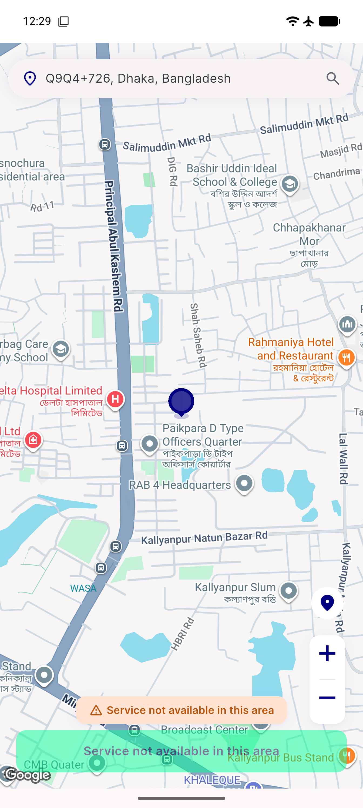
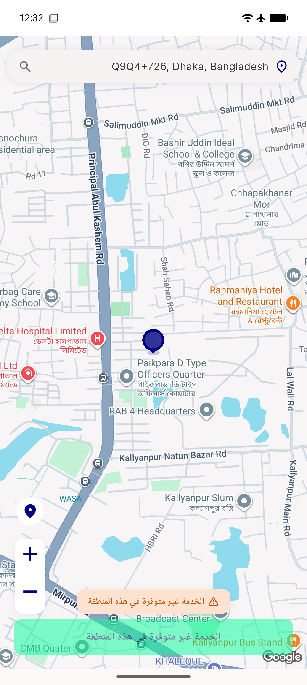

# QA Evidence — NEARS-1614

**PASS — onboarding-deletion first-run flow verified live (en/ar/bn/es), AC1-AC7 demonstrated**

**3 screenshot(s).** Click any thumbnail for full resolution.

<table>
<tr>
<td align="center" width="33%"> ac1 ac2 location gate</td>
<td align="center" width="33%"> ac1 home reached</td>
<td align="center" width="33%"> ac6 arabic location gate</td>
</tr>
</table>

### Other artifacts
- [`ac2-deferred-signup-prompt.log`](ac2-deferred-signup-prompt.log)
- [`regression-candidate-pickmap-autofetch.log`](regression-candidate-pickmap-autofetch.log)

---
*From `nears/docs/qa-evidence/NEARS-1614/` · public-repo scrub policy (no live secrets; verified clean).*
