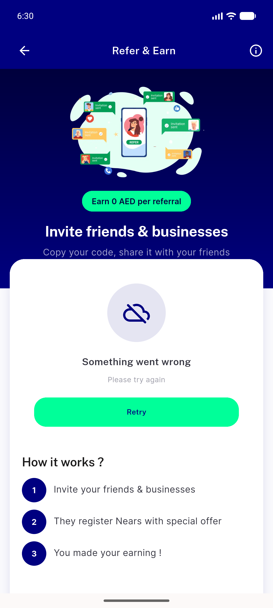
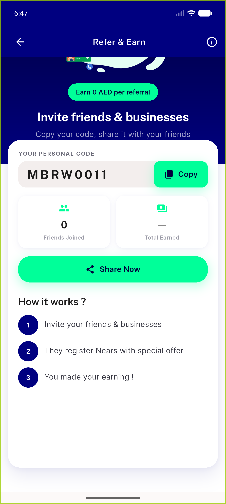
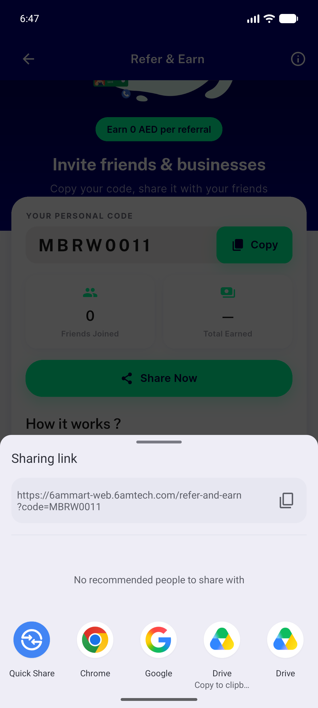
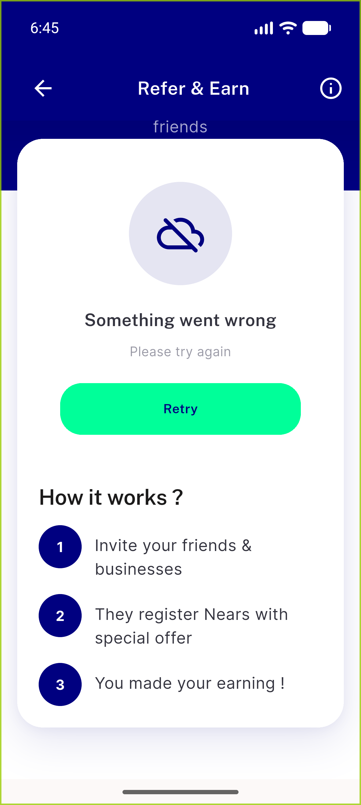
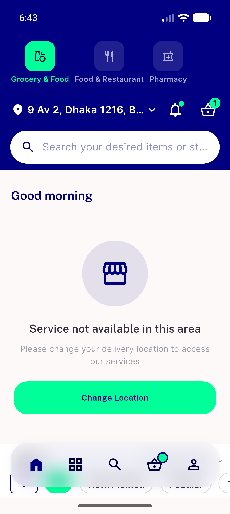
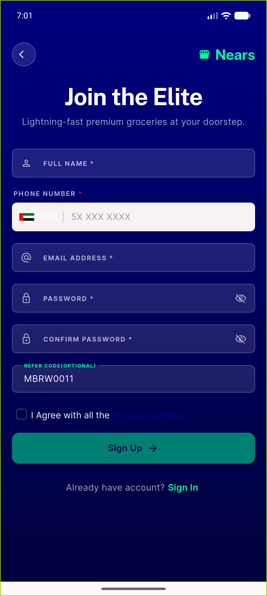
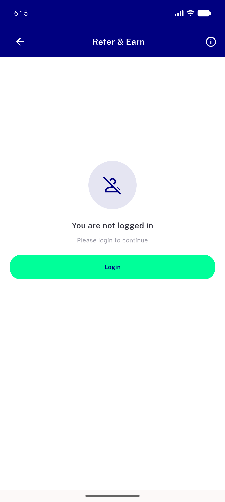
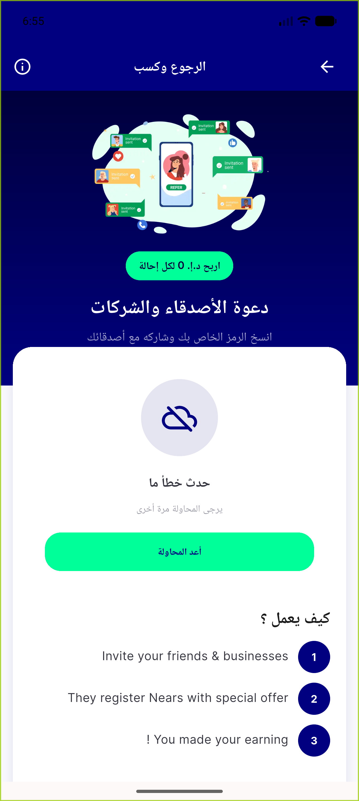

# QA Evidence — NEARS-1615

**PASS — NEARS-1615 Refer & Earn retry: 6/6 AC met (AC5b screenshot withdrawn, live textual evidence)**

**8 screenshot(s).** Click any thumbnail for full resolution.

<table>
<tr>
<td align="center" width="33%"> ac1 failure error retry 448dp</td>
<td align="center" width="33%"> ac2 ac3 success code share tiles</td>
<td align="center" width="33%"> ac2 share sheet live link</td>
</tr>
<tr>
<td align="center" width="33%"> ac5c failure 336dp howitworks</td>
<td align="center" width="33%"> ac5c failure 336dp small</td>
<td align="center" width="33%"> reg loggedout deeplink signup code</td>
</tr>
<tr>
<td align="center" width="33%"> reg loggedout notloggedin</td>
<td align="center" width="33%"> reg rtl arabic error card</td>
</tr>
</table>

---
*From `nears/docs/qa-evidence/NEARS-1615/` · public-repo scrub policy (no live secrets; verified clean).*
