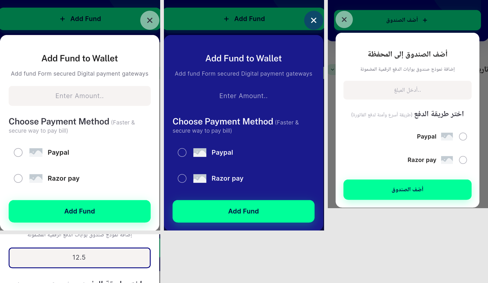
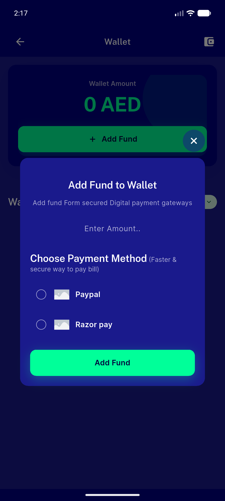
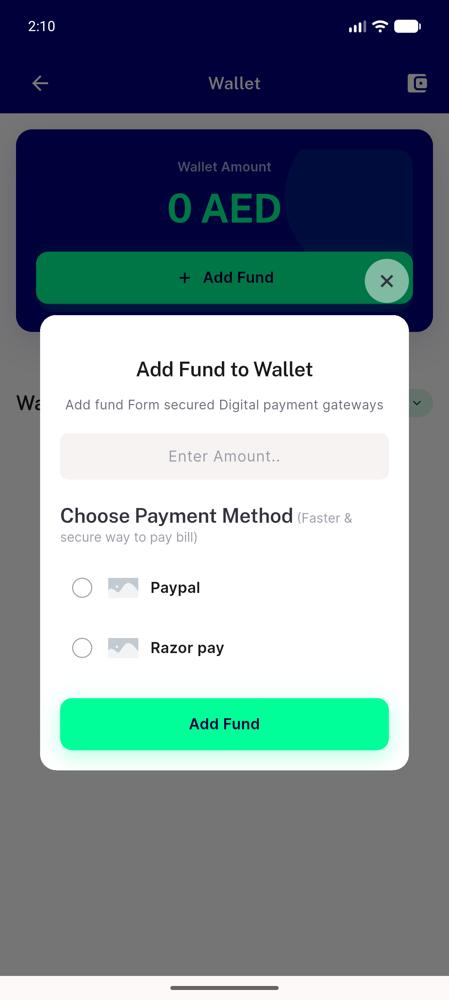
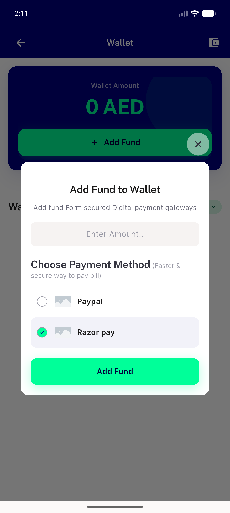
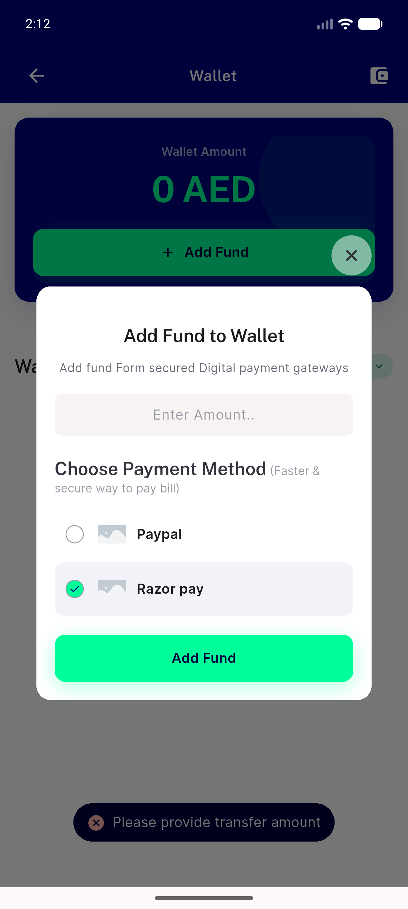
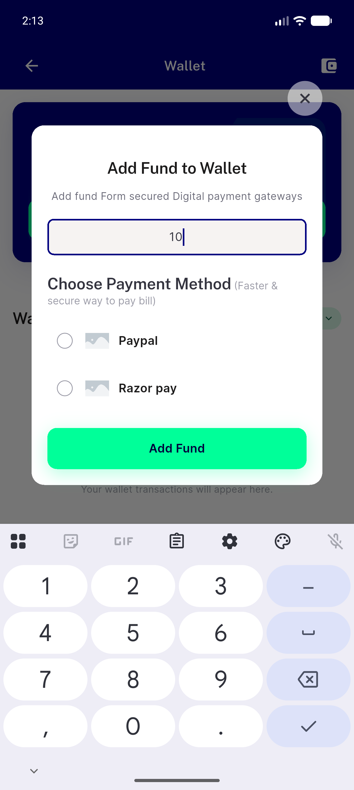
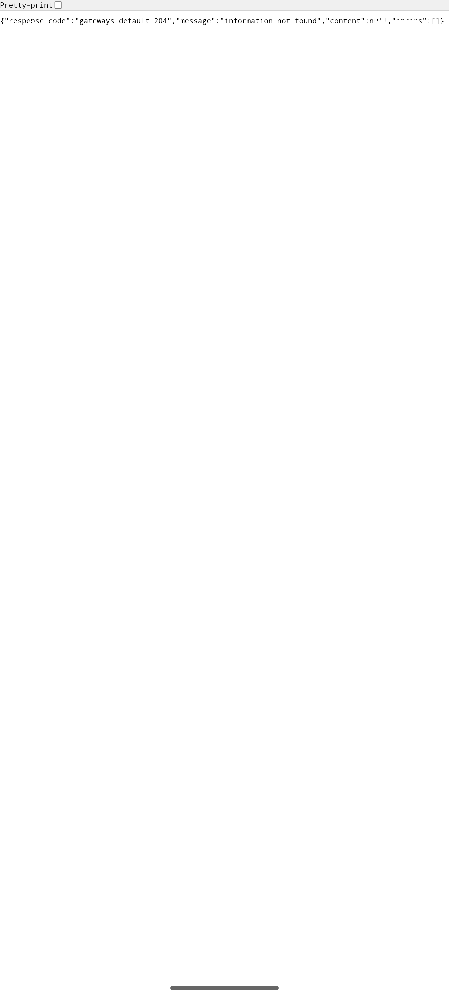
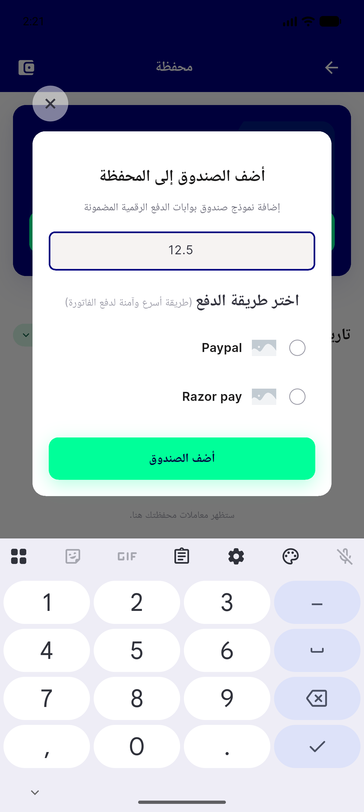
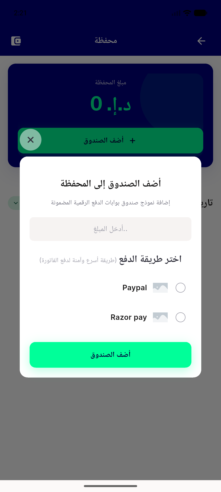

# QA Evidence — NEARS-1616

**PASS — AC2-AC6 re-QA (cycle 2) on emulator-5558, 448x997dp, apk md5 2c214278**

**10 screenshot(s).** Click any thumbnail for full resolution.

<table>
<tr>
<td align="center" width="33%"> ac2 ac6 composite light dark rtl</td>
<td align="center" width="33%"> ac2 dark add fund dialog</td>
<td align="center" width="33%"> ac2 light add fund dialog</td>
</tr>
<tr>
<td align="center" width="33%"> ac3 selection razorpay selected</td>
<td align="center" width="33%"> ac4a empty amount snackbar</td>
<td align="center" width="33%"> ac4b zero amount snackbar</td>
</tr>
<tr>
<td align="center" width="33%"> ac4c no method snackbar</td>
<td align="center" width="33%"> ac5 payment handoff</td>
<td align="center" width="33%"> ac6 rtl amount field ltr</td>
</tr>
<tr>
<td align="center" width="33%"> ac6 rtl arabic add fund dialog</td>
</tr>
</table>

---
*From `nears/docs/qa-evidence/NEARS-1616/` · public-repo scrub policy (no live secrets; verified clean).*
