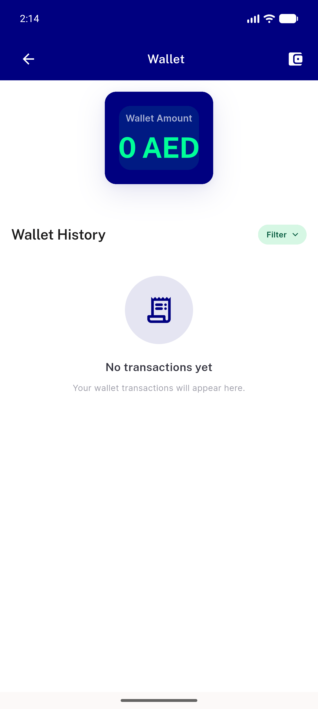

# QA Evidence — NEARS-1616

**BLOCKED — Add Fund dialog unreachable (NEARS-1618); AC2-AC6 not verifiable live**

**1 screenshot(s).** Click any thumbnail for full resolution.

<table>
<tr>
<td align="center" width="33%"> bug add fund affordance absent</td>
</tr>
</table>

---
*From `nears/docs/qa-evidence/NEARS-1616/` · public-repo scrub policy (no live secrets; verified clean).*
