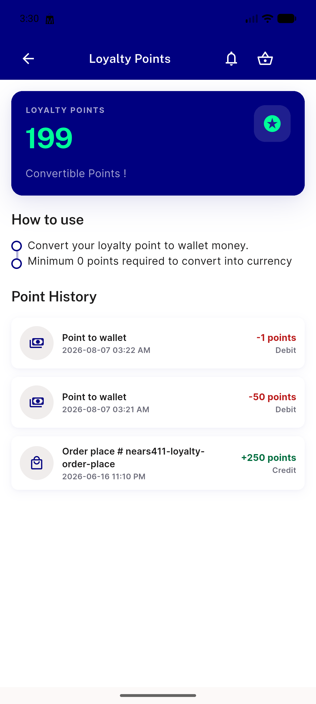
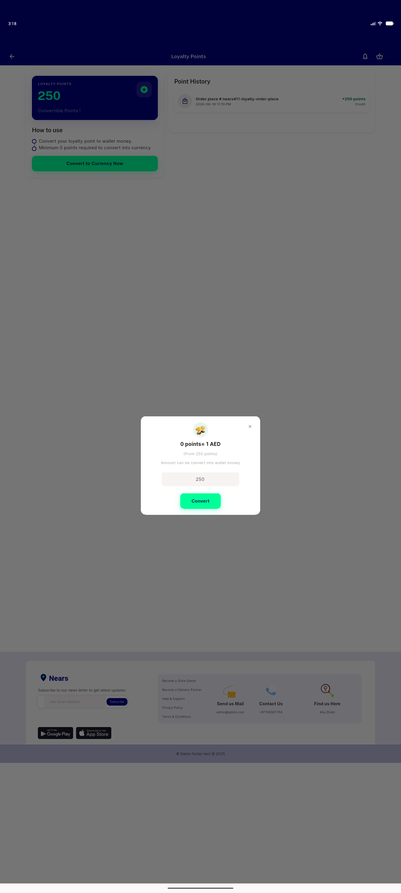
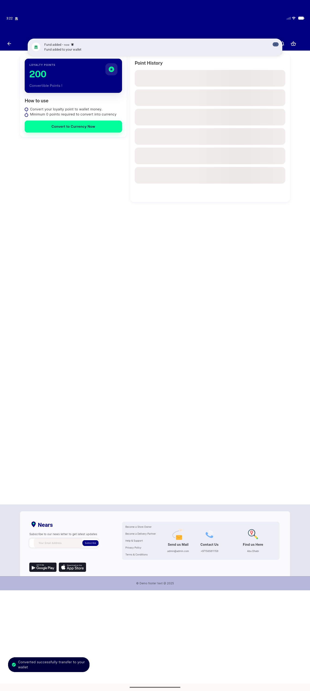
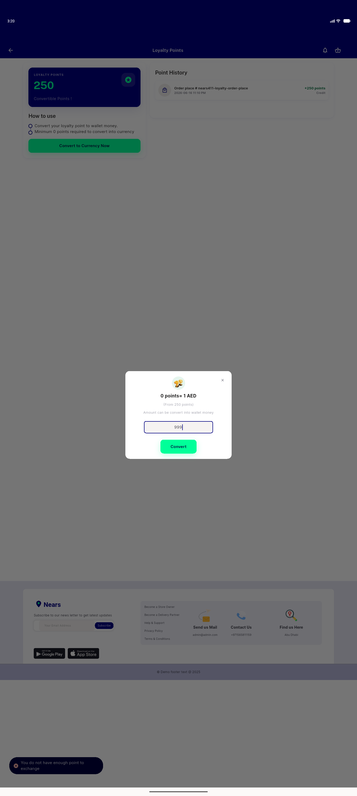
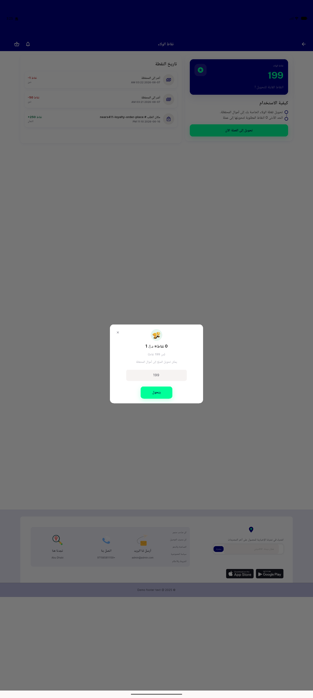
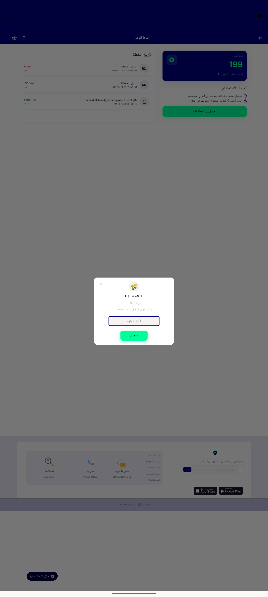

# QA Evidence — NEARS-1617

**PASS (AC2 BLOCKED, config-gated) — loyalty bottom sheet DLS reskin, emulator-5556 448x997dp light**

**7 screenshot(s).** Click any thumbnail for full resolution.

<table>
<tr>
<td align="center" width="33%"> ac2 BLOCKED mobile 448x997 no cta</td>
<td align="center" width="33%"> ac3 desktop sheet ltr light</td>
<td align="center" width="33%"> ac4 convert inflight loading</td>
</tr>
<tr>
<td align="center" width="33%"> ac4 convert success snackbar</td>
<td align="center" width="33%"> ac5 over balance rejected</td>
<td align="center" width="33%"> ac6 rtl arabic sheet</td>
</tr>
<tr>
<td align="center" width="33%"> regr empty input snackbar ar</td>
</tr>
</table>

### Other artifacts
- [`progress.md`](progress.md)

---
*From `nears/docs/qa-evidence/NEARS-1617/` · public-repo scrub policy (no live secrets; verified clean).*
