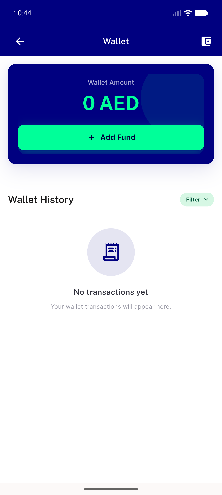
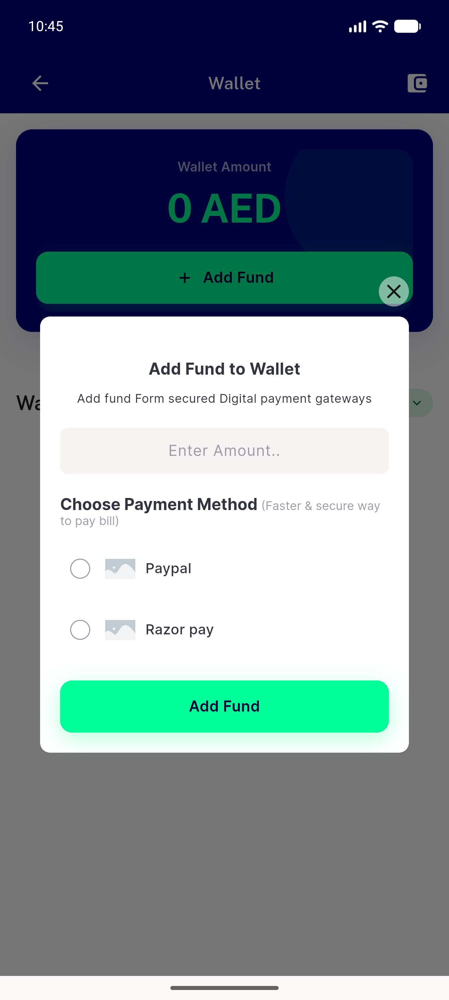
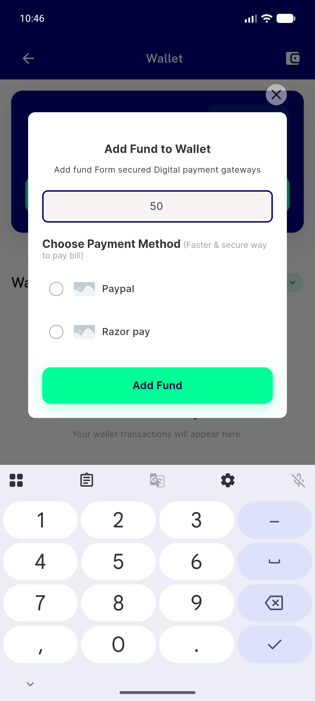
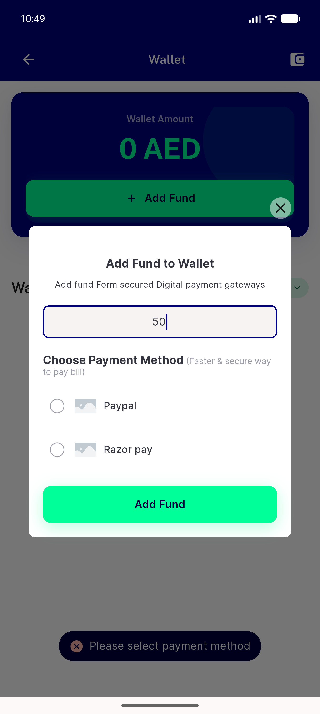
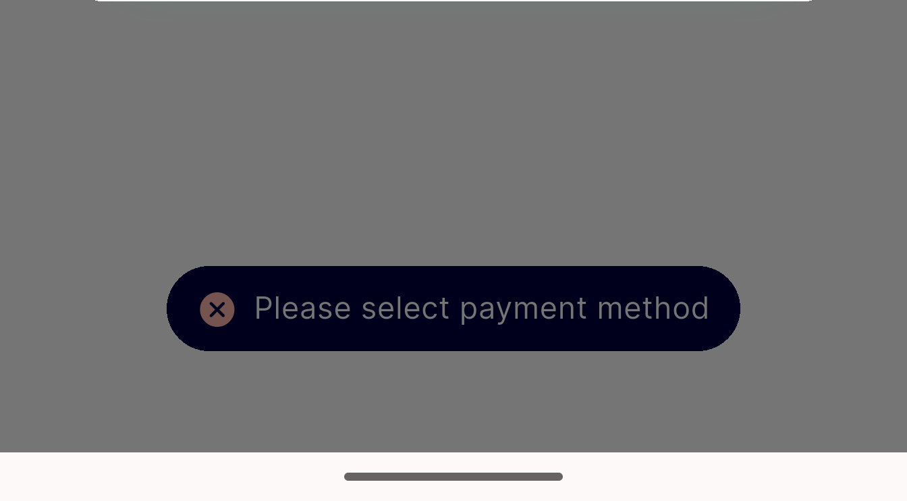
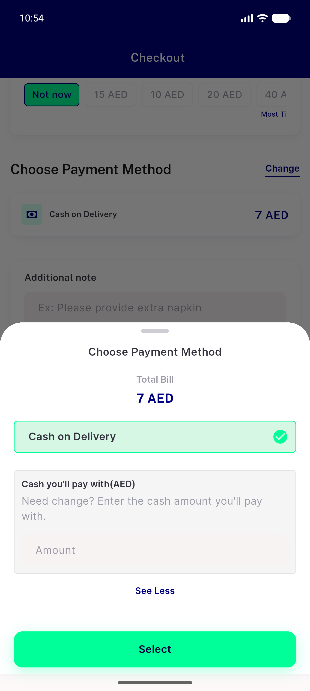

# QA Evidence — NEARS-1618

**PASS - AC4 + AC5 demonstrated live on emulator-5556; 2 gateways render, please_select_payment_method validation path reached (line 225)**

**6 screenshot(s).** Click any thumbnail for full resolution.

<table>
<tr>
<td align="center" width="33%"> ac4 01 wallet screen add fund</td>
<td align="center" width="33%"> ac4 02 add fund dialog two methods</td>
<td align="center" width="33%"> ac5 01 amount 50 no method selected</td>
</tr>
<tr>
<td align="center" width="33%"> ac5 02 please select payment method snackbar</td>
<td align="center" width="33%"> ac5 03 toast closeup</td>
<td align="center" width="33%"> sweep 01 checkout payment sheet cod only</td>
</tr>
</table>

### Other artifacts
- [`progress.md`](progress.md)

---
*From `nears/docs/qa-evidence/NEARS-1618/` · public-repo scrub policy (no live secrets; verified clean).*
