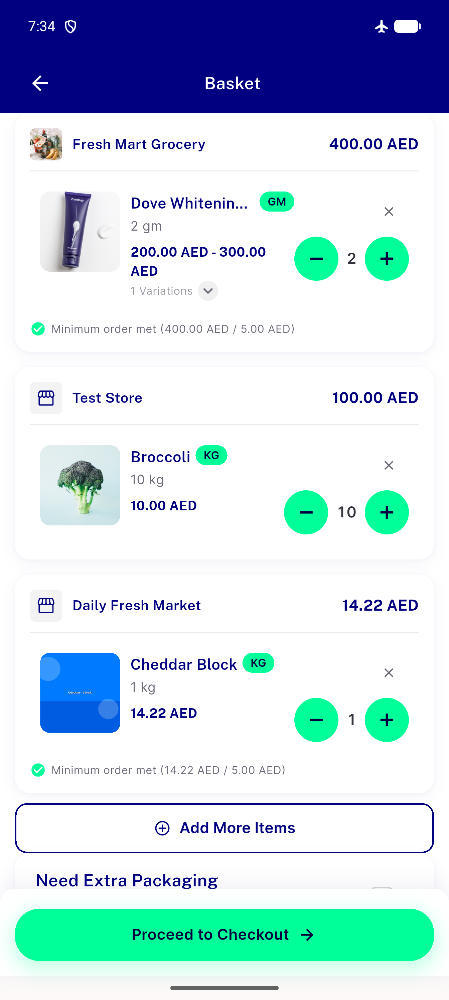

# QA Evidence — NEARS-1620

**PASS — NSkeletonListRow promoted to DLS, migrated at all 3 real call sites (order/cart/access-location), pixel-parity verified via geometry diff against pre-migration source, AC2 dead code confirmed removed, AC3 packaging confirmed present**

**1 screenshot(s).** Click any thumbnail for full resolution.

<table>
<tr>
<td align="center" width="33%"> ac1 cart site loaded</td>
</tr>
</table>

---
*From `nears/docs/qa-evidence/NEARS-1620/` · public-repo scrub policy (no live secrets; verified clean).*
