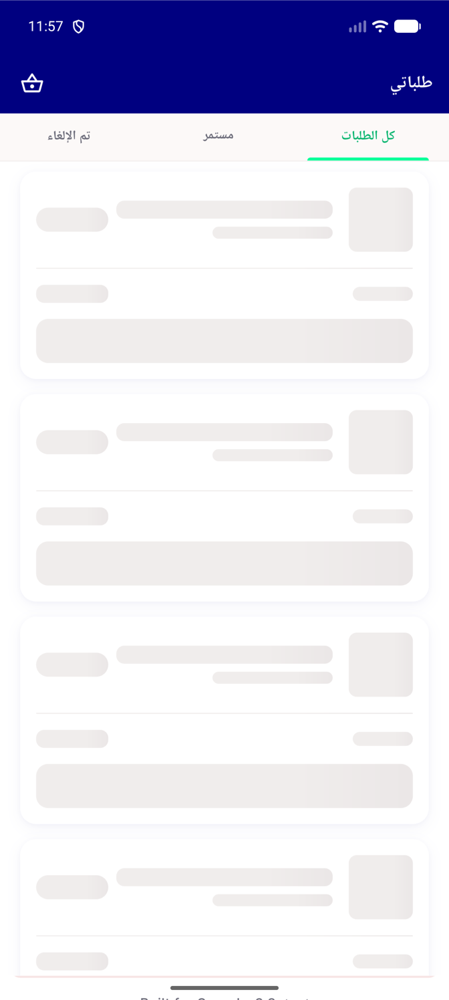

# QA Evidence — NEARS-1621

**QA-lite PASS: NSkeleton RTL sweep fix verified (n_skeleton_test.dart AC2 regression test green; live RTL My Orders skeleton renders mirrored, no errors)**

**1 screenshot(s).** Click any thumbnail for full resolution.

<table>
<tr>
<td align="center" width="33%"> rtl orders skeleton</td>
</tr>
</table>

---
*From `nears/docs/qa-evidence/NEARS-1621/` · public-repo scrub policy (no live secrets; verified clean).*
