# QA Evidence — NEARS-1626

**PASS — wallet pull-to-refresh fires on a short list (0 -> 4 [NET]) on emulator-5558 @ 448x997dp**

**17 screenshot(s).** Click any thumbnail for full resolution.

<table>
<tr>
<td align="center" width="33%"><a href="00-launch.png">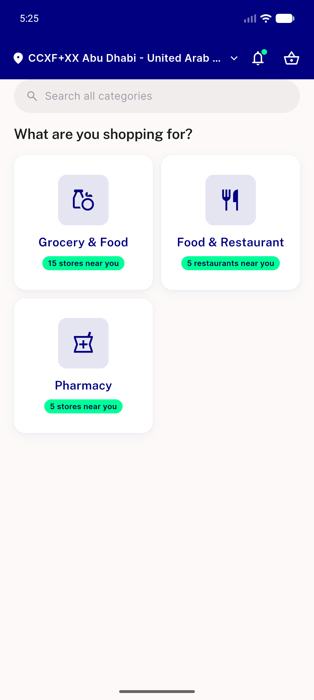</a> launch</td>
<td align="center" width="33%"><a href="01-after-module-tap.png">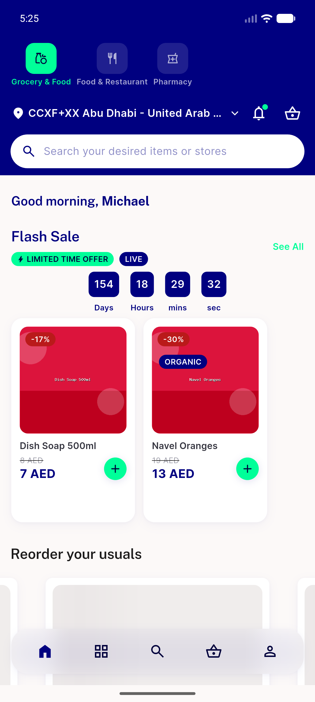</a> after module tap</td>
<td align="center" width="33%"><a href="02-profile.png">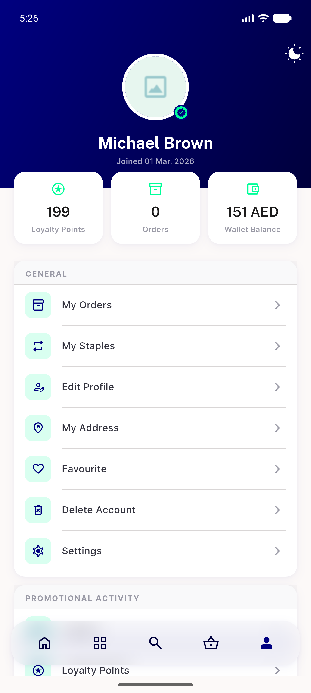</a> profile</td>
</tr>
<tr>
<td align="center" width="33%"><a href="03-profile-scrolled.png">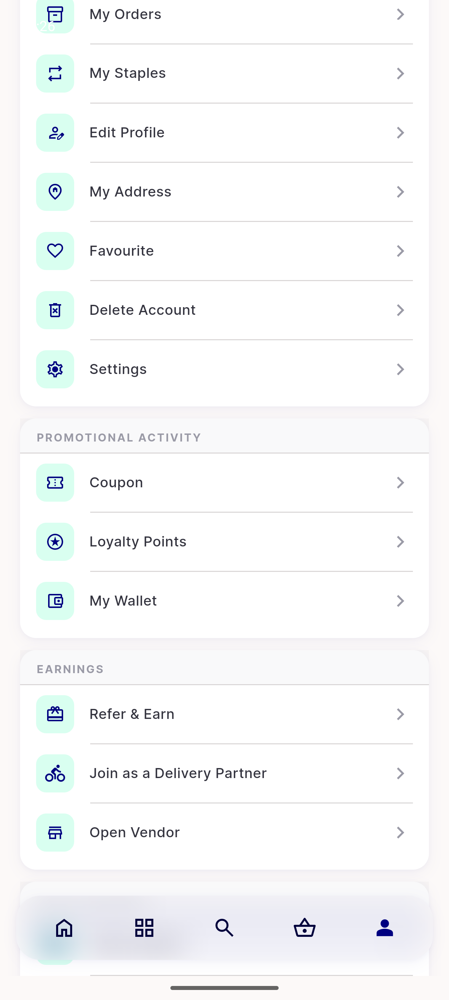</a> profile scrolled</td>
<td align="center" width="33%"> wallet screen</td>
<td align="center" width="33%"> visual before settled</td>
</tr>
<tr>
<td align="center" width="33%"><a href="11-visual-during-overscroll.png">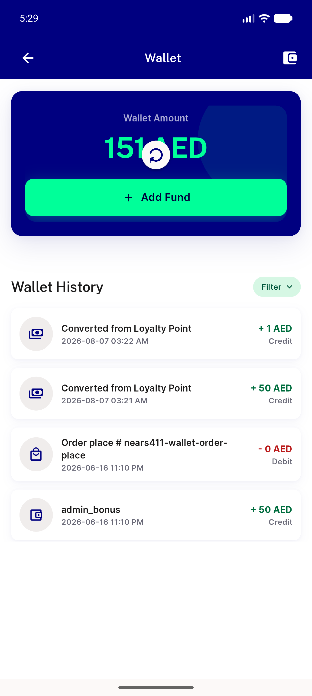</a> visual during overscroll</td>
<td align="center" width="33%"> visual after settled</td>
<td align="center" width="33%"> ac3 override 1344x1400</td>
</tr>
<tr>
<td align="center" width="33%"><a href="21-ac3-scrolled-down.png">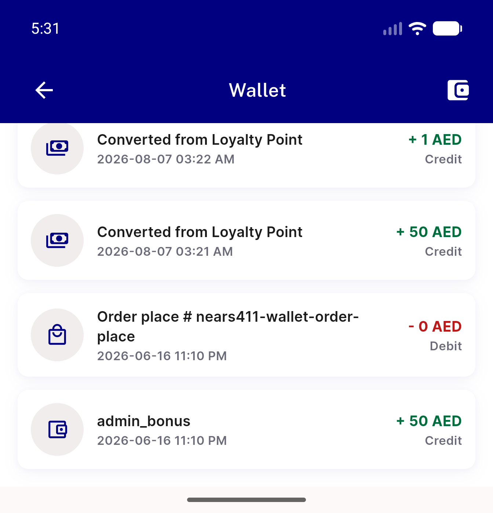</a> ac3 scrolled down</td>
<td align="center" width="33%"><a href="30-skeleton-loading-state.png">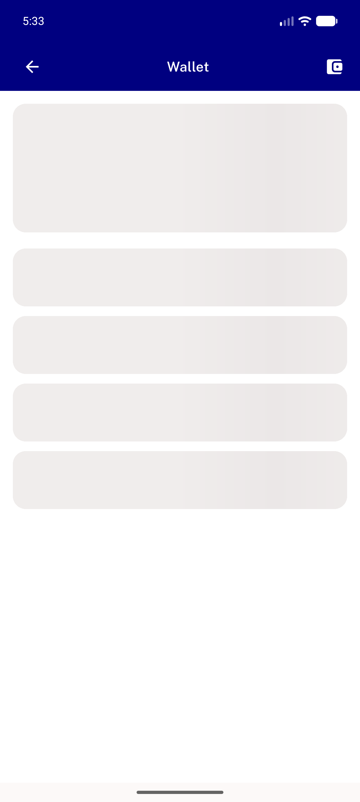</a> skeleton loading state</td>
<td align="center" width="33%"><a href="31-skeleton-after-swipes-no-scroll.png">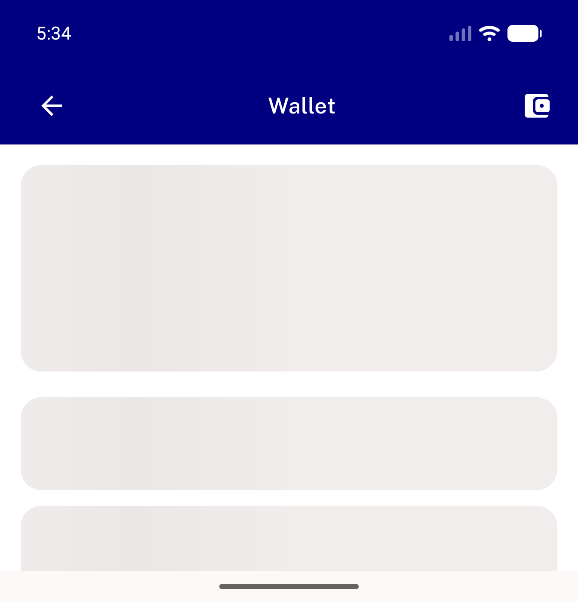</a> skeleton after swipes no scroll</td>
</tr>
<tr>
<td align="center" width="33%"><a href="32-wallet-restored.png">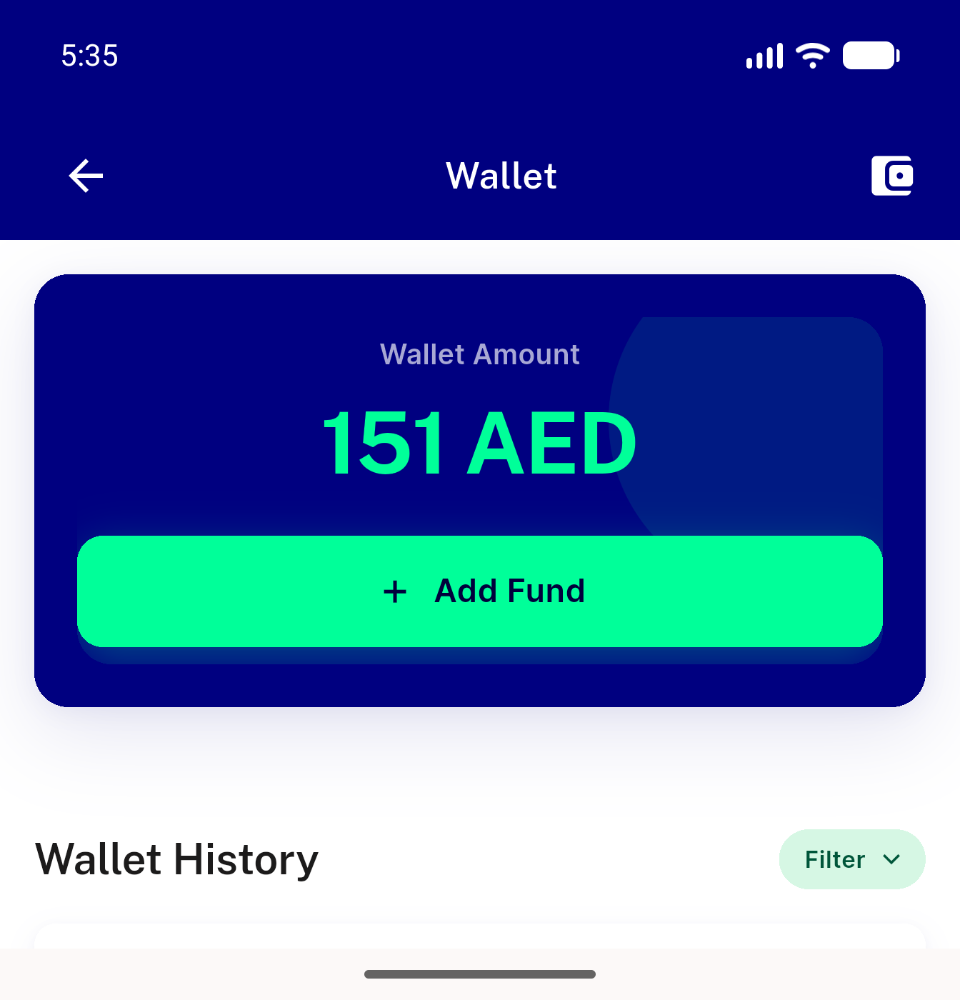</a> wallet restored</td>
<td align="center" width="33%"><a href="33-back-to-default-geometry.png">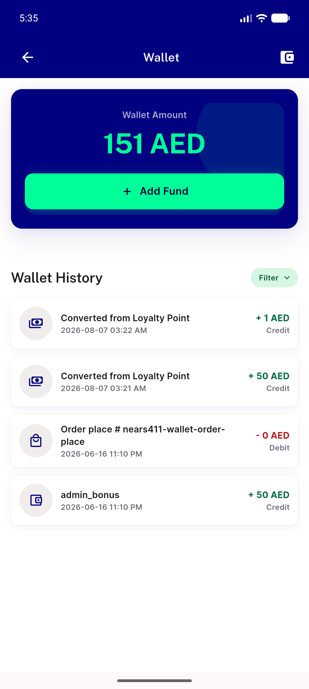</a> back to default geometry</td>
<td align="center" width="33%"><a href="40-arabic-applied.png">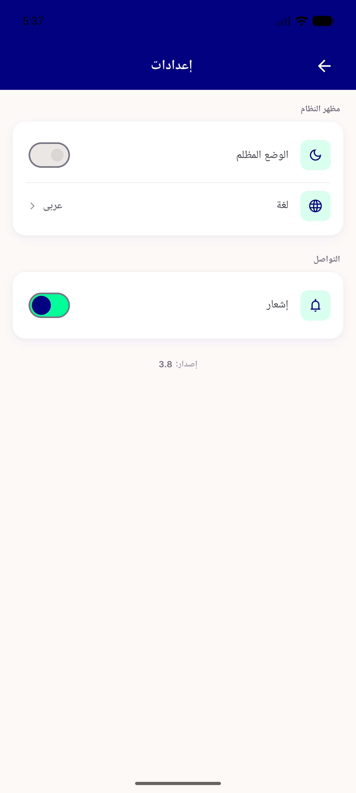</a> arabic applied</td>
</tr>
<tr>
<td align="center" width="33%"> wallet arabic rtl</td>
<td align="center" width="33%"><a href="42-arabic-after-refresh.png">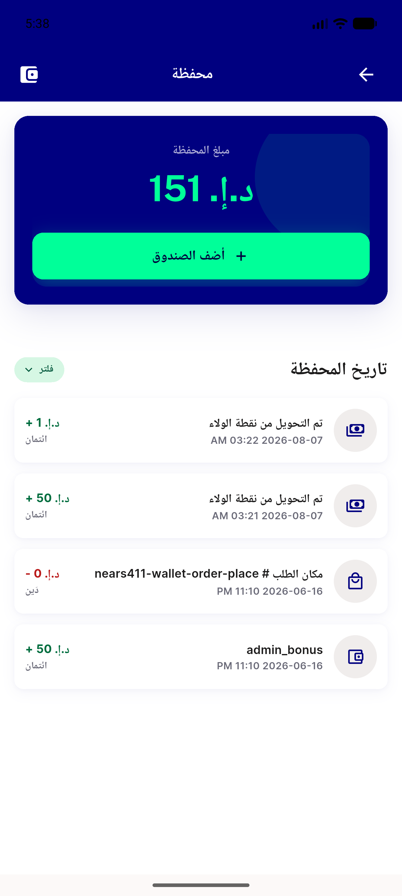</a> arabic after refresh</td>
</tr>
</table>

---
*From `nears/docs/qa-evidence/NEARS-1626/` · public-repo scrub policy (no live secrets; verified clean).*
