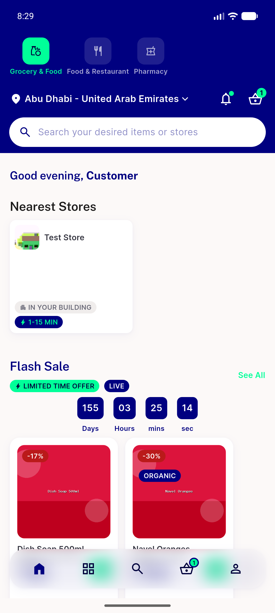

# QA Evidence — NEARS-1627

**PASS 3/3 — ui_errors false-green fixed; pre-fix RED on all 6 scenarios**

**1 screenshot(s).** Click any thumbnail for full resolution.

<table>
<tr>
<td align="center" width="33%"> uicapture happy 5556</td>
</tr>
</table>

### Other artifacts
- [`ac1-live-injection-5554-5556.log`](ac1-live-injection-5554-5556.log)
- [`ac2-ac3-format-and-overmatch-matrix.log`](ac2-ac3-format-and-overmatch-matrix.log)
- [`bug-vendorapp-guide-stale-false-clean.log`](bug-vendorapp-guide-stale-false-clean.log)
- [`followup-uinav-ios-same-class-defect.log`](followup-uinav-ios-same-class-defect.log)
- [`helpers-regression.log`](helpers-regression.log)
- [`uicapture-block-and-prefix-truncation.log`](uicapture-block-and-prefix-truncation.log)

---
*From `nears/docs/qa-evidence/NEARS-1627/` · public-repo scrub policy (no live secrets; verified clean).*
