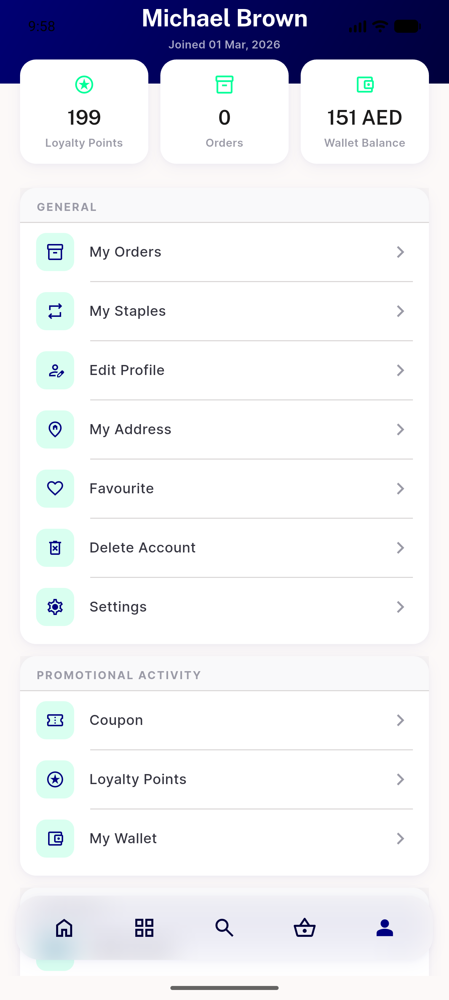
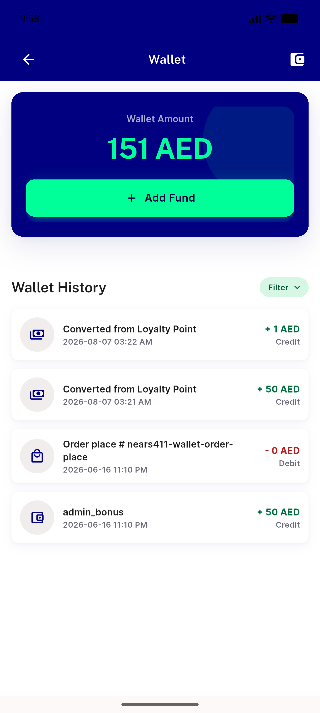
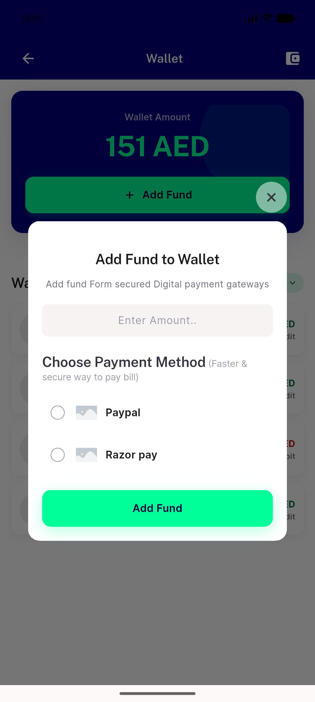
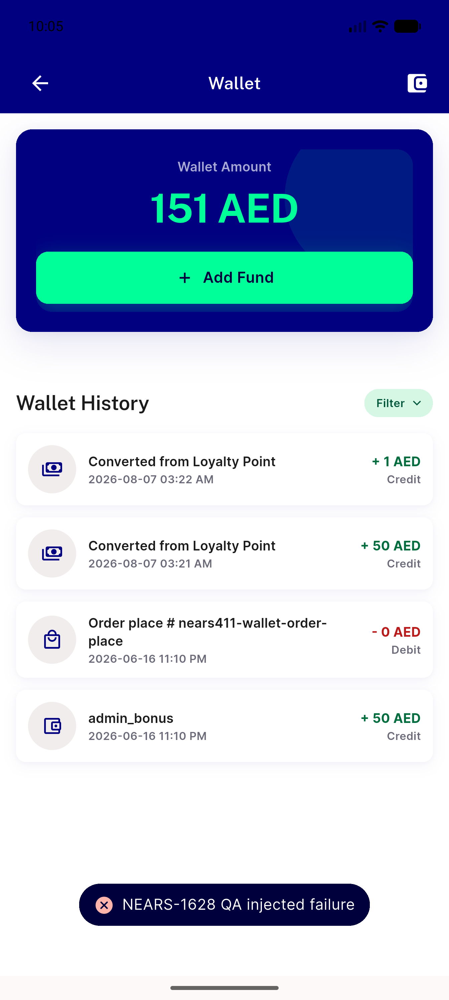
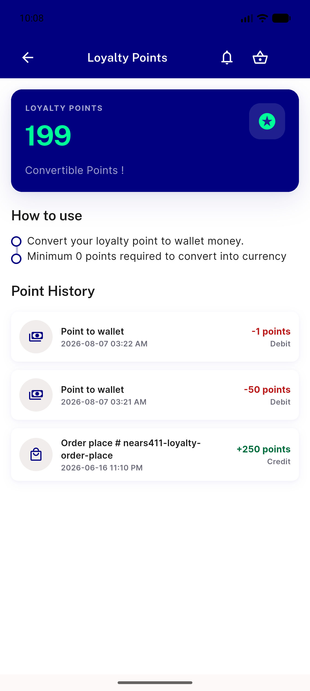
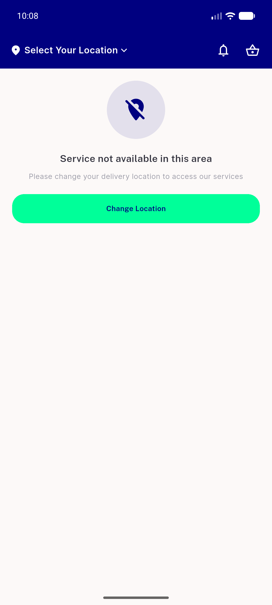

# QA Evidence — NEARS-1628

**PASS with 2 ACs NOT TESTED (data gap: zero wallet_bonuses rows, 4 tx rows) — no-regression gate on the latent-leak fix**

**7 screenshot(s).** Click any thumbnail for full resolution.

<table>
<tr>
<td align="center" width="33%"> after login</td>
<td align="center" width="33%"> wallet success settled</td>
<td align="center" width="33%"> addfund dialog</td>
</tr>
<tr>
<td align="center" width="33%"> fault snackbar</td>
<td align="center" width="33%"> fault snackbar caught</td>
<td align="center" width="33%"> loyalty points</td>
</tr>
<tr>
<td align="center" width="33%"> home smoke</td>
</tr>
</table>

### Other artifacts
- [`fault-proxy-wallet-traffic.log`](fault-proxy-wallet-traffic.log)
- [`gate-test-failures.log`](gate-test-failures.log)
- [`measure-isloading-fault.log`](measure-isloading-fault.log)
- [`measure-isloading-success.log`](measure-isloading-success.log)
- [`measure-skeleton-fault.log`](measure-skeleton-fault.log)
- [`measure-skeleton-filter.log`](measure-skeleton-filter.log)
- [`measure-skeleton-success.log`](measure-skeleton-success.log)
- [`measure-snackbar-fault.log`](measure-snackbar-fault.log)
- [`progress.md`](progress.md)

---
*From `nears/docs/qa-evidence/NEARS-1628/` · public-repo scrub policy (no live secrets; verified clean).*
