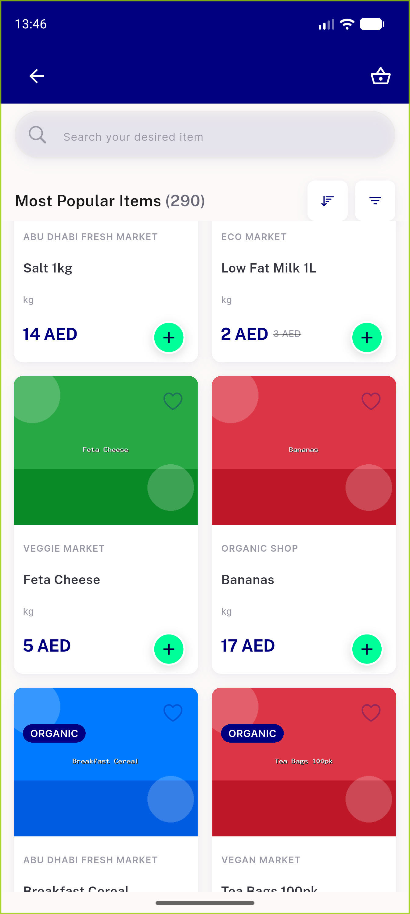

# QA Evidence — NEARS-1629

**PASS — AC-A demonstrated live on the popular axis (offline load-more then recovery in one screen visit); reviewed/discounted/brands live-unverified (measured unreachable), all four covered by a two-sided mutation check**

**2 screenshot(s).** Click any thumbnail for full resolution.

<table>
<tr>
<td align="center" width="33%"> ac a popular recovered after offline loadmore</td>
<td align="center" width="33%"> regression footer spinner inflight</td>
</tr>
</table>

### Other artifacts
- [`ac-a-popular-live-sequence.log`](ac-a-popular-live-sequence.log)
- [`bug-failed-loadmore-page-skipped.log`](bug-failed-loadmore-page-skipped.log)
- [`followup-anr-under-memory-pressure.log`](followup-anr-under-memory-pressure.log)
- [`mutation-check-defect-pins-red-at-base.log`](mutation-check-defect-pins-red-at-base.log)
- [`reachability-of-the-four-helpers.log`](reachability-of-the-four-helpers.log)

---
*From `nears/docs/qa-evidence/NEARS-1629/` · public-repo scrub policy (no live secrets; verified clean).*
