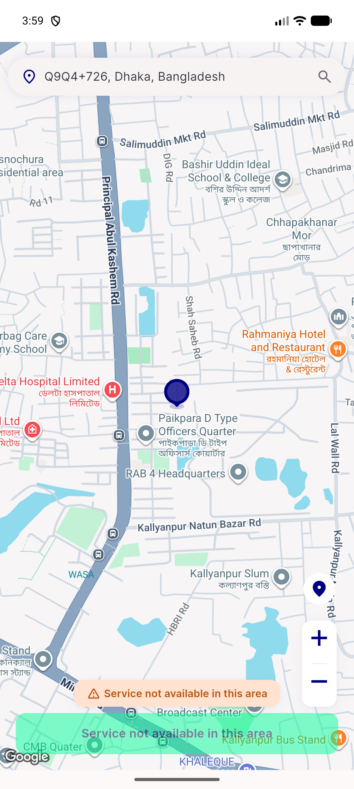
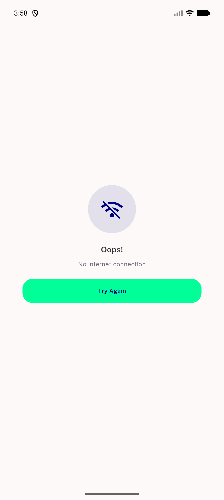
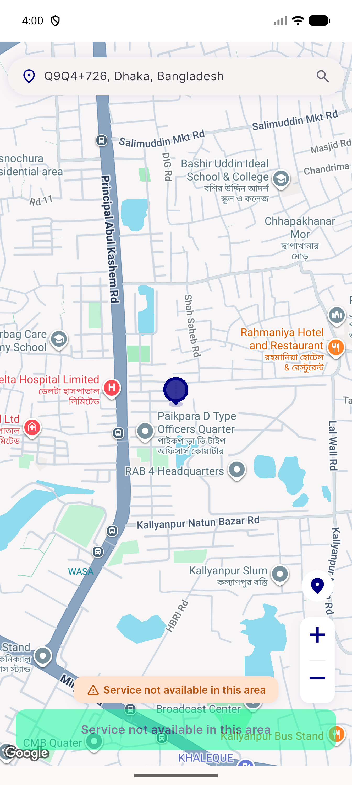
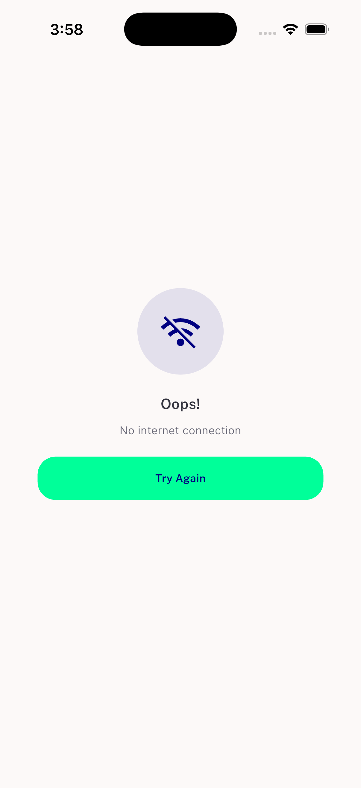

# QA Evidence — NEARS-1632

**PASS - AC1 timeout+fallback and AC2 offline routing (Android+iOS) verified live**

**4 screenshot(s).** Click any thumbnail for full resolution.

<table>
<tr>
<td align="center" width="33%"> android ac1 timeout fallback pickmap</td>
<td align="center" width="33%"> android ac2 no internet screen</td>
<td align="center" width="33%"> android home happy path and saved address skip</td>
</tr>
<tr>
<td align="center" width="33%"> ios ac2 no internet screen</td>
</tr>
</table>

### Other artifacts
- [`android-full-session-location-log-excerpt.log`](android-full-session-location-log-excerpt.log)
- [`ios-ac2-checkinternet-offline-live.log`](ios-ac2-checkinternet-offline-live.log)

---
*From `nears/docs/qa-evidence/NEARS-1632/` · public-repo scrub policy (no live secrets; verified clean).*
