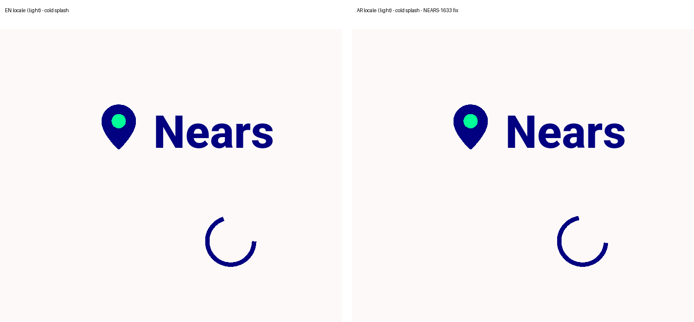

# QA Evidence — NEARS-1633

**QA-lite PASS - ar/en splash wordmark lockup (NEARS-1633)**

**1 screenshot(s).** Click any thumbnail for full resolution.

<table>
<tr>
<td align="center" width="33%"> splash en vs ar light side by side</td>
</tr>
</table>

---
*From `nears/docs/qa-evidence/NEARS-1633/` · public-repo scrub policy (no live secrets; verified clean).*
