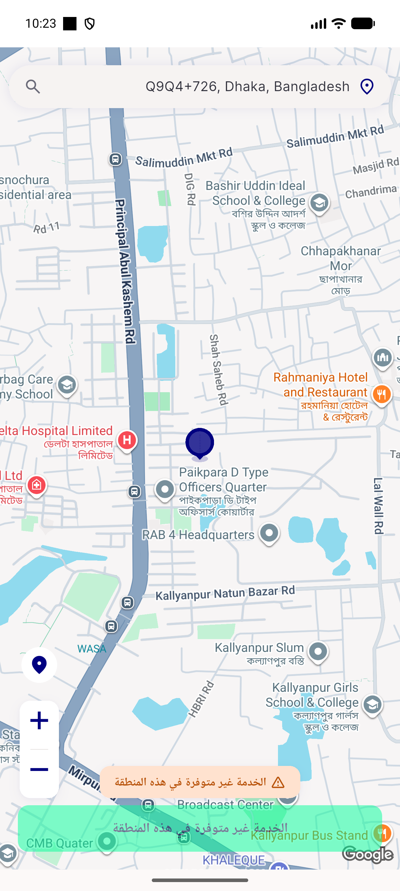
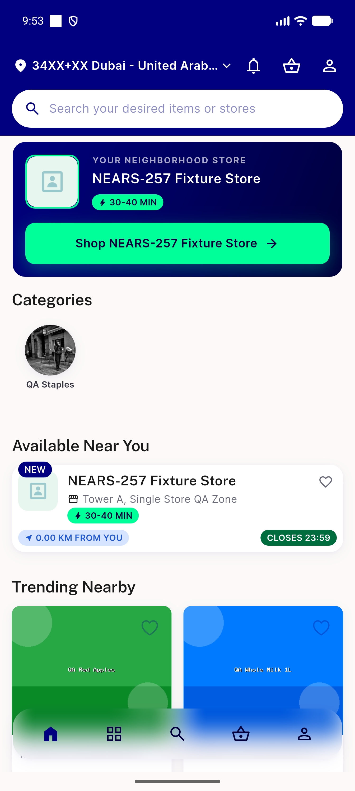
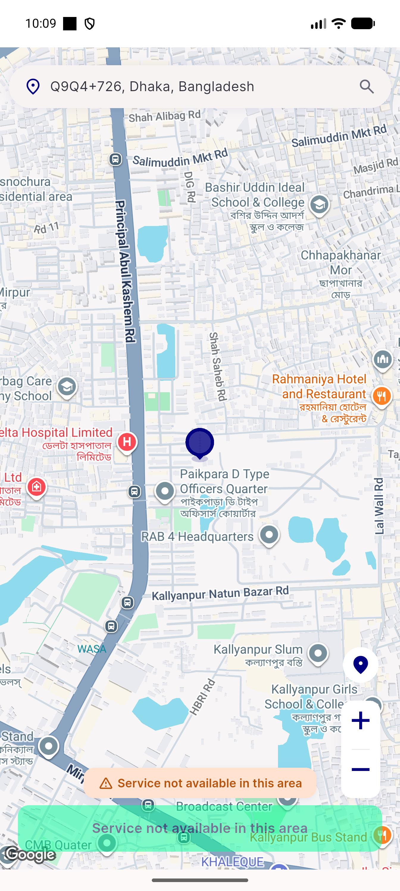
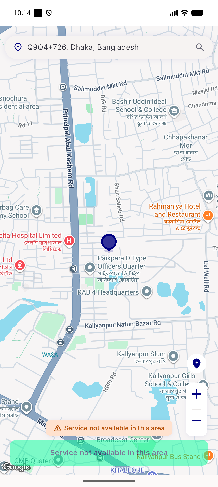

# QA Evidence — NEARS-1634

**PASS — location fallback confirm-gate verified live at 2 sites (splash-resolver, onboarding) under both real-GPS and fallback conditions; AC5 regression clean; automated backstop 170/170 + 418/418**

**4 screenshot(s).** Click any thumbnail for full resolution.

<table>
<tr>
<td align="center" width="33%"> ac rtl pickmap fallback</td>
<td align="center" width="33%"> ac2 onboarding realgps home</td>
<td align="center" width="33%"> ac3 splash fallback pickmap confirm</td>
</tr>
<tr>
<td align="center" width="33%"> ac4 onboarding fallback pickmap confirm</td>
</tr>
</table>

---
*From `nears/docs/qa-evidence/NEARS-1634/` · public-repo scrub policy (no live secrets; verified clean).*
