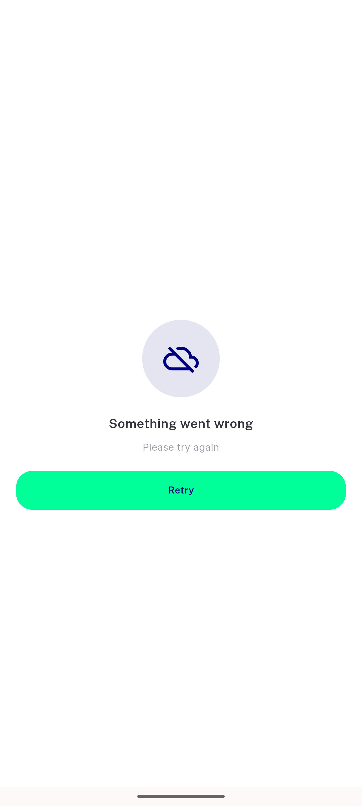
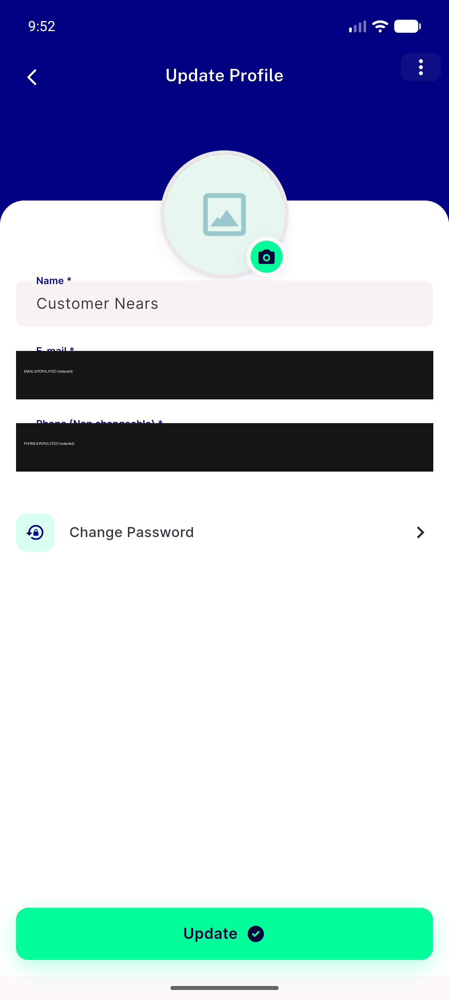
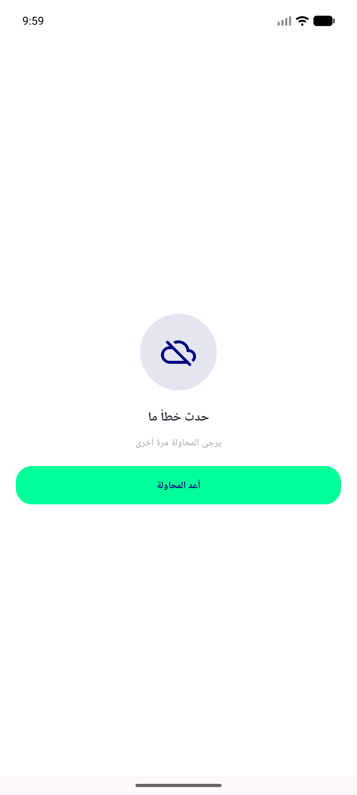

# QA Evidence — NEARS-1636

**PASS — NEARS-1636 Edit Profile retry: AC1-AC4 demonstrated live on emulator-5556 (fault-proxy 503 on /api/v1/customer/info)**

**5 screenshot(s).** Click any thumbnail for full resolution.

<table>
<tr>
<td align="center" width="33%"> ac1 error state</td>
<td align="center" width="33%"> ac1b reentry error state</td>
<td align="center" width="33%"> ac2 after retry</td>
</tr>
<tr>
<td align="center" width="33%"> ac3 populated form survives failed refresh</td>
<td align="center" width="33%"> rtl arabic error state</td>
</tr>
</table>

### Other artifacts
- [`progress.md`](progress.md)

---
*From `nears/docs/qa-evidence/NEARS-1636/` · public-repo scrub policy (no live secrets; verified clean).*
