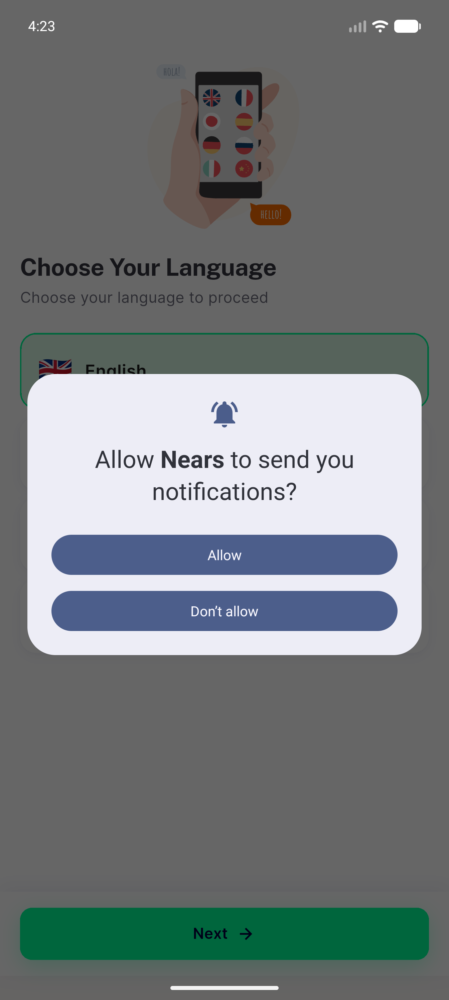
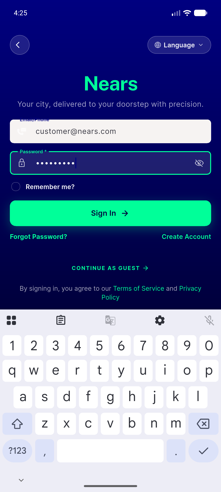
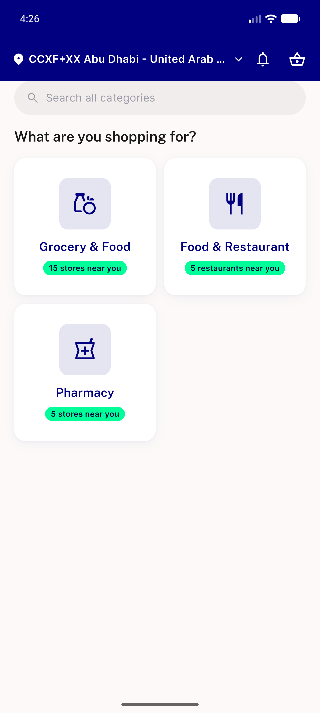
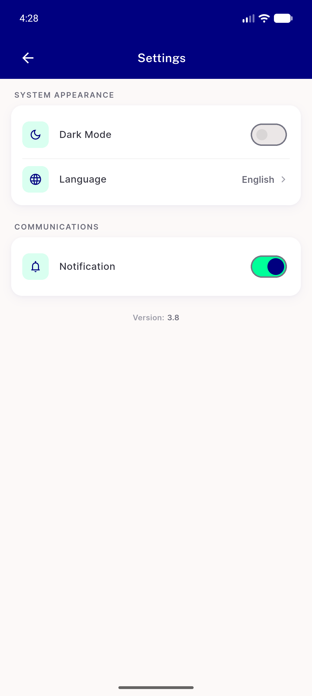
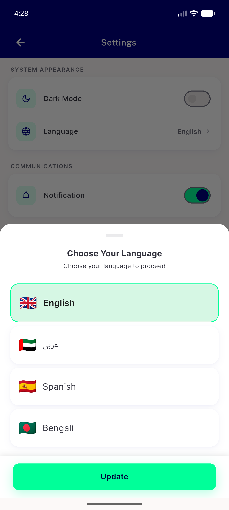
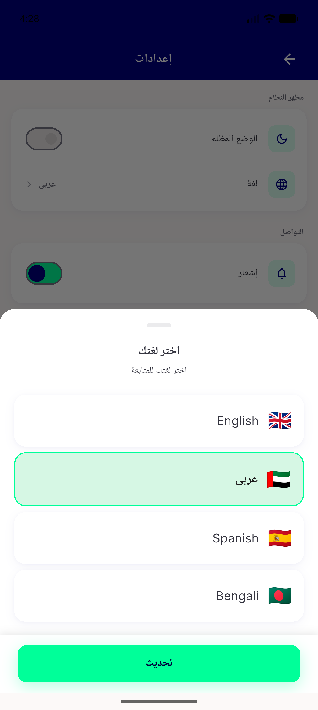
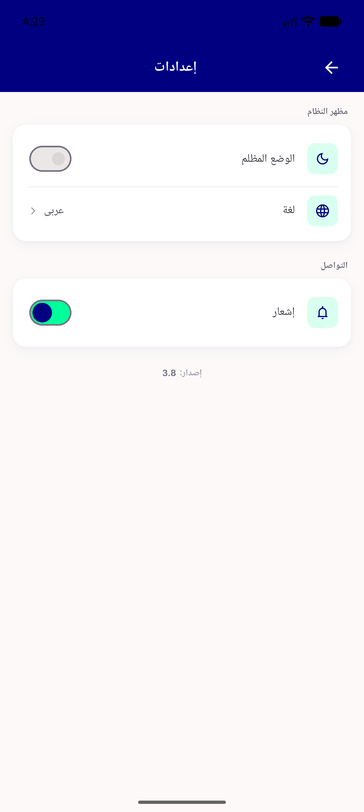
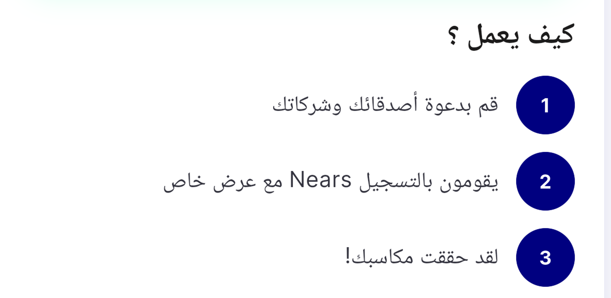
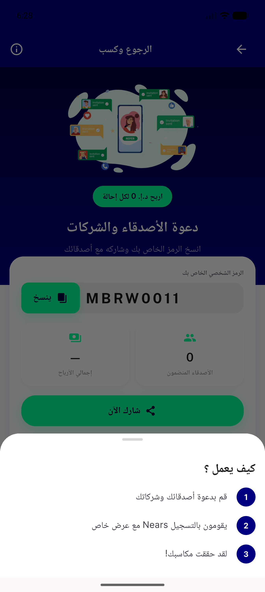

# QA Evidence — NEARS-1637

**POST-FIX PASS — AC1/AC2/AC3 all met, one-process locale switch proven both directions**

**21 screenshot(s).** Click any thumbnail for full resolution.

<table>
<tr>
<td align="center" width="33%"> launch</td>
<td align="center" width="33%"> after lang en</td>
<td align="center" width="33%"> post location</td>
</tr>
<tr>
<td align="center" width="33%"> login filled</td>
<td align="center" width="33%"> after signin</td>
<td align="center" width="33%"> referearn EN</td>
</tr>
<tr>
<td align="center" width="33%"> settings EN</td>
<td align="center" width="33%"> lang sheet</td>
<td align="center" width="33%"> settings AR</td>
</tr>
<tr>
<td align="center" width="33%"> settings AR after</td>
<td align="center" width="33%"> referearn AR REPRO</td>
<td align="center" width="33%"> info sheet AR</td>
</tr>
<tr>
<td align="center" width="33%"> postfix 01 referearn EN</td>
<td align="center" width="33%"> postfix 02 referearn AR AC1</td>
<td align="center" width="33%"> postfix 03 AR howitworks closeup</td>
</tr>
<tr>
<td align="center" width="33%"> postfix 04 AR step2 closeup</td>
<td align="center" width="33%"> postfix 05 AR info sheet</td>
<td align="center" width="33%"> postfix 06 AR info sheet closeup</td>
</tr>
<tr>
<td align="center" width="33%"> postfix 07 AC2 AR fresh launch</td>
<td align="center" width="33%"> postfix 08 AC3 EN after switch</td>
<td align="center" width="33%"> postfix 09 EN info sheet</td>
</tr>
</table>

### Other artifacts
- [`postfix-10-no-restart-and-freshness-proof.txt`](postfix-10-no-restart-and-freshness-proof.txt)

---
*From `nears/docs/qa-evidence/NEARS-1637/` · public-repo scrub policy (no live secrets; verified clean).*
