# QA Evidence — NEARS-1651

**PASS — NAppBar optional subtitle: 6/6 ACs verified live on Widgetbook web**

**13 screenshot(s).** Click any thumbnail for full resolution.

<table>
<tr>
<td align="center" width="33%"><a href="A-twoline-default.png">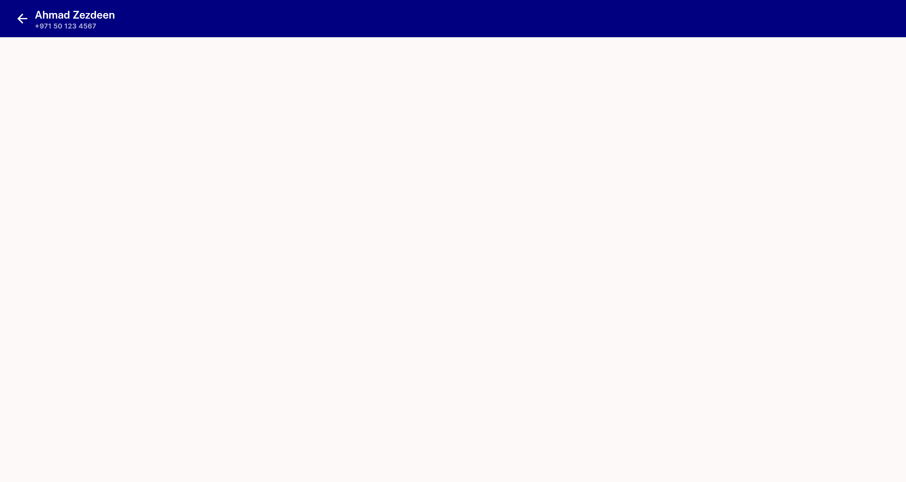</a> A twoline default</td>
<td align="center" width="33%"><a href="AC3-composite-A-D-C-E.png">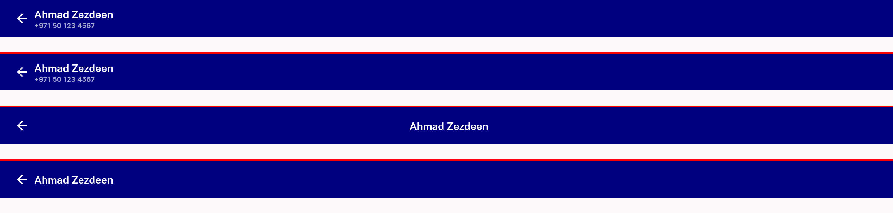</a> AC3 composite A D C E</td>
<td align="center" width="33%"><a href="AC6-composite-twoline-vs-playground.png">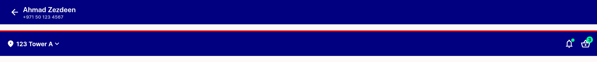</a> AC6 composite twoline vs playground</td>
</tr>
<tr>
<td align="center" width="33%"><a href="B-playground-default.png">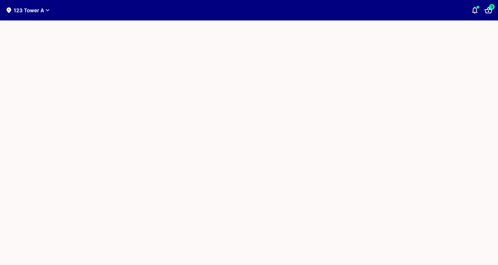</a> B playground default</td>
<td align="center" width="33%"><a href="C-subtitle-cleared-centertrue.png">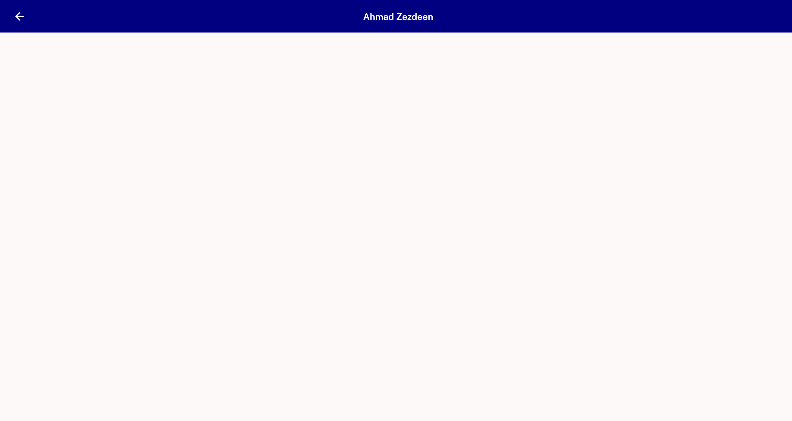</a> C subtitle cleared centertrue</td>
<td align="center" width="33%"> D subtitle set centerfalse</td>
</tr>
<tr>
<td align="center" width="33%"> E cleared centerfalse</td>
<td align="center" width="33%"><a href="F-long-title-subtitle-ellipsis-iphonese.png">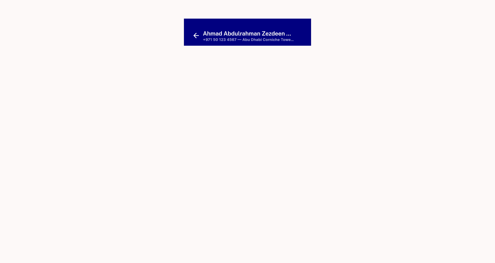</a> F long title subtitle ellipsis iphonese</td>
<td align="center" width="33%"><a href="G-rtl-arabic-twoline-iphonese.png">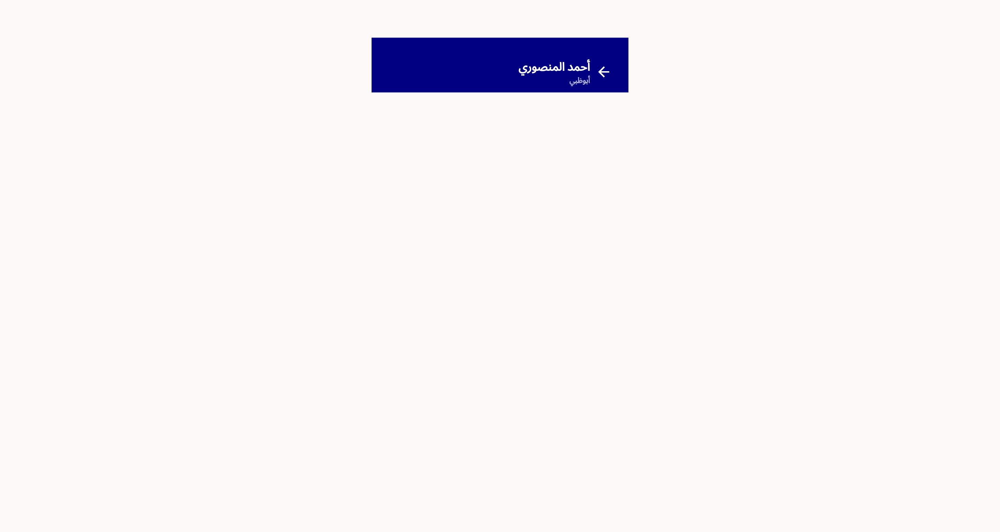</a> G rtl arabic twoline iphonese</td>
</tr>
<tr>
<td align="center" width="33%"><a href="REG-composite-home-vs-pushed.png">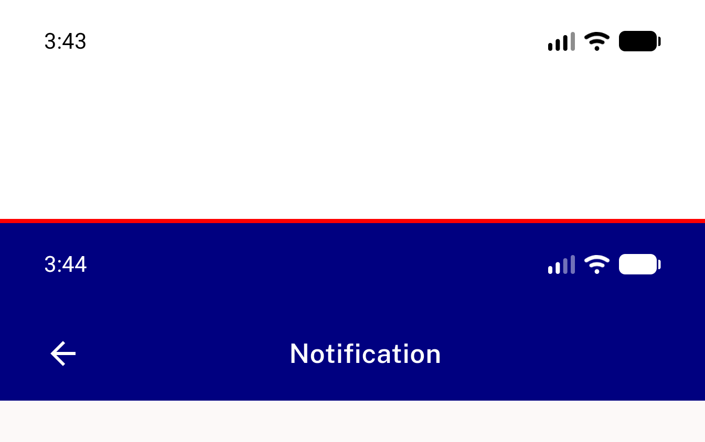</a> REG composite home vs pushed</td>
<td align="center" width="33%"><a href="REG1-home-appbar.png">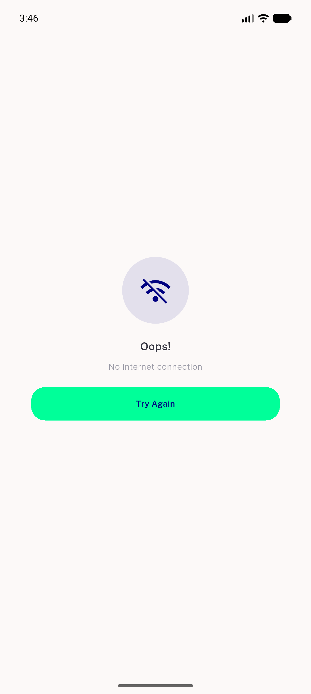</a> REG1 home appbar</td>
<td align="center" width="33%"><a href="REG2-pushed-route-centred-title.png">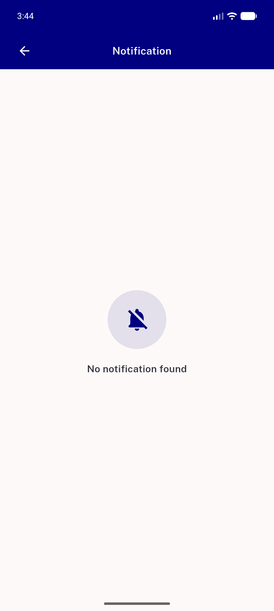</a> REG2 pushed route centred title</td>
</tr>
<tr>
<td align="center" width="33%"><a href="REG3-modules-screen.png">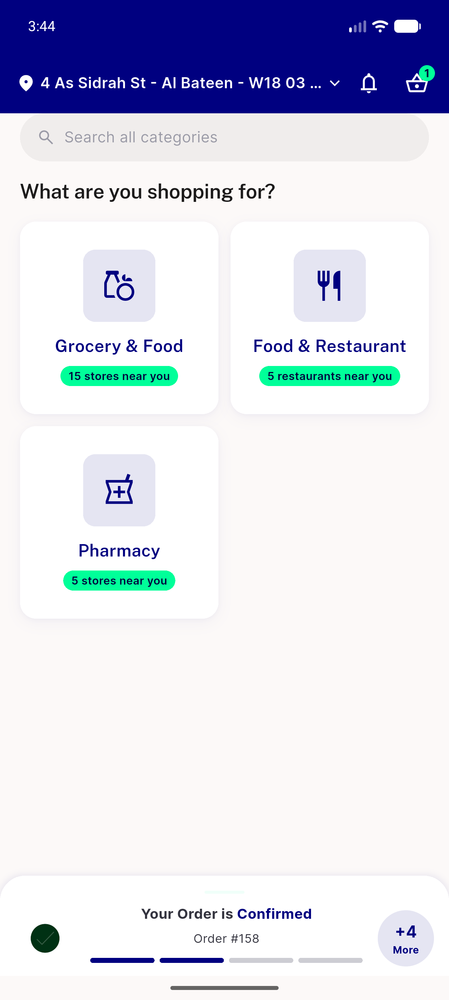</a> REG3 modules screen</td>
</tr>
</table>

---
*From `nears/docs/qa-evidence/NEARS-1651/` · public-repo scrub policy (no live secrets; verified clean).*
