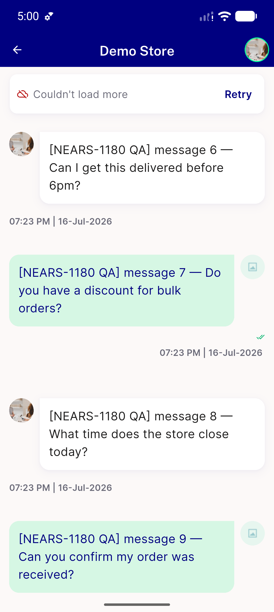
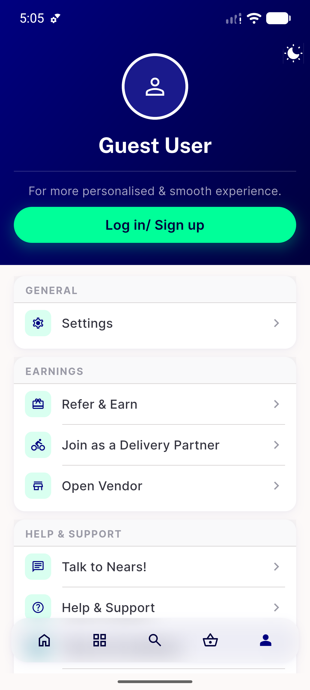
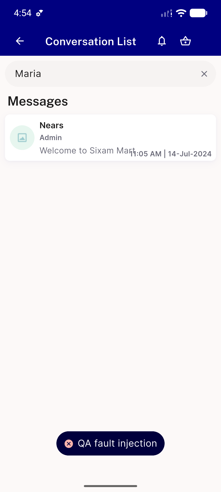
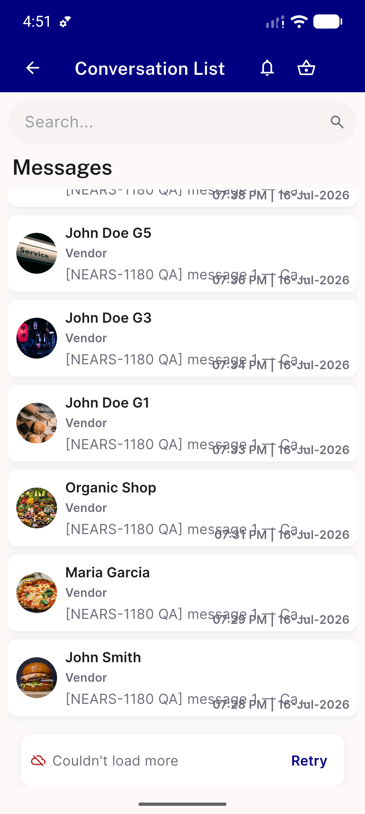
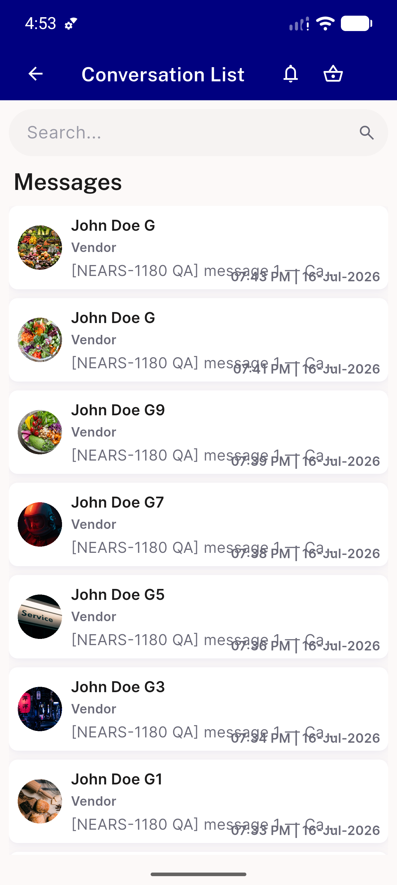
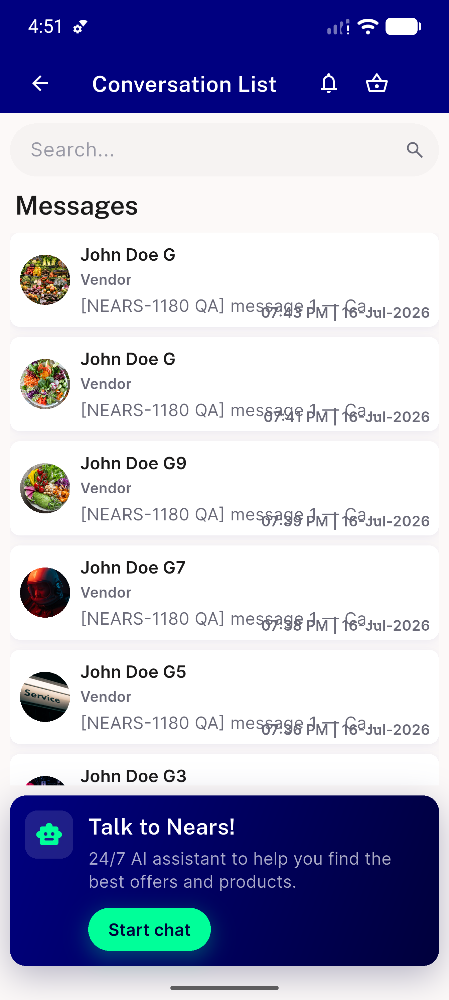
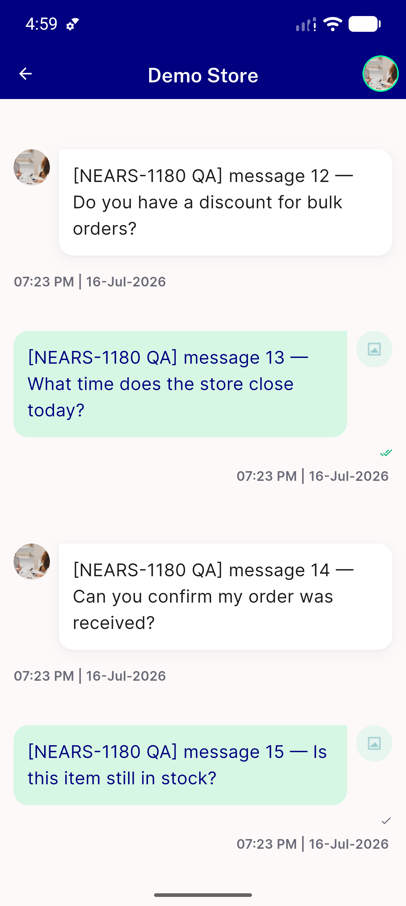

# QA Evidence — NEARS-1652

**PASS — AC3 demonstrated live on both chat fetches; 401 force-logout intact on GET + search; no PII in any [FAIL]**

**7 screenshot(s).** Click any thumbnail for full resolution.

<table>
<tr>
<td align="center" width="33%"> a thread fault retry row</td>
<td align="center" width="33%"> b 401 forced logout guest state</td>
<td align="center" width="33%"> d search failure toast</td>
</tr>
<tr>
<td align="center" width="33%"> e pagination retry row</td>
<td align="center" width="33%"> f failed refresh keeps data</td>
<td align="center" width="33%"> g success conversation list</td>
</tr>
<tr>
<td align="center" width="33%"> g success message thread</td>
</tr>
</table>

### Other artifacts
- [`bug-order-tracking-chat-null-deliveryman.log`](bug-order-tracking-chat-null-deliveryman.log)
- [`progress.md`](progress.md)

---
*From `nears/docs/qa-evidence/NEARS-1652/` · public-repo scrub policy (no live secrets; verified clean).*
