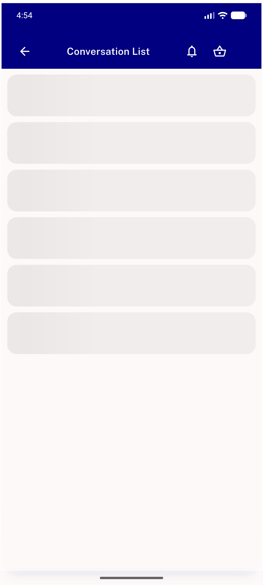
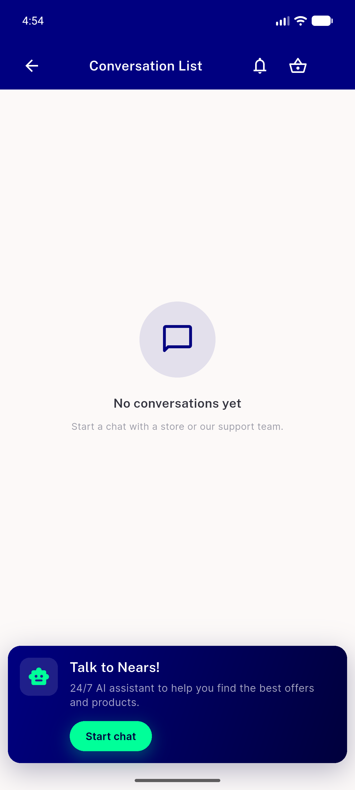
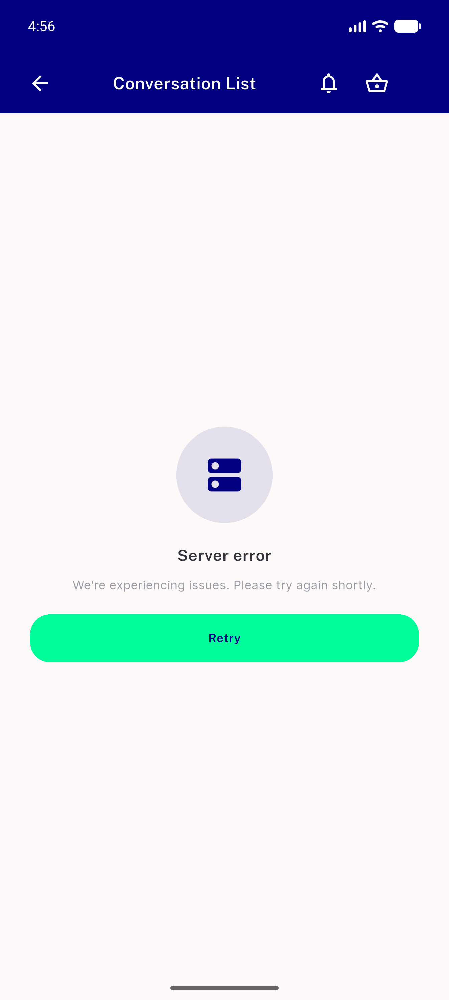
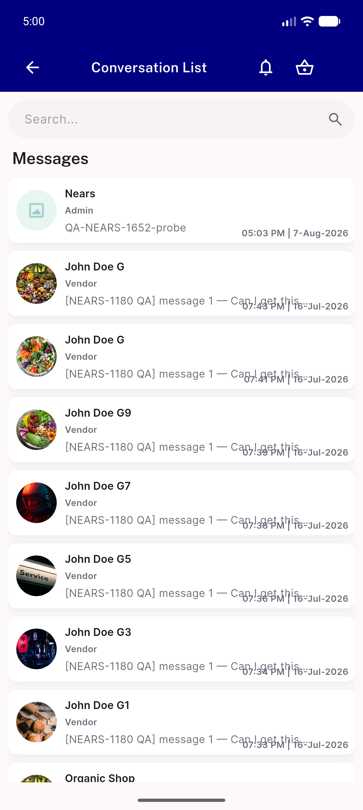
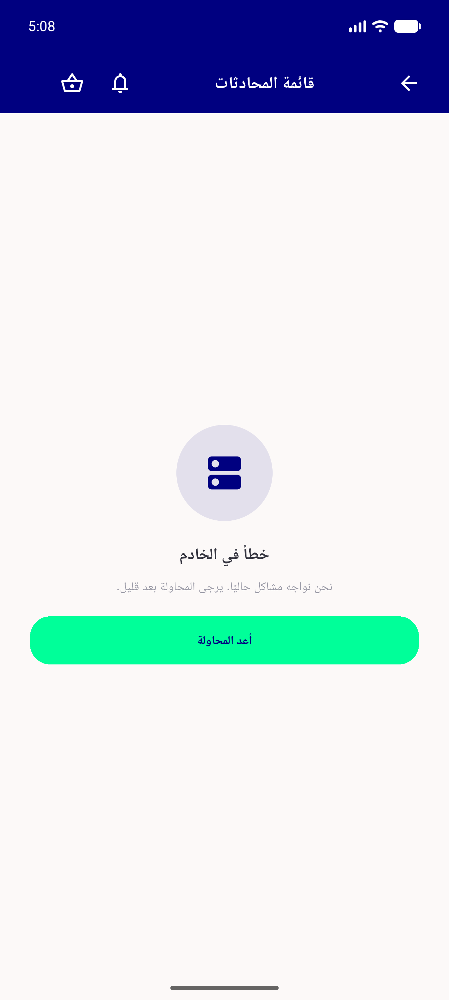
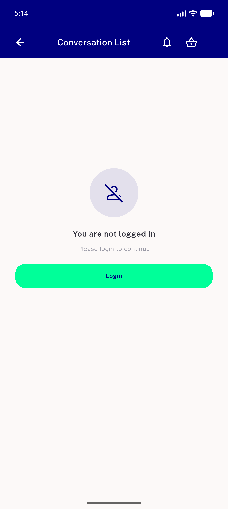

# QA Evidence — NEARS-1653

**PASS - all 7 ACs demonstrated live on emulator-5556 (fault-proxy injection); 4 regression checks clean**

**6 screenshot(s).** Click any thumbnail for full resolution.

<table>
<tr>
<td align="center" width="33%"> ac3 skeleton in flight</td>
<td align="center" width="33%"> ac4 empty no retry</td>
<td align="center" width="33%"> ac1 ac7 error retry surface</td>
</tr>
<tr>
<td align="center" width="33%"> ac2 after retry list loaded</td>
<td align="center" width="33%"> ac6 rtl arabic error</td>
<td align="center" width="33%"> regression logged out</td>
</tr>
</table>

---
*From `nears/docs/qa-evidence/NEARS-1653/` · public-repo scrub policy (no live secrets; verified clean).*
