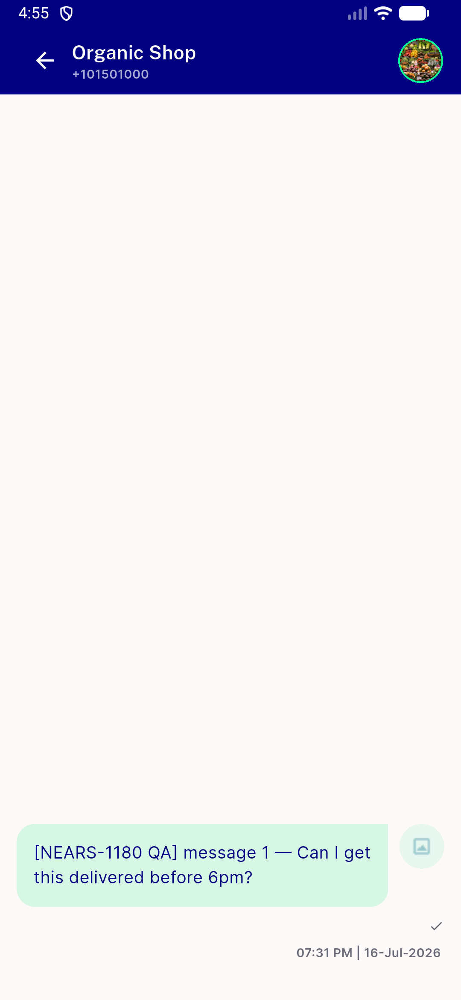
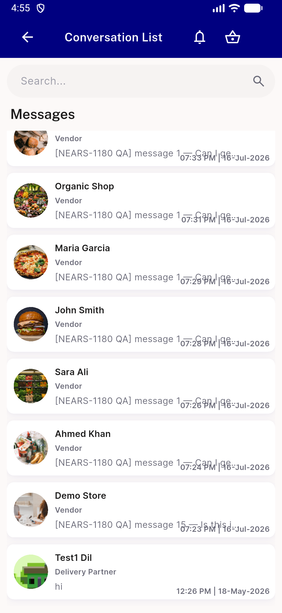
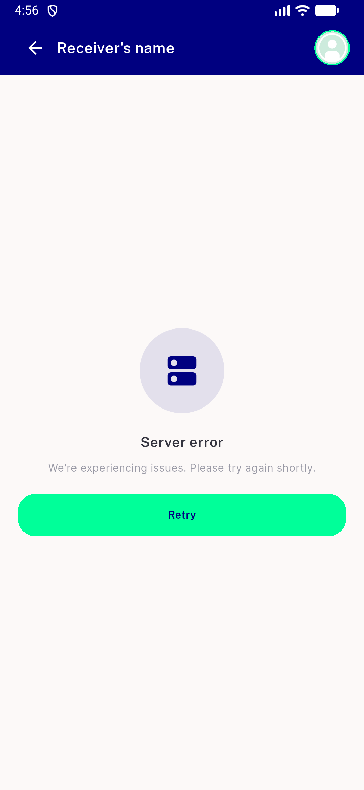
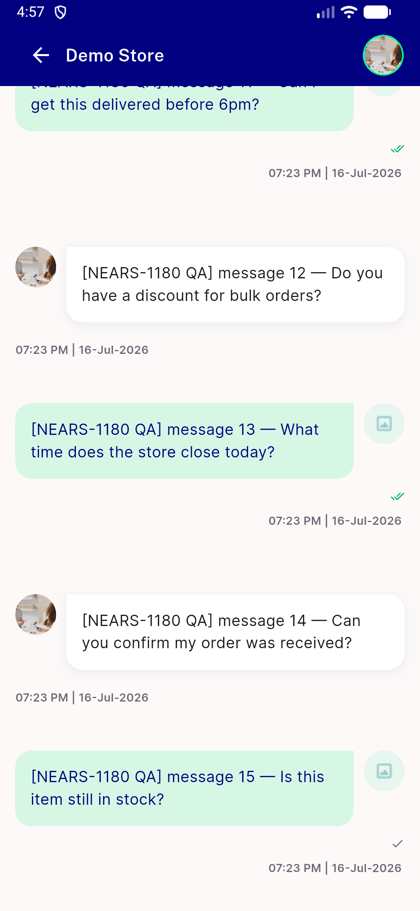
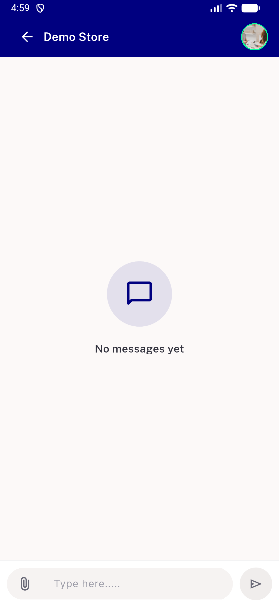
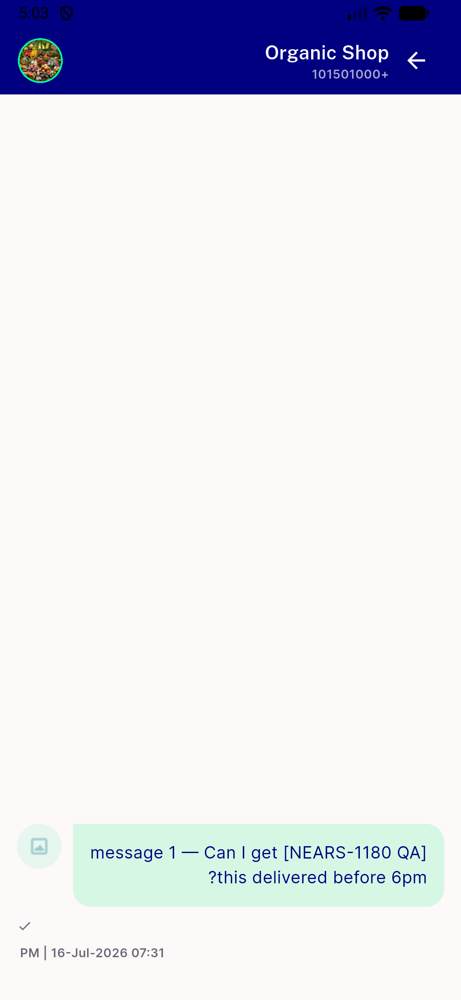
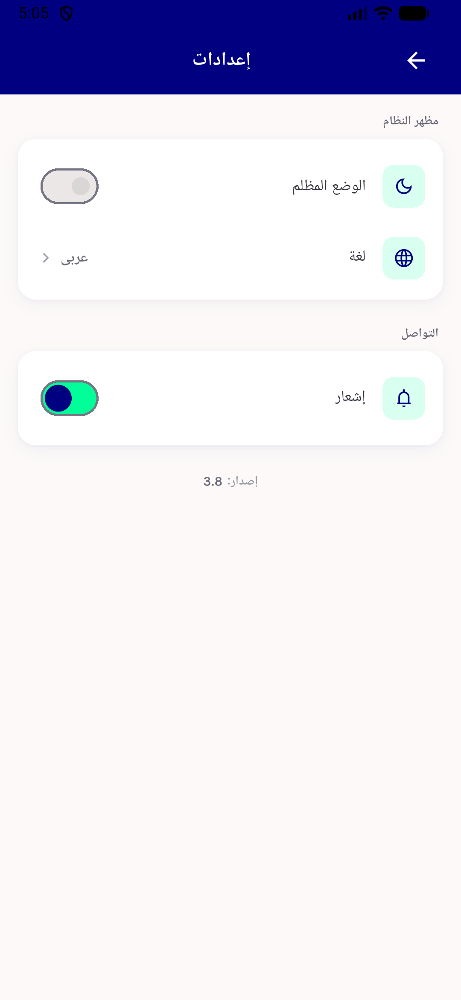

# QA Evidence — NEARS-1654

**PASS — AC1-AC8 verified live on emulator-5560; back-glyph RTL finding is pre-existing DLS-wide**

**8 screenshot(s).** Click any thumbnail for full resolution.

<table>
<tr>
<td align="center" width="33%"> AC1 oneline conv46</td>
<td align="center" width="33%"> AC1 twoline conv51</td>
<td align="center" width="33%"> AC2 back to list</td>
</tr>
<tr>
<td align="center" width="33%"> AC4 failure retry</td>
<td align="center" width="33%"> AC4 retry recovers</td>
<td align="center" width="33%"> AC5 empty not failure</td>
</tr>
<tr>
<td align="center" width="33%"> Q10 rtl arabic bar</td>
<td align="center" width="33%"> Q10 rtl control settings untouched screen</td>
</tr>
</table>

---
*From `nears/docs/qa-evidence/NEARS-1654/` · public-repo scrub policy (no live secrets; verified clean).*
