# QA Evidence — NEARS-1655

**PASS — 7/7 ACs verified live on emulator-5558 (448x997dp)**

**16 screenshot(s).** Click any thumbnail for full resolution.

<table>
<tr>
<td align="center" width="33%"><a href="00-home-bell-baseline.png">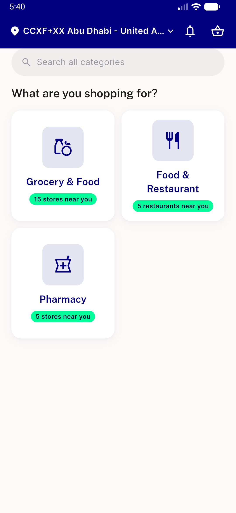</a> home bell baseline</td>
<td align="center" width="33%"><a href="01-ac7-list-7cards-4buckets.png">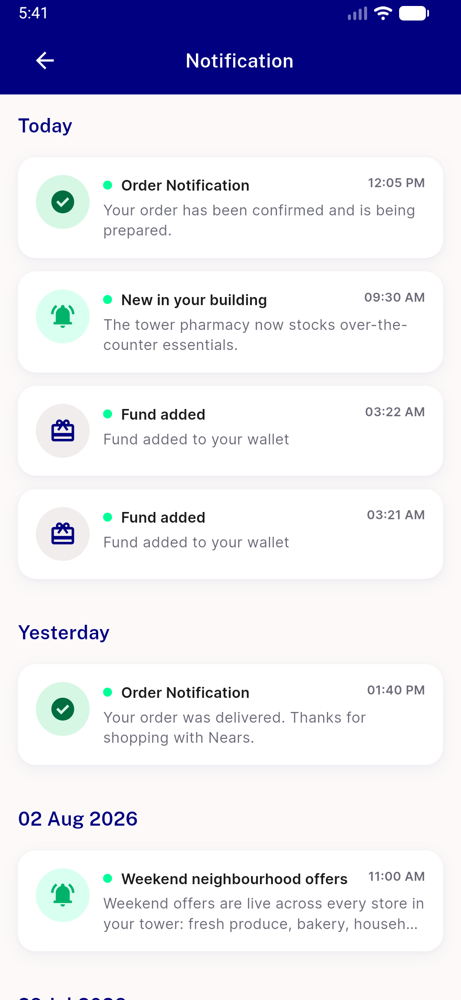</a> ac7 list 7cards 4buckets</td>
<td align="center" width="33%"><a href="01-list-7cards-today-yesterday.png">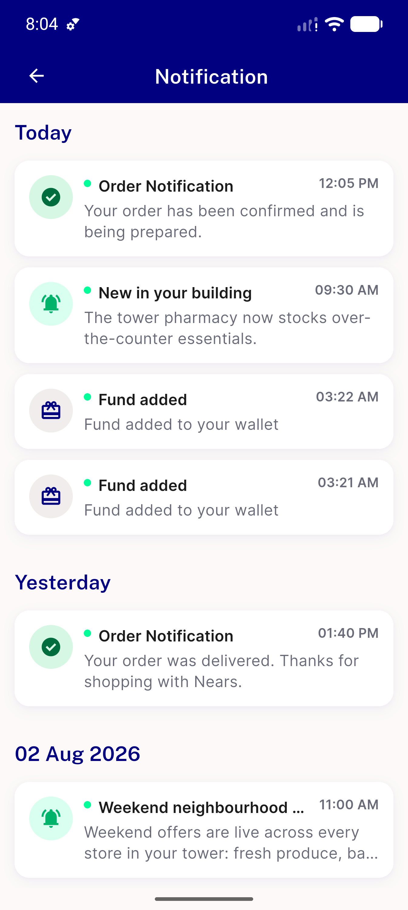</a> list 7cards today yesterday</td>
</tr>
<tr>
<td align="center" width="33%"><a href="02-ac4-sheet-single-handle.png">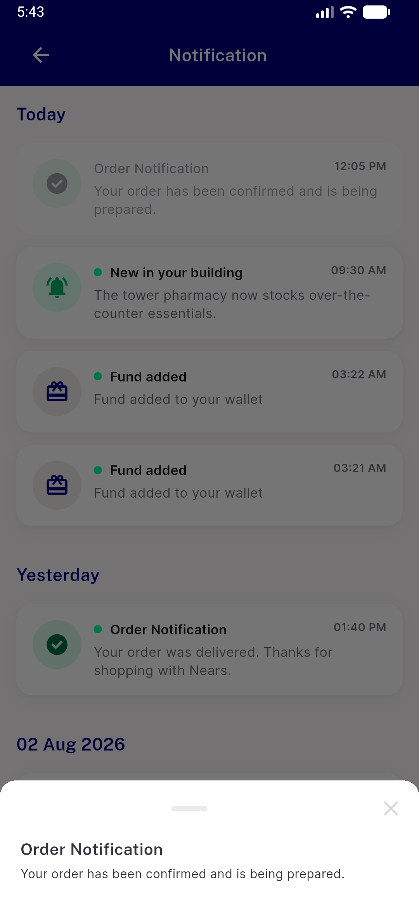</a> ac4 sheet single handle</td>
<td align="center" width="33%"><a href="02-list-4th-bucket-29jul.png">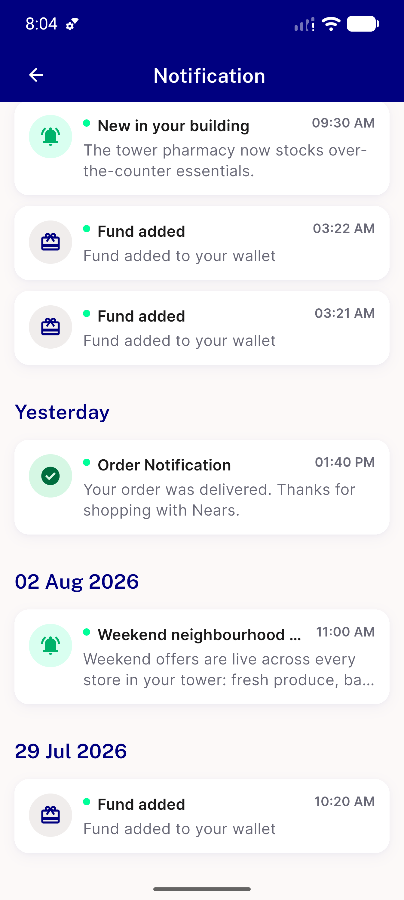</a> list 4th bucket 29jul</td>
<td align="center" width="33%"><a href="03-AC4-nbottomsheet-single-handle.png">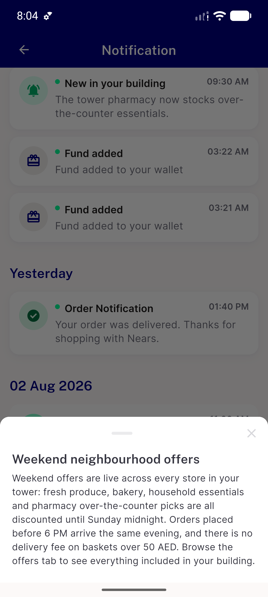</a> AC4 nbottomsheet single handle</td>
</tr>
<tr>
<td align="center" width="33%"><a href="03-ac4-longbody-default-font.png">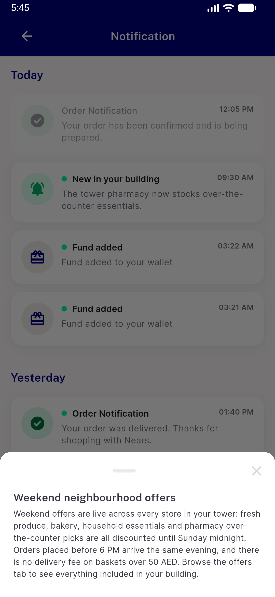</a> ac4 longbody default font</td>
<td align="center" width="33%"><a href="04-AC5-unread-dot-cleared.png">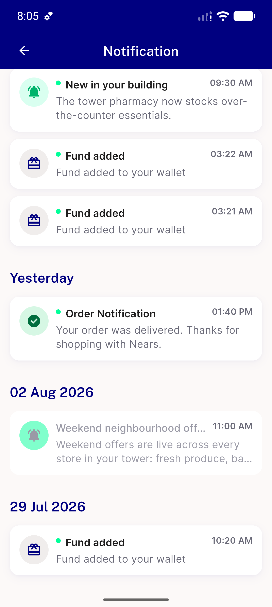</a> AC5 unread dot cleared</td>
<td align="center" width="33%"><a href="04-ac4-80pct-cap-binds.png">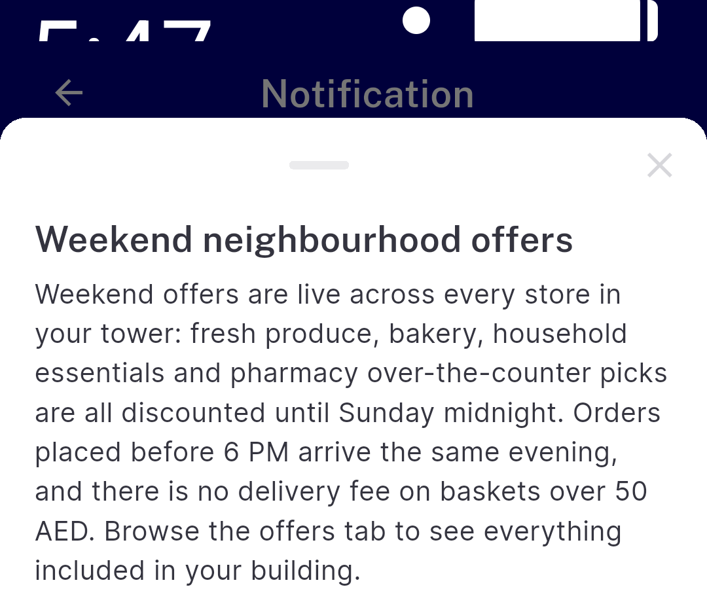</a> ac4 80pct cap binds</td>
</tr>
<tr>
<td align="center" width="33%"><a href="05-AC2-nearserrorretry.png">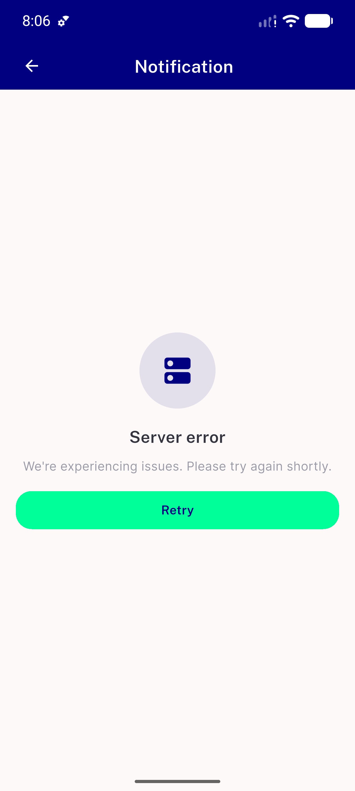</a> AC2 nearserrorretry</td>
<td align="center" width="33%"> ac7 back to home</td>
<td align="center" width="33%"><a href="06-AC2-retry-recovered.png">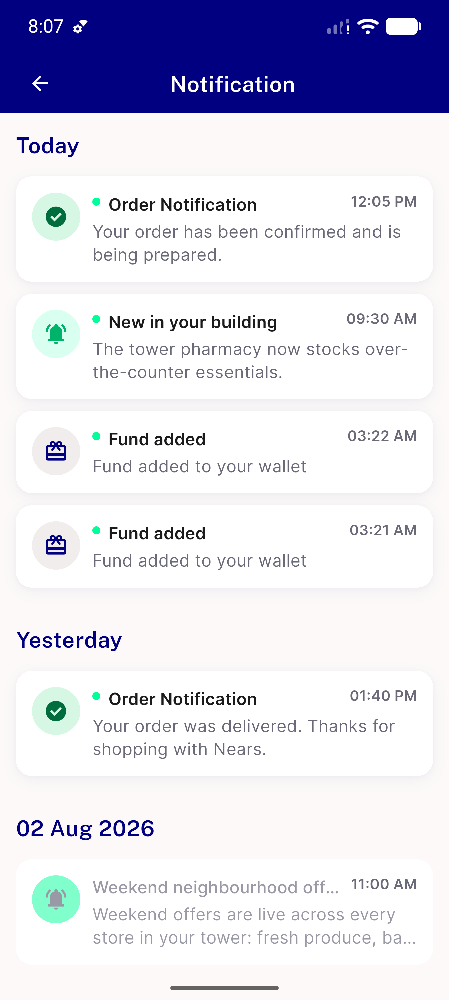</a> AC2 retry recovered</td>
</tr>
<tr>
<td align="center" width="33%"><a href="07-AC3-nemptystate-user6.png">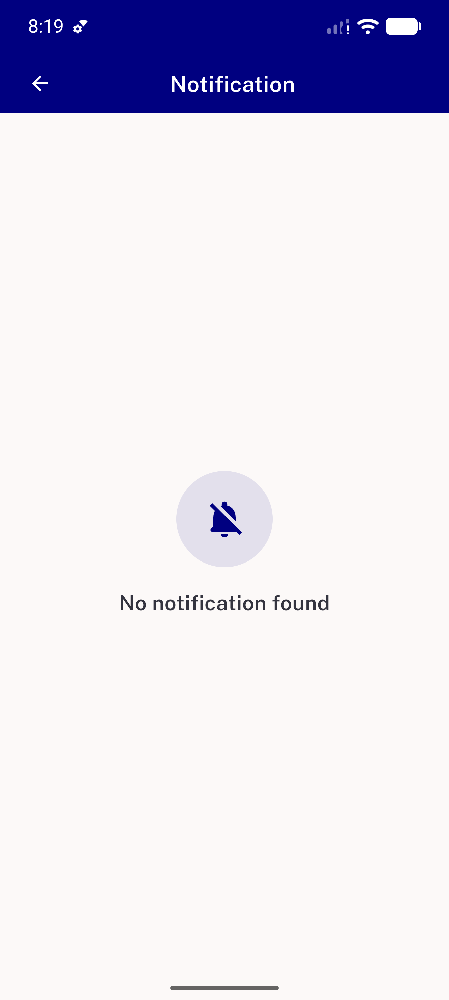</a> AC3 nemptystate user6</td>
<td align="center" width="33%"><a href="08-RTL-error-state.png">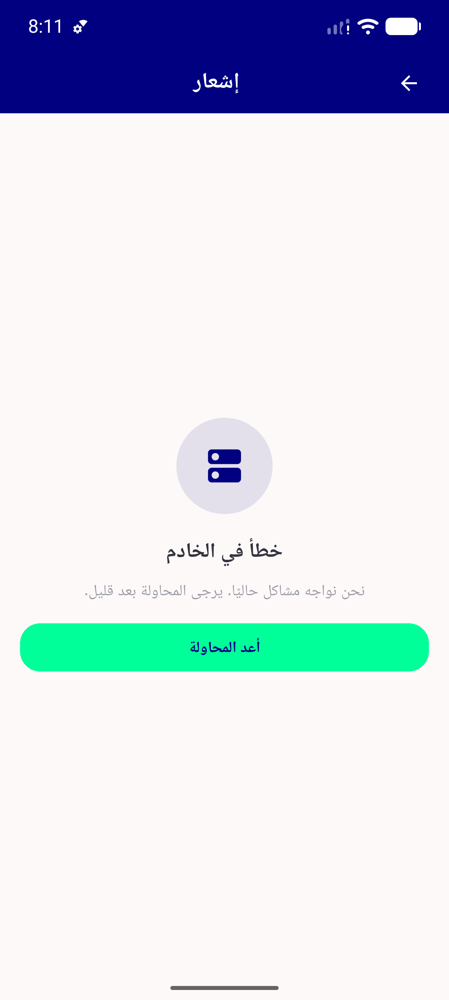</a> RTL error state</td>
<td align="center" width="33%"><a href="09-RTL-list-and-sheet.png">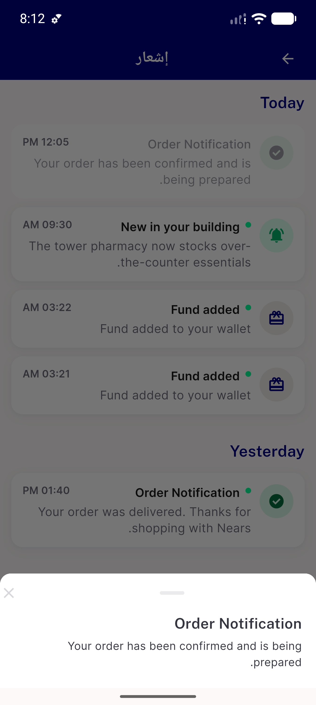</a> RTL list and sheet</td>
</tr>
<tr>
<td align="center" width="33%"><a href="10-AC7-pull-to-refresh.png">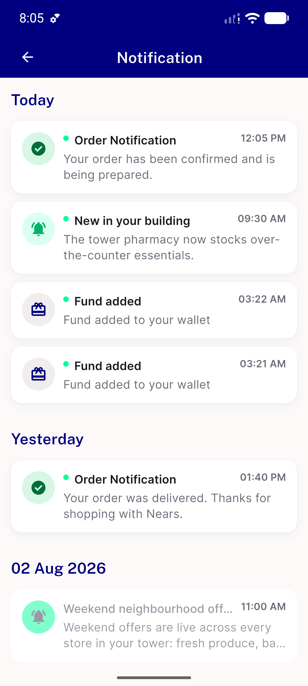</a> AC7 pull to refresh</td>
</tr>
</table>

---
*From `nears/docs/qa-evidence/NEARS-1655/` · public-repo scrub policy (no live secrets; verified clean).*
