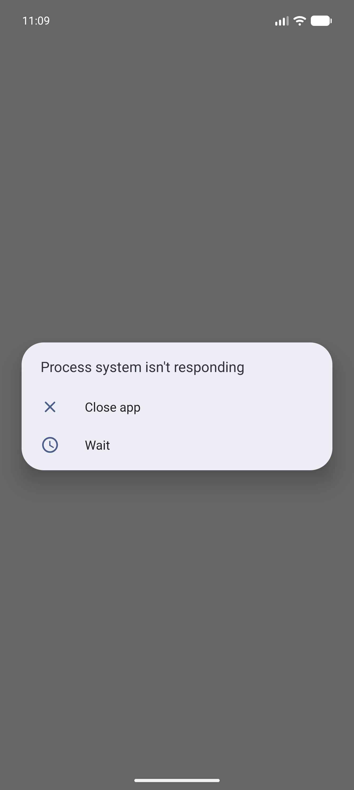
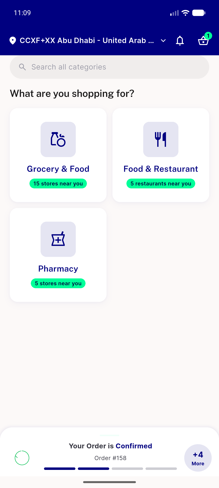
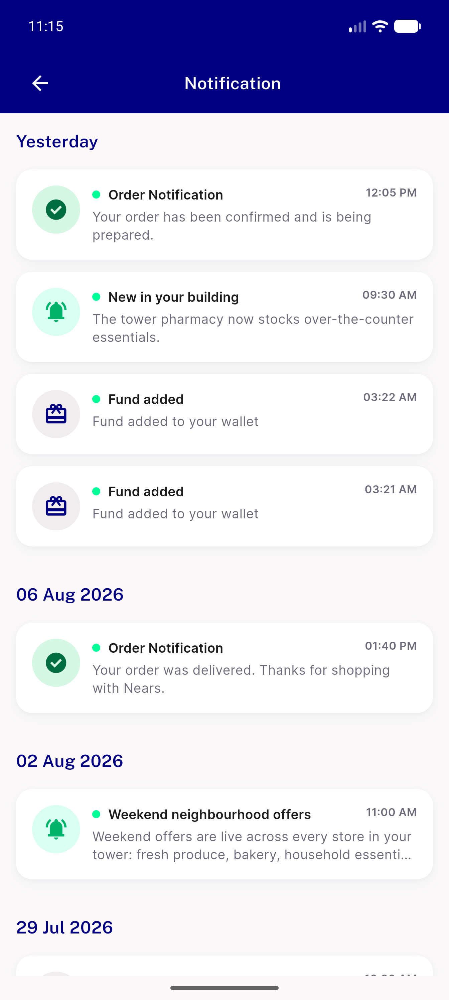
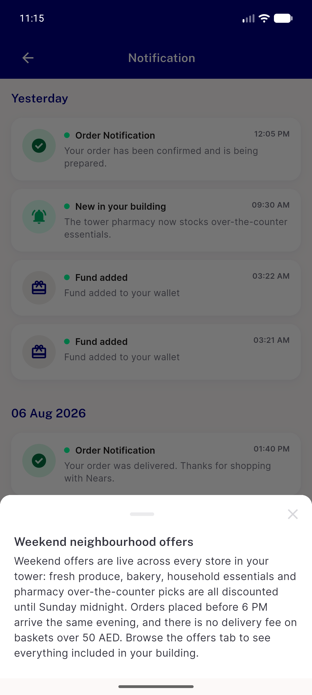
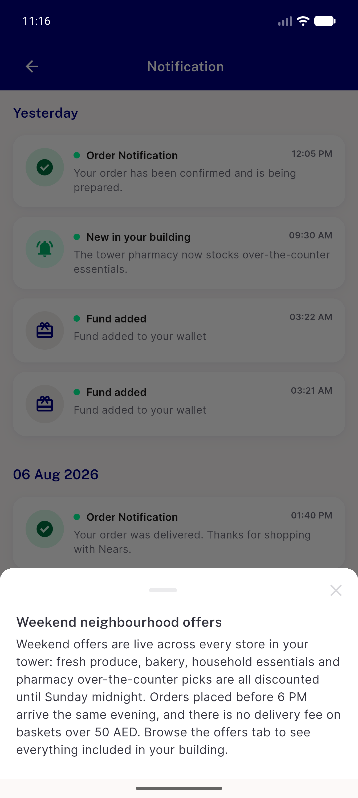
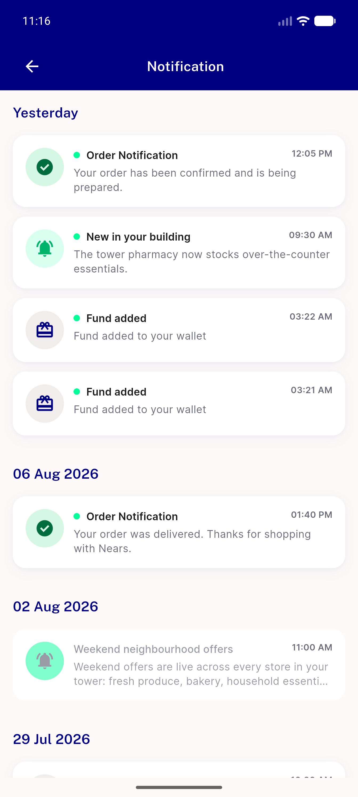
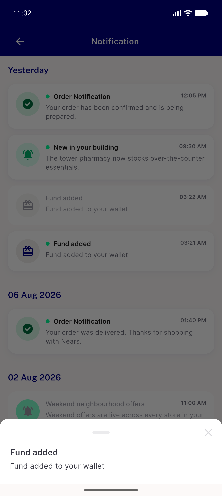
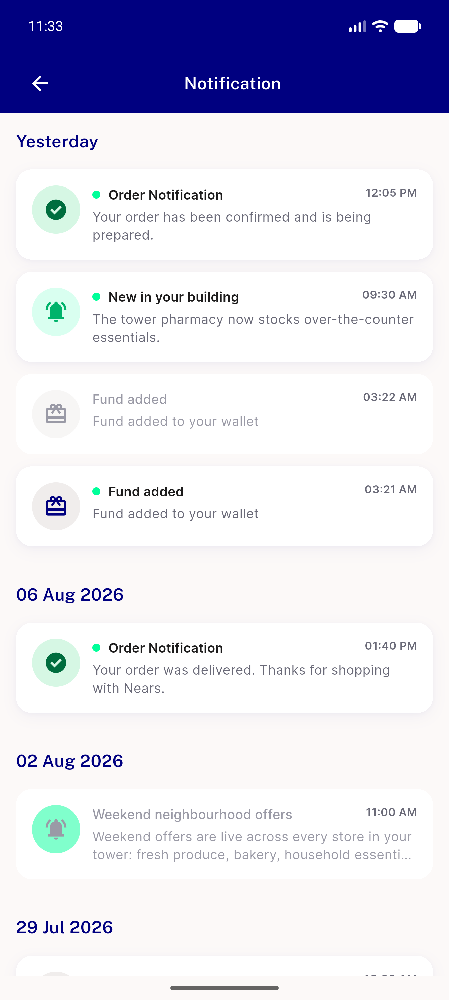
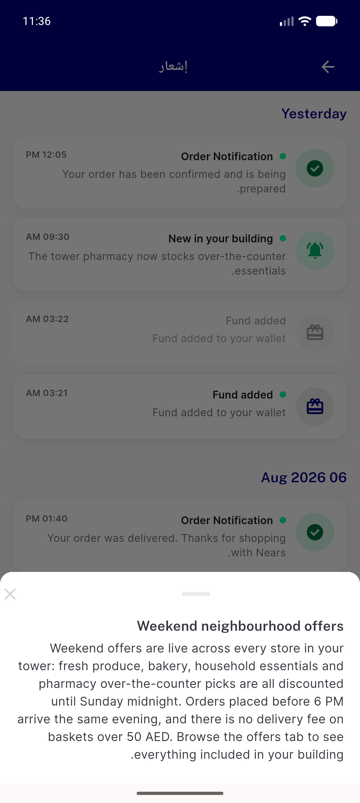

# QA Evidence — NEARS-1656

**PASS - 5/5 ACs; notification detail sheet typography onto DLS tokens (subtitle + bodyMd)**

**10 screenshot(s).** Click any thumbnail for full resolution.

<table>
<tr>
<td align="center" width="33%"> launch</td>
<td align="center" width="33%"> 01b after wait</td>
<td align="center" width="33%"> notification list</td>
</tr>
<tr>
<td align="center" width="33%"> sheet long body</td>
<td align="center" width="33%"> sheet scroll attempt</td>
<td align="center" width="33%"> dismiss x</td>
</tr>
<tr>
<td align="center" width="33%"> sheet short body</td>
<td align="center" width="33%"> dismiss scrim</td>
<td align="center" width="33%"> dismiss swipe</td>
</tr>
<tr>
<td align="center" width="33%"> sheet rtl arabic</td>
</tr>
</table>

---
*From `nears/docs/qa-evidence/NEARS-1656/` · public-repo scrub policy (no live secrets; verified clean).*
