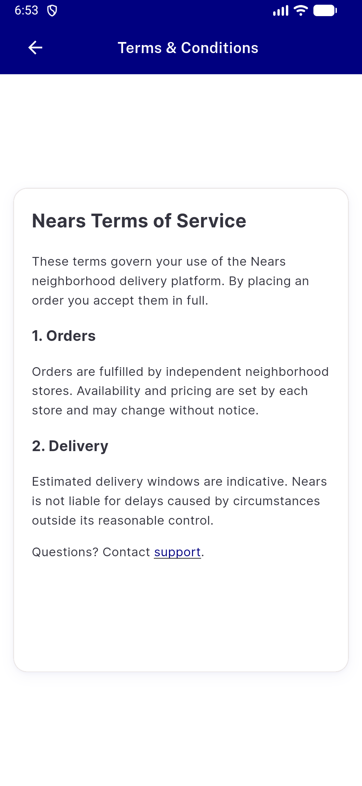
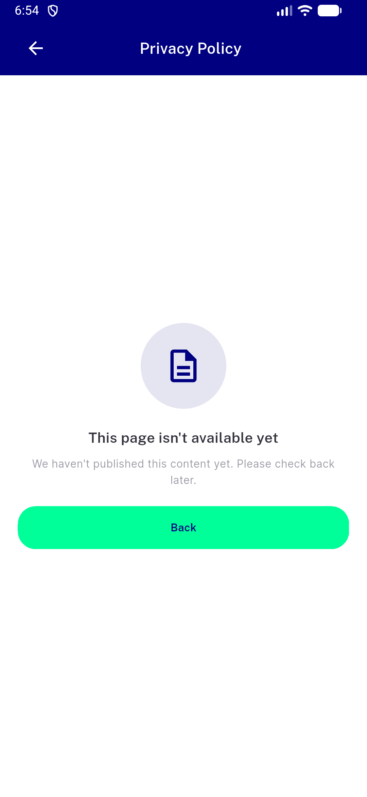
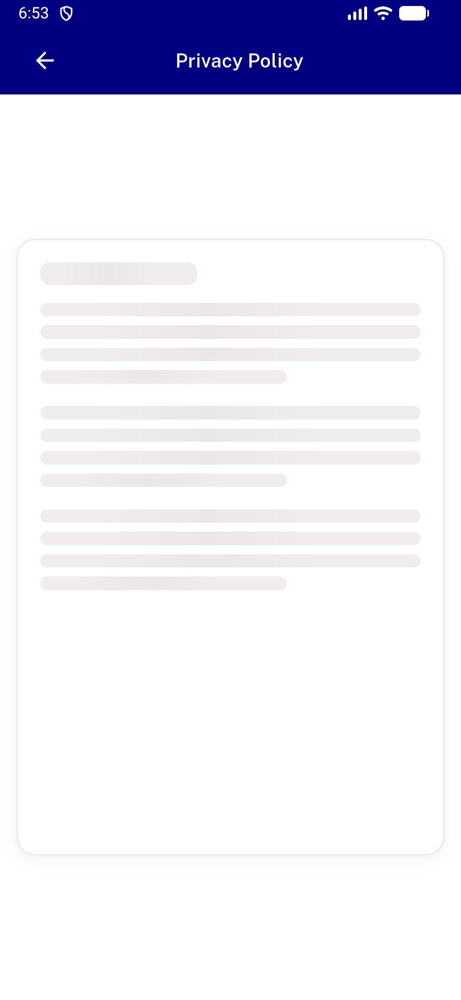
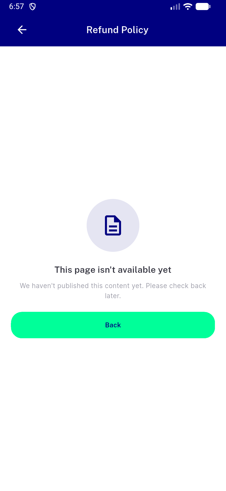
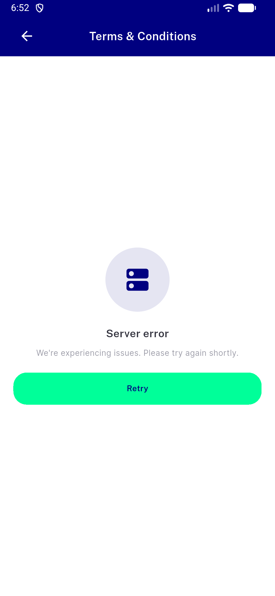
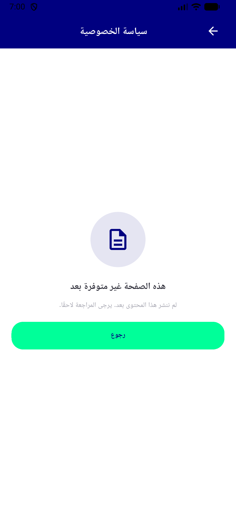
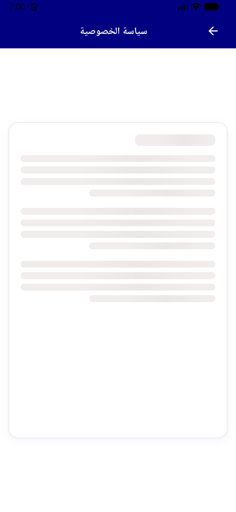
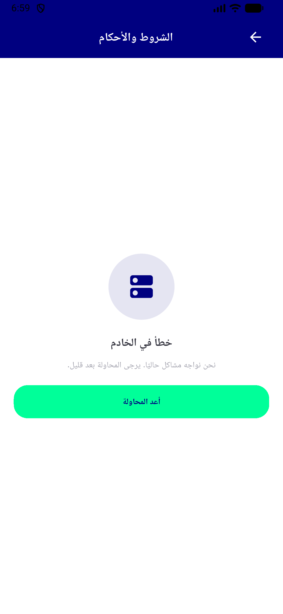
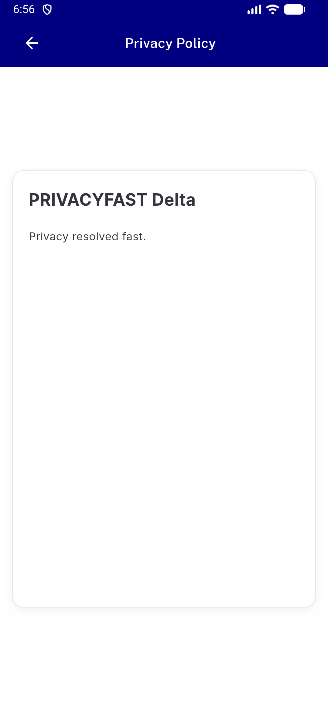

# QA Evidence — NEARS-1657

**PASS - NEARS-1657 policy/HTML viewer error, empty and skeleton states; 10 shots; emulator-5560; APK md5 7b937602**

**10 screenshot(s).** Click any thumbnail for full resolution.

<table>
<tr>
<td align="center" width="33%"> ac2 terms content after retry en</td>
<td align="center" width="33%"> ac3 privacy empty state en</td>
<td align="center" width="33%"> ac4 privacy skeleton loading en</td>
</tr>
<tr>
<td align="center" width="33%"> ac7 refund title empty en</td>
<td align="center" width="33%"> ac8 terms error retry en</td>
<td align="center" width="33%"> rtl privacy empty state ar</td>
</tr>
<tr>
<td align="center" width="33%"> rtl privacy skeleton loading ar</td>
<td align="center" width="33%"> rtl terms error retry ar</td>
<td align="center" width="33%"> staleness late terms reply blocked</td>
</tr>
<tr>
<td align="center" width="33%"> staleness privacy skeleton not terms</td>
</tr>
</table>

---
*From `nears/docs/qa-evidence/NEARS-1657/` · public-repo scrub policy (no live secrets; verified clean).*
