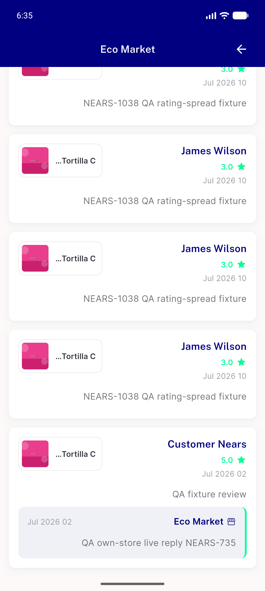
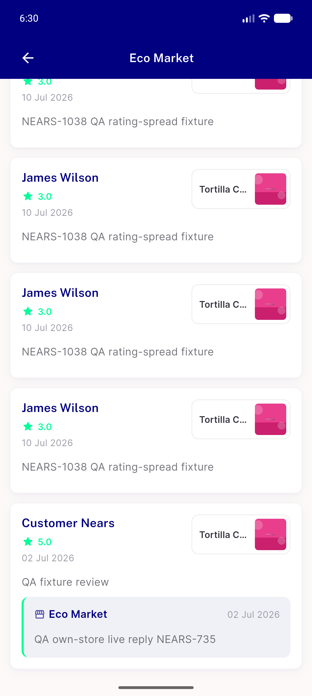
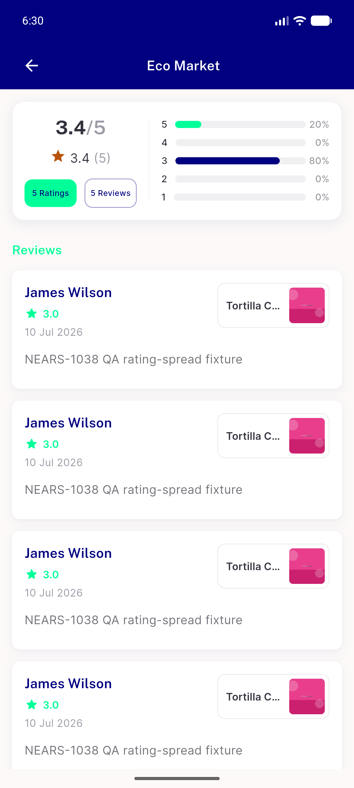
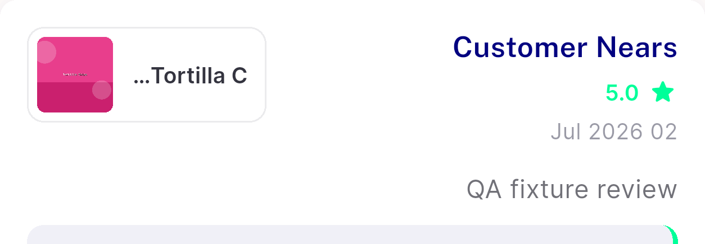

# QA Evidence — NEARS-1658

**FAIL — AC7/AC3/AC4 pass live; AC6 unmet as written (date word order mirrors under RTL, pre-existing)**

**5 screenshot(s).** Click any thumbnail for full resolution.

<table>
<tr>
<td align="center" width="33%"> ac6 rtl arabic reviews</td>
<td align="center" width="33%"> ac7 reply branch ltr</td>
<td align="center" width="33%"> ac7 store19 reviews ltr</td>
</tr>
<tr>
<td align="center" width="33%"> bug ac6 rtl date word order</td>
<td align="center" width="33%"> bug item chip fewer chars before ellipsis</td>
</tr>
</table>

### Other artifacts
- [`bug-test-name-asserts-false-claim.log`](bug-test-name-asserts-false-claim.log)
- [`progress.md`](progress.md)

---
*From `nears/docs/qa-evidence/NEARS-1658/` · public-repo scrub policy (no live secrets; verified clean).*
