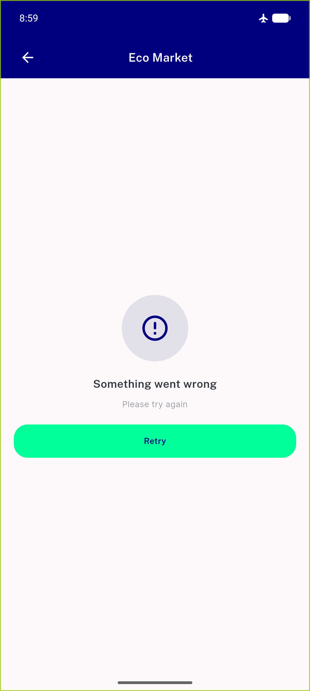
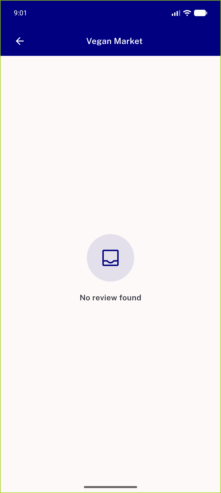
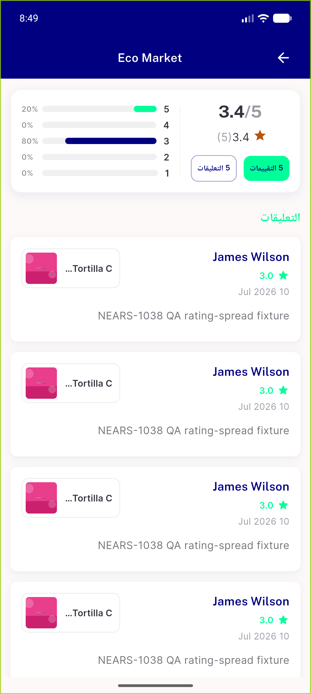
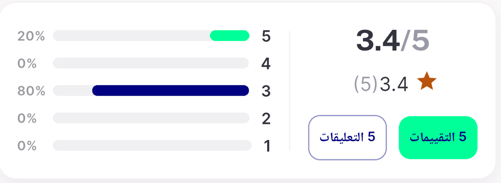
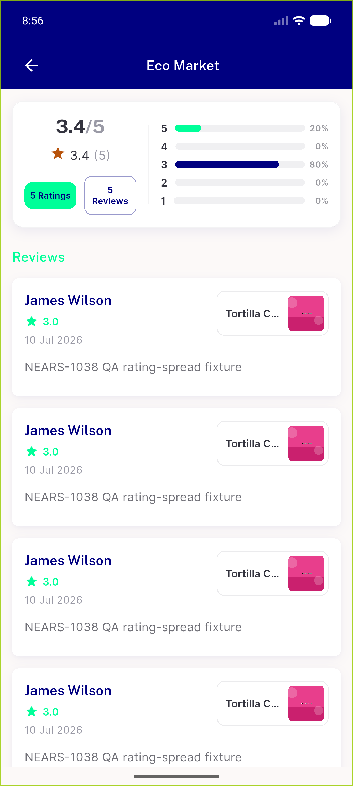
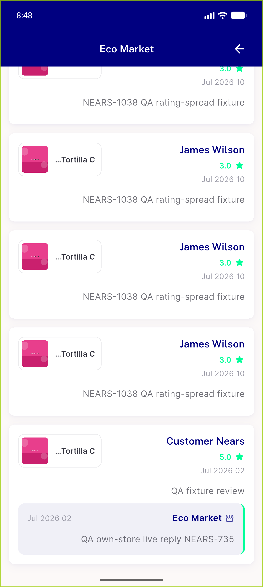

# QA Evidence — NEARS-1659

**FAIL (fix cycle 2) — AC2 unmet as written (mobile average numeral is textBody #34343F, not navy; identical at base). AC1/3/4/5/6/7/8/9 PASS.**

**9 screenshot(s).** Click any thumbnail for full resolution.

<table>
<tr>
<td align="center" width="33%"> ac3 skeleton mobile t1</td>
<td align="center" width="33%"> ac4 error retry</td>
<td align="center" width="33%"> ac5 no review found</td>
</tr>
<tr>
<td align="center" width="33%"> ac6 pull to refresh rtl</td>
<td align="center" width="33%"> ac8 reviews rtl arabic</td>
<td align="center" width="33%"> ac8 rtl panel zoom</td>
</tr>
<tr>
<td align="center" width="33%"> ac9 reviews ltr loaded</td>
<td align="center" width="33%"> bug reviews pill wraps two lines</td>
<td align="center" width="33%"> regression reply block rtl</td>
</tr>
</table>

### Other artifacts
- [`ac4-error-branch.log`](ac4-error-branch.log)
- [`bug-reviews-pill-wraps-two-lines.log`](bug-reviews-pill-wraps-two-lines.log)
- [`bug-store-review-screen-name-too-long.log`](bug-store-review-screen-name-too-long.log)
- [`progress.md`](progress.md)

---
*From `nears/docs/qa-evidence/NEARS-1659/` · public-repo scrub policy (no live secrets; verified clean).*
