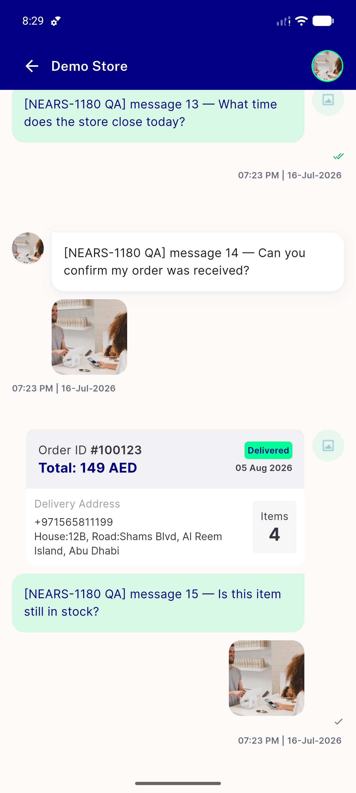
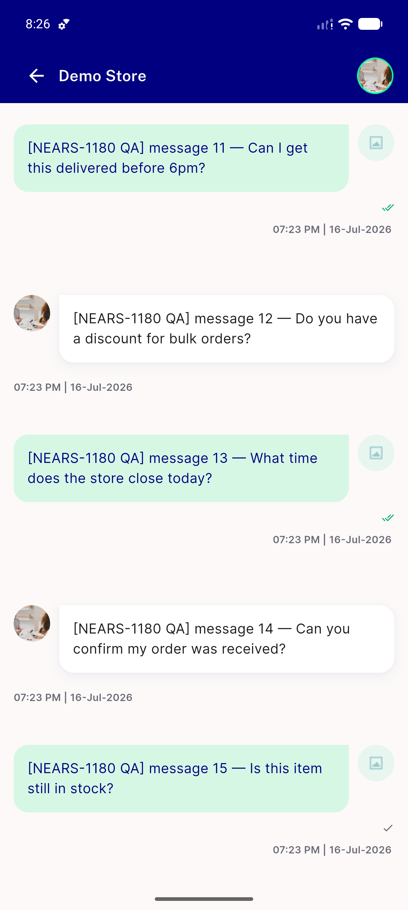
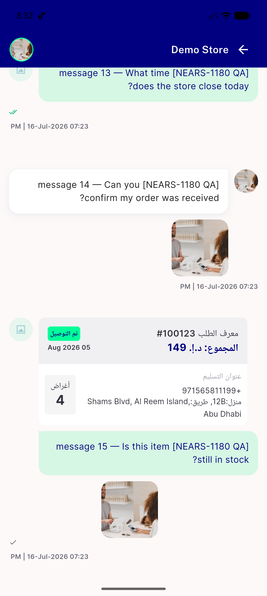
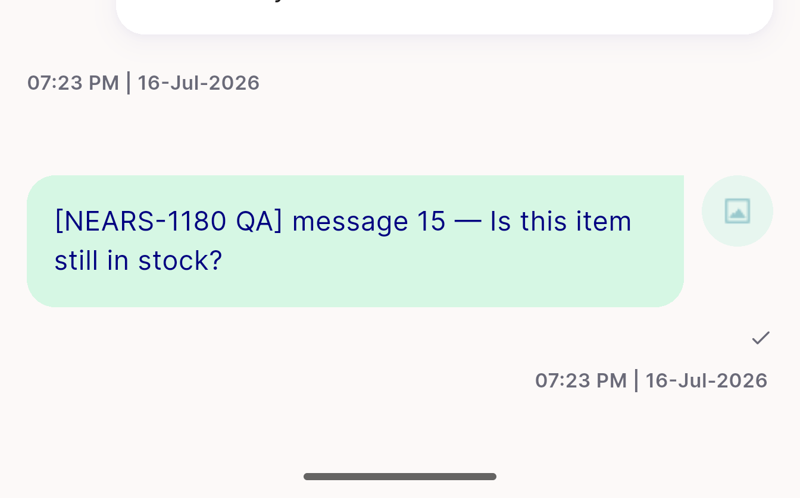
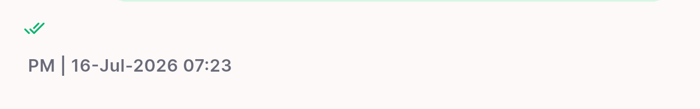

# QA Evidence — NEARS-1660

**PASS — NEARS-1660 message bubble DLS typography migration, emulator-5558, light mode, en+ar**

**6 screenshot(s).** Click any thumbnail for full resolution.

<table>
<tr>
<td align="center" width="33%"> ac3 ac4 order card and image bubbles ltr</td>
<td align="center" width="33%"> ac4 ltr plain bubbles both sides</td>
<td align="center" width="33%"> ac6 rtl arabic alignment flip and order card</td>
</tr>
<tr>
<td align="center" width="33%"> bug chat composer missing</td>
<td align="center" width="33%"> bug own avatar broken placeholder</td>
<td align="center" width="33%"> bug rtl datetime bidi reorder</td>
</tr>
</table>

### Other artifacts
- [`progress.md`](progress.md)

---
*From `nears/docs/qa-evidence/NEARS-1660/` · public-repo scrub policy (no live secrets; verified clean).*
