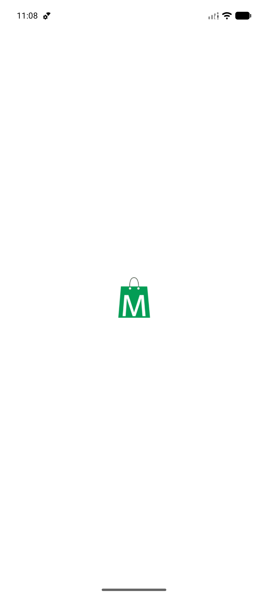
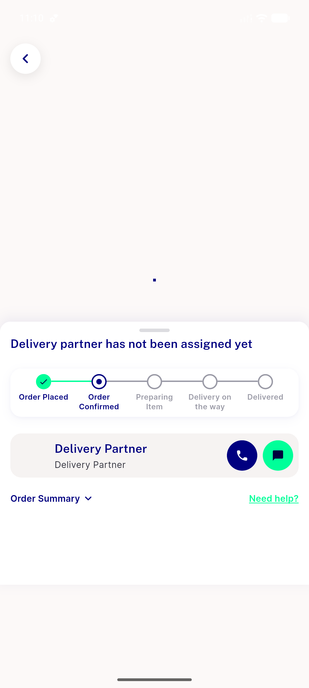
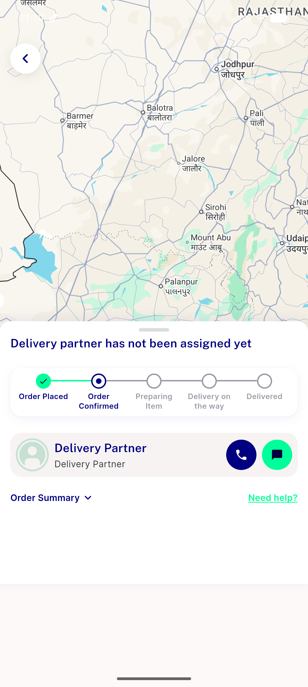
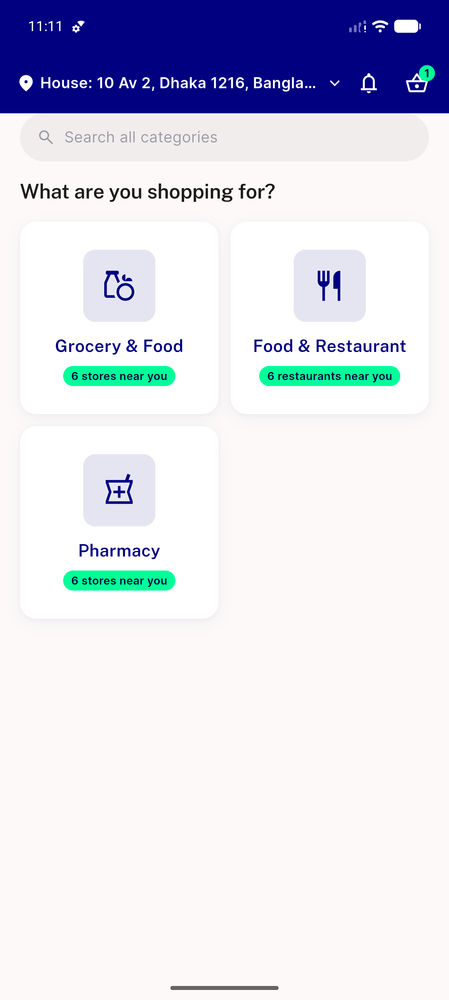
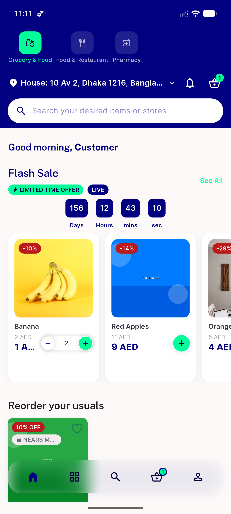
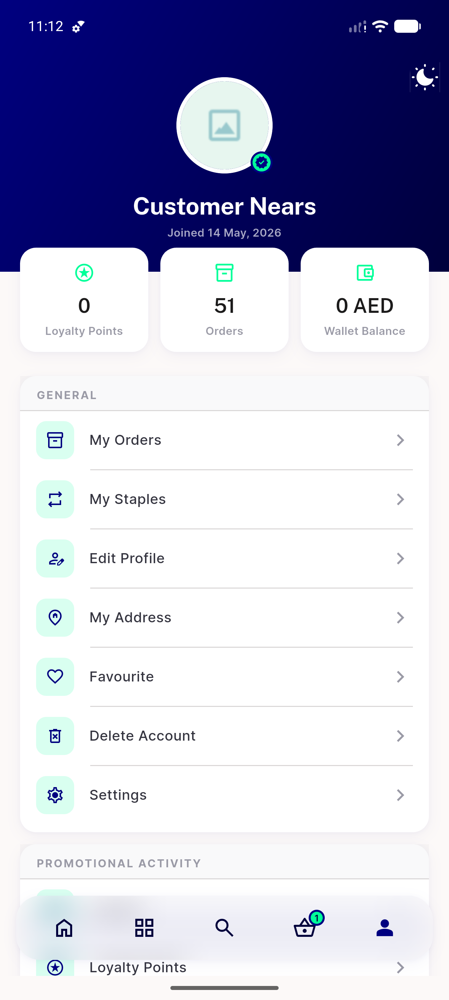
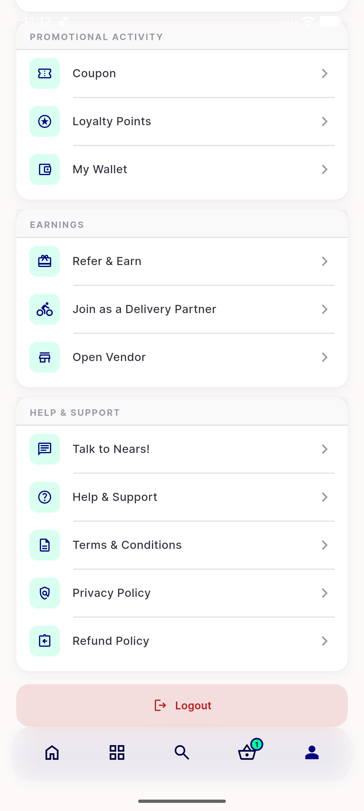
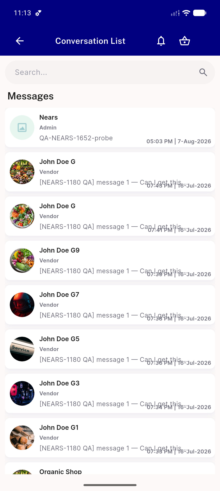
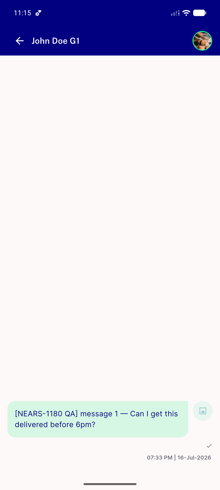

# QA Evidence — NEARS-1661

**PARTIAL: regression PASS live; attachment-viewer ACs unreachable (0 of 31 seeded messages carry an attachment, in-app send path undrivable)**

**15 screenshot(s).** Click any thumbnail for full resolution.

<table>
<tr>
<td align="center" width="33%"> launch</td>
<td align="center" width="33%"> after splash</td>
<td align="center" width="33%"> after lang</td>
</tr>
<tr>
<td align="center" width="33%"> chat open</td>
<td align="center" width="33%"> back</td>
<td align="center" width="33%"> module</td>
</tr>
<tr>
<td align="center" width="33%"> profile</td>
<td align="center" width="33%"> profile scrolled</td>
<td align="center" width="33%"> conversations</td>
</tr>
<tr>
<td align="center" width="33%"> chat thread</td>
<td align="center" width="33%"> probe attach</td>
<td align="center" width="33%"> attach tap</td>
</tr>
<tr>
<td align="center" width="33%"> probe composer</td>
<td align="center" width="33%"> scrolled</td>
<td align="center" width="33%"> longpress</td>
</tr>
</table>

---
*From `nears/docs/qa-evidence/NEARS-1661/` · public-repo scrub policy (no live secrets; verified clean).*
